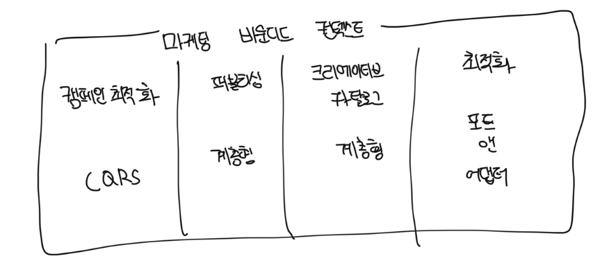

# 범위

- 계층형, 포트앤 어댑터, CQRS는 시스템 전체에 적용하는 구성 원칙으로 취급하면 안됨
- 이것은 전체 바운디드 컨텍스트를 위한 고수준의 아키텍쳐 패턴도 아님
- 목적은 실제 필요성과 비즈니스 전략에 따라서 설계 의사결정을 내리는 것임
- 비즈니스 하위 도메인을 묶는 모듈의 논리적 경계를 분명하게 정의하고, 각각에 맞는 적합한 도구를 사용하는게 중요함
- 적절한 수직 경게는 모놀리식 바운디드 컨텍스를 모듈화하고 커다란 진흙 덩어가 되는것을 방지하는데 도움이 됨
- 이와 같은 논리적인 경게는 좀 더 세분화된 바운디드 컨텍스트의 물리적 경계로 리팩토링이 가능함

