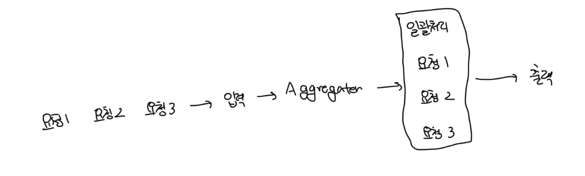

# 모델 변환

- 두 개의 바운디드 컨텍스트에서 `ACL` 또는 `OHS`를 사용하는 경우는 모델 변환이 필요하다
- 이러한 변환은 한쪽 또는 양쪽 모두에서 처리할 수 있음
- 이 때 사용되는 방법에는 `스테이트리스 변환`과 `스테이트풀 변환`이 있음

 

# 스테이트리스(Stateless) 변환

- 상태를 보존하지 않는 변환 방식으로 `수신(OHS)` 또는 `발신(ACL)` 요청이 발행될 때 즉석에서 발생한다
- 스테이트리스 모델 변환을 소유하는 바운디드 컨텍스트는 `프록시 디자인 패턴`을 구현해서 수/발신 요청을 삽입하고 소스 모델을 바운디드 컨텍스트의 목표 모델에 매핑함
- 이 때 `프록시 다자인 패턴`은 바운디드 컨텍스트가 `동기식`인지 `비동기식`인지에 따라서 다름

 

### 동기

- 일반적인 변환 방법은 바운디드 컨텍스트의 코드베이스에 변환 로직을 포함하는 방법임
- `OHS`에서 공용 언어로의 변환은 유입되는 요청을 처리할 때 발생하고, `ACL`에서는 업스트림 바운디드 컨텍스트를 호출할 때 발생함
- 경우에 따라서는 변환 로직을 `API Gateway` 패턴과 같은 외부 컴포넌트로 넘기는것이 더 효율적일수도 있음
  - Kong, KrakenD 같은 오픈소스나 AWS API Gateway, Google ApiGee 같은 클라우드 매니지드 서비스일수도 있음

 

#### OHS 패턴을 구현하는 바운디드 컨텍스트

- API Gateway는 내부 모델을 통합에 최적화된 공표된 언어로 변환하는 역할을 담당함
- 명시적 API Gateway를 사용하면 바운디드 컨텍스트 API의 여러 버전을 관리하고 제공하는 프로세스를 도울 수 있음
- 이러한 바운디드 컨텍스트는 주로 다른 컴포넌트에서 좀 더 편리하게 사용할 수 있게 모델을 변환하는 역할을 하고 `교환 컨텍스트`라고도 부름

 

### 비동기

- 비동기 통신에 사용하는 모델을 변환하기 위해서 `메세지 프록시`를 구현할 수 있음
- 이는 소스 바운디드 컨텍스트에서 오는 메세지를 구독하는 중개 컴포넌트다
- 프록시는 필요한 모델 변환을 적용하고 결과 메세지를 대상 구독자에게 전달함
- `OHS`를 구현할 때 비동기식 모델 변환은 반드시 필요함
- 비동기식 변환은 도메인 이벤트를 가로채서 공표된 언어로 변환이 가능하므로 바운디드 컨텍스트의 구현 상세를 더 잘 캡슐화할 수 있음

 

#### 메세지 구분

- 메세지를 공표된 언어로 변환하면 바운디드 컨텍스트의 내부 요구사항을 위한 `프라이빗 이벤트`로 구분이 가능함
- 또한 다른 바운디드 컨텍스트와 연동하기 위해서 설계된 `퍼블릭 이벤트`로도 구분이 가능함

 

# 스테이트풀(Stateful) 변환

- 더 중요한 모델 변환의 경우는 스테이트풀 변환이 필요할수도 있음

 

### 들어오는 데이터 집계하기

- 바운디드 컨텍스트가 들어오는 요청을 집계하고 성능 최적화를 위해서 일괄처리가 필요하다고 가정한다
- 이런 경우는 동기와 비동기 요청 모두에 대해 집계가 필요할수도 있음

 

#### 요청의 일괄 처리

 

#### 들어오는 이벤트 통합하기

 

#### 유입되는 데이터를 집계하는 모델

- 유입되는 데이터를 집계하는 모델은 API Gateway 사용이 불가능하므로 좀 더 정교한 스테이트풀 처리가 필요함
- 들어오는 데이터를 추적하고 그에 따라서 처리하려면 변환 로직에 자체 영구 저장소가 필요함
- 또한 일부 유스케이스에 따라서는 상용 제품을 사용해서 직접 구현하지 않는 경우도 존재함
  - Kafa, AWS Kenesis, Apache NIFI, AWS Glue, Spark 등이 존재함

 

### 여러 요청 통합

- 다른 바운디드 컨텍스트를 포함해서 여러 요청에서 집계된 데이터를 처리해야할수도 있음
- 대표적인 예시로는 `BFF(Backend-For-Frontend)`가 있음
- 또 다른 예시는 여러 다른 컨텍스트의 데이터를 처리하고 이를 위해 복잡한 비즈니스 로직을 구현해야 하는 바운디드 컨텍스트다
- 이런 경우는 모든 바운디드 컨텍스트에서 데이터를 집계하는 ACL을 바운디드 컨텍스트 전면에 배치해서 연동과 로직의 복잡성을 분리하는게 유리할 수 있음

#### ACL 패턴을 사용해서 통합 모델을 단순화하는 예시

