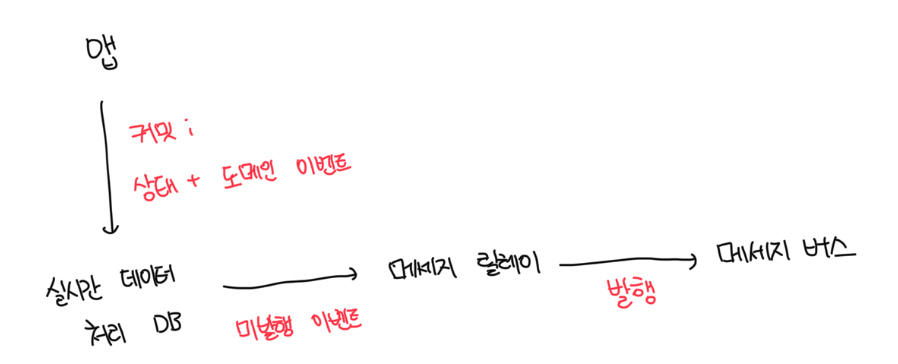
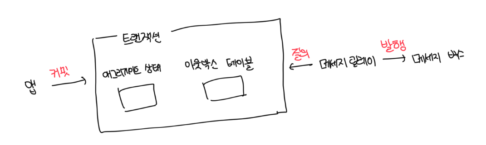
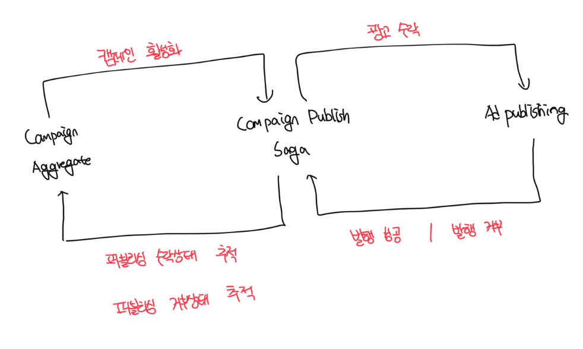
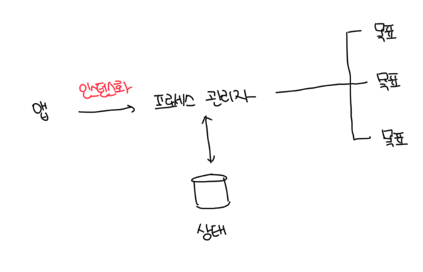
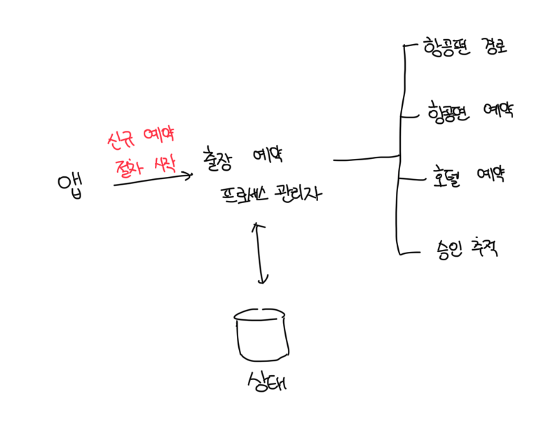

# 애그리게이트 연동

- 애그리게이트가 시스템의 나머지 부분과 통신하는 방법 중 하나는 `도메인 이벤트`를 발행하는 것임
- 외부 컴포넌트는 이러한 `도메인 이벤트`를 구독하고 해당 로직을 실행할 수 있음

<br>

# 이벤트 발행 프로세스에서 발생하는 실수들

### 첫번째 예시

- 애그리게이트에서 바로 도메인 이벤트를 발행하는것은 두 가지 이유로 좋지 않다
- 애그리게이트의 새 상태가 디비에 커밋되기 전에 이벤트가 발행됨
- 애그리게이트 로직으로 인해서 작업이 무효화되거나 단순히 디비의 기술적인 문제로 인해 디비 트랜잭션이 커밋되지 않으면 일관성이 깨짐

```ts
export class Campain {
  private readonly events: DomainEvent[] = [];
  private messageBus: IMesageBus;

  deactive(reason: string): void {
    this.locations.forEach((l) => l.deactive(reason));
    this.isActive = false;

    // 이벤트 인스턴스화
    const newEvent = new CampainDeactivated(this.id, reason);

    // 새로운 이벤트 추가
    this.events.push(newEvent);

    // 메세지 버스에 발행
    this.messageBus.publish(newEvent);
  }
}
```

<br>

### 두번째 예시

- 아래 예시는 트랜잭션 이벤트가 모두 성공하고 나서 이벤트를 발행하도록 개선되었다
- 하지만 여전히 트랜잭션이 커밋되고 나서 메세지 버스에 장애가 발생하면 일관성이 깨진다
- 이런 극단적인 경우를 대비해서는 `아웃박스 패턴`을 사용해서 해결이 가능하다

```ts
export class ManagementAPI {
  private readonly messageBus: IMessageBus;
  private readonly repository: ICampaignRepository;

  deactivateCampaign(id: CampaignId, reason: string): ExecutionResult {
    try {
      const campaign = this.repository.load(id);
      campaign.deactive(reason);
      this.repository.commitChanges(campaign);

      const events = campaign.getUnpublishedEvents();
      events.forEach((e) => this.messageBus.publish(e));

      campaign.clearUnpublishedEvents();
    } catch {
      // ...
    }
  }
}
```

<br>

# 아웃박스

### 아웃박스 알고리즘을 사용한 도메인 이벤트의 안정적인 발행 보장

- 업데이트된 애그리게이트의 상태와 새 도메인 이벤트는 모두 동일한 원자성 트랜잭션으로 커밋함
- 메세지 릴레이는 디비에서 새로 커밋된 도메인 이벤트를 가져옴
- 릴레이는 도메인 이벤트를 메세지 버스에 발행함
- 성공적으로 발행하면 릴레이는 이벤트를 디비에서 발행한 것으로 표시하거나 완전히 삭제함

<br>

#### 아웃박스 패턴



#### 아웃박스 테이블



<br>

### NoSQL을 사용하는 경우

- 다중 문서 트랜잭션을 지원하지 않는 NoSQL 디비를 사용하는 경우 전달된 도메인 이벤트는 애그리게이트 레코드에 포함되야함

```json
{
  "campaignId": "123",
  "state": {
    "name: "someName",
    "publising-state": "DEACTIVATED",
    "ad-locations": [ ... ]
  }
},
"outbox": [
  {
    "campaignId": "123",
    "type": "campaign-deactivated",
    "reason": "some reason",
    "published": false
  }
]
```

<br>

### 발행되지 않은 이벤트 가져오기

- 일반적으로 `풀` 기반 또는 `푸시` 기반 형식으로 새 도메인 이벤트를 가져올 수 있음

<br>

#### 풀: 발행자 폴링

- 발행되지 않은 이벤트에 대해서 디비를 지속해서 질의함
- 지속적인 폴링으로 인한 데이터베이스 부하를 최소화 할려면 적절한 인덱스가 있어야함

<br>

#### 푸시: 트랜잭션 로그 추적

- 디비의 기능을 활용해서 새 이벤트가 추가될 때마다 발행 릴레이 호출이 가능함
- 일부 RDBMS의 경우는 디비의 트랜잭션 로그를 추적해서 업데이트/추가된 레코드에 대한 알림 받는것이 가능함
- 일부 NoSQL의 경우는 커밋된 변경사항을 이벤트 스트림으로 노출하기도 함, 예시로는 DynamoDB Streams가 있음

<br>

### 사가

- 핵심 애그리게이트 설계 원칙 중 하나는 각 트랜잭션을 애그리게이트의 단일 인스턴스로 제한하는 것임
- 하지만 때로는 여러 애그리게이트에 걸쳐 있는 비즈니스 프로세스를 구현해야 하는 경우가 존재함
- 아래 예시는 동일한 애그리게이트 경계에 2개의 엔티티가 배치되었는데 이는 명백하게 잘못 설계된 경우임

<br>

#### 광고 캠페인 예시

- 광고 캠페인이 활성화되면 캠페인의 광고 자료를 퍼블리셔에게 자동으로 제출
- 퍼블리셔에게 확인을 받으면 캠페인의 발생 상태가 `발행됨`으로 변경
- 만약 거부한 경우 `거부됨`으로 변경

<br>

#### 사가란?

- 사가는 오래 지속되는 비즈니스 프로세스로 몇초에서 몇년까지 지속이 가능함
- 중요하게 봐야하는 것은 `시간 측면`이 아닌 `트랜잭션 측면`에서 봐야함
- 사가는 관련 컴포넌트에서 발생하는 이벤트를 수신하고, 다른 컴포넌트에 후속 커맨드를 실행하게됨



<br>

#### 상태관리가 필요하지 않은 사가(메세징 이벤트에 의존)

```ts
interface CampaignActivatedEvent {
  type: "CampaignActivated";
}
interface PublishingConfirmedEvent {
  type: "PublishingConfirmed";
}
interface PublishingRejectedEvent {
  type: "PublishingRejected";
}

type Event =
  | CampaignActivatedEvent
  | PublishingConfirmedEvent
  | PublishingRejectedEvent;

export class CampaignPublishingSaga {
  private readonly repository: ICampaignRepository;
  private readonly publishingService: IPublishingServiceClient;

  process(event: Event) {
    switch (event.type) {
      case "CampaignActivated":
        const campaign = this.repository.load(event.campaignId);
        const advertisingMaterials = campaign.getAdvertisingMaterials();
        this.publishingService.submitAdvertisement(
          event.campaignId,
          advertisingMaterials
        );
        break;
      case "PublishingConfirmed":
        // ...
        break;
      case "PublishingRejected":
        // ...
        break;
    }
  }
}
```

<br>

#### 상태 관리가 필요한 사가

- 사가는 이벤트 소싱 애그리게이트로 구현되어 수신된 이벤트와 실행된 커맨드의 전체 기록을 유지할 수 있음
- 그러나 커맨드 실행 로직은 도메인 이벤트가 아웃박스 패턴으로 전달하는 방식과 유사하게 사가 패턴에서 벗어나 비동기적으로 실행함

```ts
class CommandIssuedEvent implements IDomainEvent {
  constructor(
    public readonly target: Target,
    public readonly command:
      | SubmitAdvertisementCommand
      | TrackConfirmation
      | TrackRejection,
    public readonly campaignId: number
  ) {}
}

interface AdvertisingMaterial {
  // 광고 자료 관련 속성들...
}

// 메인 Saga 클래스
class CampaignPublishingSaga {
  constructor(
    private readonly repository: ICampaignRepository,
    private readonly events: IDomainEvent[] = []
  ) {}

  process(event: CampaignActivated): void;
  process(event: PublishingConfirmed): void;
  process(event: PublishingRejected): void;
  process(
    event: CampaignActivated | PublishingConfirmed | PublishingRejected
  ): void {
    if (event instanceof CampaignActivated) {
      this.processCampaignActivated(event);
    } else if (event instanceof PublishingConfirmed) {
      this.processPublishingConfirmed(event);
    } else if (event instanceof PublishingRejected) {
      this.processPublishingRejected(event);
    }
  }

  private processCampaignActivated(activated: CampaignActivated): void {
    const campaign = this.repository.load(activated.campaignId);
    const advertisingMaterials = campaign.generateAdvertisingMaterials();
    const commandIssuedEvent = new CommandIssuedEvent(
      Target.PublishingService,
      new SubmitAdvertisementCommand(
        activated.campaignId,
        advertisingMaterials
      ),
      activated.campaignId
    );

    this.events.push(activated);
    this.events.push(commandIssuedEvent);
  }

  private processPublishingConfirmed(confirmed: PublishingConfirmed): void {
    const commandIssuedEvent = new CommandIssuedEvent(
      Target.CampaignAggregate,
      new TrackConfirmation(confirmed.campaignId, confirmed.confirmationId),
      confirmed.campaignId
    );

    this.events.push(confirmed);
    this.events.push(commandIssuedEvent);
  }

  private processPublishingRejected(rejected: PublishingRejected): void {
    const commandIssuedEvent = new CommandIssuedEvent(
      Target.CampaignAggregate,
      new TrackRejection(rejected.campaignId, rejected.rejectionReason),
      rejected.campaignId
    );

    this.events.push(rejected);
    this.events.push(commandIssuedEvent);
  }
}
```

<br>

### 일관성

- 사가 패턴이 다중 컴포넌트의 트랜잭션을 조율하기는 하지만 관련된 컴포넌트의 상태는 궁극적으로 일관성을 가짐
- 애그리게이트 경계 내의 데이터만 강한 일관성을 가지고, 그 외부에 모든 것은 궁극적으로 일관성을 가짐
- 부적절한 애그리게이트 경계를 보상하기 위해 사가를 남용하지 않는 지침을 따르는것을 원칙으로 해야됨
- 동일한 애그리게이트에 속해야 하는 비즈니스 작업에는 강한 일관성을 갖는 데이터가 필요함

<br>

# 프로세스 관리자

- 프로세스 관리자 패턴은 비즈니스 로직 기반 프로세스를 구현하기 위한 것이다
- 이는 시퀀스의 상태를 유지하고 다음 처리 단계를 결정하는 중앙 처리 장치로 정의된다
- 일반적으로 사가에 올바른 동작 과정을 선택하는 `if-else`문이 있다면 아마도 프로세스 관리자일것이다
- 여러 단계로 구성된 응집된 비즈니스 프로세스로 단일 소스 이벤트에는 바인딩이 불가능하다
- 따라서 프로세스 관리자는 명시적으로 인스턴스화 해야한다



<br>

### 예시: 출장 예약 프로세스

```ts
class BookingProcessManager {
  private events: IDomainEvent[] = [];
  private id: BookingId;
  private destination: Destination;
  private parameters: TripDefinition;
  private traveler: EmployeeId;
  private route: Route;
  private rejectedRoutes: Route[] = [];

  constructor(private readonly routing: IRoutingService) {}

  initialize(
    destination: Destination,
    parameters: TripDefinition,
    traveler: EmployeeId
  ): void {
    this.destination = destination;
    this.parameters = parameters;
    this.traveler = traveler;
    this.route = this.routing.calculate(destination, parameters);

    const routeGenerated = new RouteGeneratedEvent(this.id, this.route);

    const commandIssuedEvent = new CommandIssuedEvent(
      new RequestEmployeeApproval(this.traveler, this.route)
    );

    this.events.push(routeGenerated);
    this.events.push(commandIssuedEvent);
  }

  process(event: RouteConfirmed): void;
  process(event: RouteRejected): void;
  process(event: ReroutingConfirmed): void;
  process(event: FlightBooked): void;
  process(
    event: RouteConfirmed | RouteRejected | ReroutingConfirmed | FlightBooked
  ): void {
    if (event instanceof RouteConfirmed) {
      this.processRouteConfirmed(event);
    } else if (event instanceof RouteRejected) {
      this.processRouteRejected(event);
    } else if (event instanceof ReroutingConfirmed) {
      this.processReroutingConfirmed(event);
    } else if (event instanceof FlightBooked) {
      this.processFlightBooked(event);
    }
  }

  private processRouteConfirmed(confirmed: RouteConfirmed): void {
    const commandIssuedEvent = new CommandIssuedEvent(
      new BookFlights(this.route, this.parameters)
    );

    this.events.push(confirmed);
    this.events.push(commandIssuedEvent);
  }

  private processRouteRejected(rejected: RouteRejected): void {
    const commandIssuedEvent = new CommandIssuedEvent(
      new RequestRerouting(this.traveler, this.route)
    );

    this.events.push(rejected);
    this.events.push(commandIssuedEvent);
  }

  private processReroutingConfirmed(confirmed: ReroutingConfirmed): void {
    this.rejectedRoutes.push(this.route);
    this.route = this.routing.calculateAltRoute(
      this.destination,
      this.parameters,
      this.rejectedRoutes
    );

    const routeGenerated = new RouteGeneratedEvent(this.id, this.route);

    const commandIssuedEvent = new CommandIssuedEvent(
      new RequestEmployeeApproval(this.traveler, this.route)
    );

    this.events.push(confirmed);
    this.events.push(routeGenerated);
    this.events.push(commandIssuedEvent);
  }

  private processFlightBooked(booked: FlightBooked): void {
    const commandIssuedEvent = new CommandIssuedEvent(
      new BookHotel(this.destination, this.parameters)
    );

    this.events.push(booked);
    this.events.push(commandIssuedEvent);
  }
}
```


