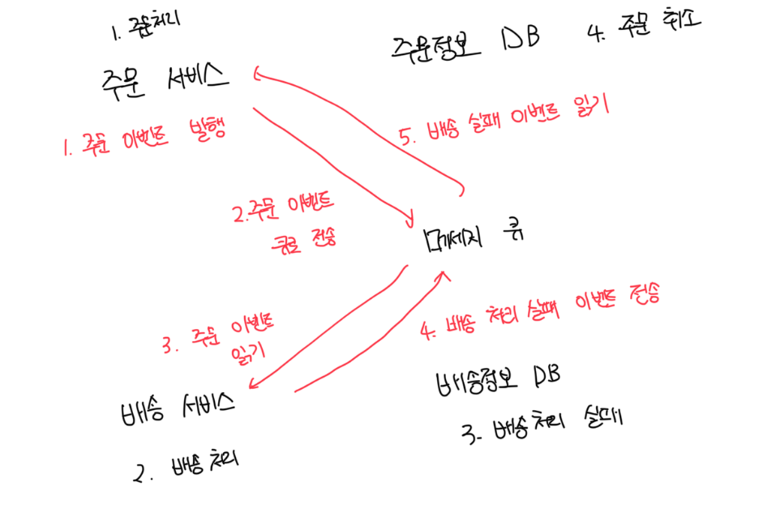

# 조직의 변화: 업무 기능 중심 팀

- 기존의 팀 구조는 하나의 앱을 만드는데 UI 팀, 서버팀, 디비팀 등 기술별로 팀이 나누어진것이 일반적임
  - 시스템도 이러한 의사소통 구조를 그대로 반영하고 팀 간 의사결정도 느리고 의사소통도 힘듬
- 마이크로서비스팀은 업무 기능 중심의 팀이어야함. 역할이나 기술로 분리되는게 아닌 업무 기능을 중심으로 다양한 사람이 하나의 팀이됨
  - 기획자, 디자이너, 프론트엔드, 백엔드 등 으로 구성되며 서비스의 A-Z를 위한 모든 단계의 역할을 갖추고있음
  - 마이크로서비스를 만드는 데 필요한 기능과 기술을 하나의 팀에서 모두 가지고있으므로 다른 팀과는 협력할 일이 적음

 

# 관리체계의 변화: 자율적인 분권 거버넌스, 폴리글랏

- 다기능 팀이 개발과 운영을 책임지는데 이는 `우리가 만들고, 우리가 운영한다`라는 뜻임
- 중앙의 강력한 표준이나 절차 준수를 강요하지 않고 빠르게 서비스를 만드는 것을 최우선 목적으로 두고 적용함

 

# 개발 생명주기의 변화: 프로젝트가 아니라 제품 중심으로

- 기존에는 대부분 앱 개발 모델이 프로젝트 단위였다
- 필요한 기술을 사용하는 인력들이 한시적으로 모여서 장기간 프로젝트 개발이후 운영 조직에 넘기는 방식으로 진행됬다. 즉 서로 분리되어있다
- 초기에 모든 일정을 계획하고 각 단계는 완료 데드라인이 있어 그 일정을 완료함으로써 최종 기능을 제공한다
- 마이크로서비스의 개발팀은 제품을 기능의 집합이 아닌 비즈니스를 제공하는 제품으로 바라본다
- 소프트웨어를 개발하는 방식에서 폭포수 모델, 빅뱅 방식이 아닌 `애자일` 개발 방식을 채용한다
- 계속 피드백을 받아서 지속적으로 변화, 개선되고 향상되는 존재다

 

# 개발 환경의 변화: 인프라 자동화

- 마이크로서비스는 독립적으로 배포되는데 수동 배포 방식은 바람직하지 않으며 여러개의 서비스를 빠르게 배포하는 방식이 필요하다
- 클라우드 인프라를 활용하면 이러한 단계를 빠르게 준비할 수있어서 개발 속도가 높아진다
- 이러한 과정을 `인프라 자동화`라고 하며 이는 마이크로서비스 개발 과정의 필수조건이 돼어야한다
- 최근에는 인프라 구성과 자동화를 마치 소프트웨어처럼 코드로 처리하는 방식인 `IaC`가 각광받고 있다

 

# 저장소의 변화: 통합 저장소가 아닌 분권 데이터 관리

- 모노리스 시스템은 단일 통합 디비를 사용하는데. 이는 과거 스토리지 가격 및 네트워크 속도에 따른 데이터의 안정성과 효율을 추구한 결과다
- 하지만 요즈음에는 스토리지 가격이 저렴하고 네트워크 대역폭이 매우 커졌기때문에 데이터를 억지로 꾸깃꾸깃 뭉쳐서 작은 공간에 넣을 필요가 없다
- 각 저장소는 서비스마다 디비를 갖도록 설계하며 서비스별로 분산되어있기 때문에 필요한 데이터에 접근을 위해서는 API를 통해서만 접근이 가능하다
- 데이터 일관성을 위해서 `2단계 커밋`같은 분산 트랜잭션 기법을 사용하는데 이러한 문제 해결을 위해 2개의 서비스를 단일 트랜잭션으로 묶는게 아닌 비동기 이벤트 처리를 통합 협업을 강조한다

 

### 마이크로서비스가 일관성을 확보하는 방법

- 마이크로서비스는 각 트랜잭션을 분리하고 `큐 매커니즘`을 이용해서 보상 트랜잭션을 활용하는 기법을 사용한다

 

# 위기 대응 방식의 변화: 실패를 고려한 설계

- 시스템은 언제든 실패할 수 있으며 실패해서 더는 진행할 수 없을때도 자연스럽게 대응할 수 있도록 설계해야 한다는 말임
  - 이는 `내결함성(fault tolerance)` 이라고 불림
- 다양한 실패에 대비해서 완벽히 테스트할 수 있는 환경을 마련해야 하고, 시스템의 실패를 감지하고 대응이 가능한 모니터링 체계도 갖춰야한다
-
