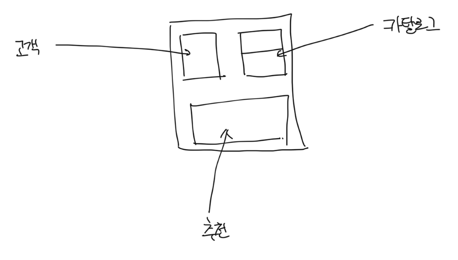
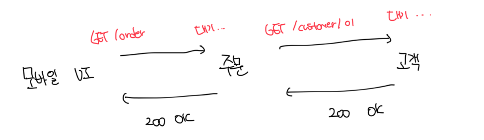
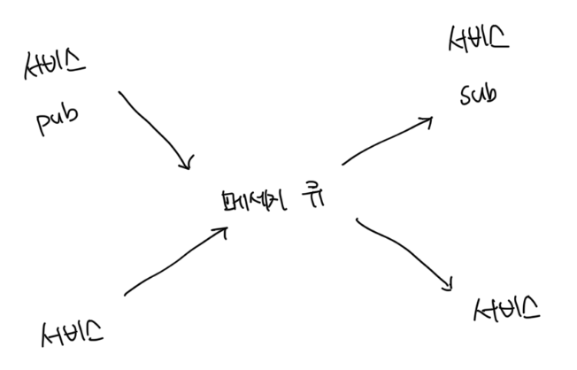
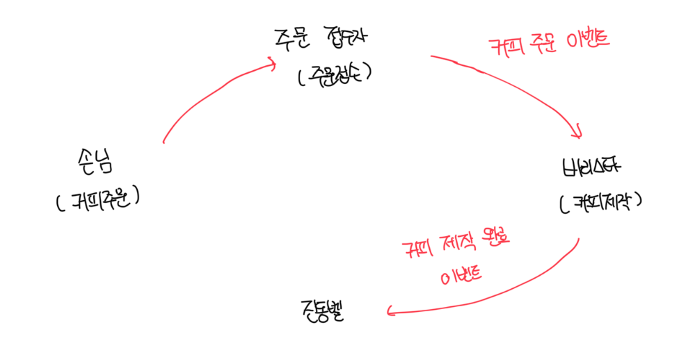
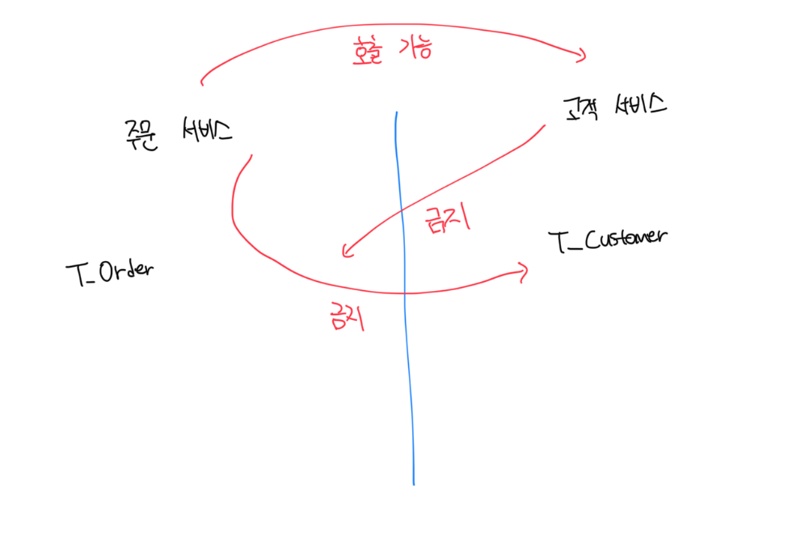
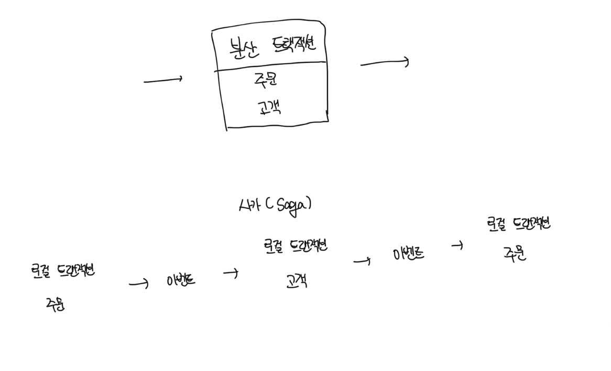
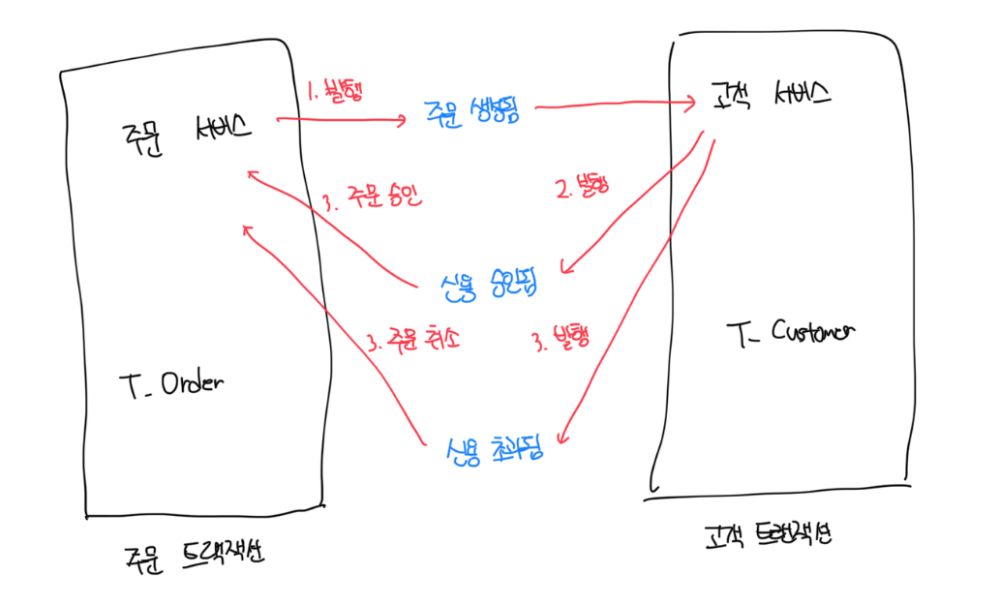
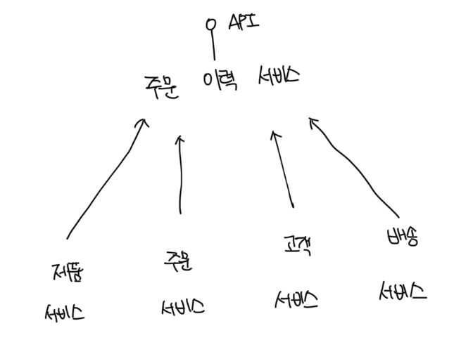
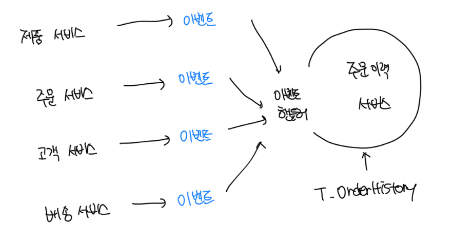
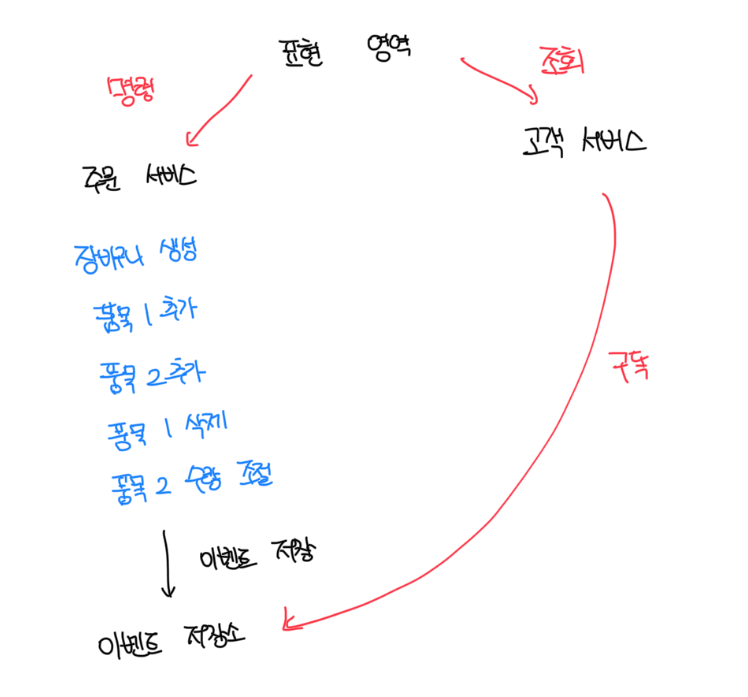

# 인프라 구성요소

- 마이크로서비스를 지탱하는 하부구조 인프라를 구축하는 데 필요한 구성요소로 하드웨어, 소프트웨어, 네트워크 등 모두 포함됨
- 클라우드 환경에서는 이러한 인프라 구성요소가 가상화됭서 제공된다

 

### 퍼블릭 클라우드와 베어메탈, 프라이빗 클라우드 환경

- 마이크로서비스를 베어메탈같은 서버에서 구동하는 경우 새로운 서비스가 올라갈때마다 장비 설정이 필요하다
- 이런 경우는 당연히 가상 인프라 환경을 검토할 필요가 있음
- MSA를 위한 베어메탈을 고려한다면 그것은 베어 메탈에 별도의 프라이빗 클라우드 환경을 구축하는걸 의미함
- 요즘은 모든 소프트웨어들이 상호 독립적이고 서로 호환되도록 유연한 구조로 만들어졌기 때문에 크게 환경에 대해서 신경쓰지 않아도 된다

 

### VM과 Container

- 2개의 큰 차이점은 `게스트 OS` 유무로 볼 수 있는데 게스트 OS를 사용하는 가상 머신은 OS 패치, 관련 라이브러리 설치 등 오버헤드가 지속적으로 발생함
- 마이크로서비스 같은 작은 서비스를 패키지하고 배포하기에는 컨테이너 환경이 더 적합함
- 대표적인 컨테이너 기술은 `Docker`가 존재하며 이는 레이어 단위의 이미지를 포개는 방식으로 구성됨
  - 기반 이미지 -> 이미지 레이어(OS) -> 이미지 레이어(런타임) -> 이미지 레이어(앱) 방식
- 가상머신의 대표적인 제품으로는 AWC EC2, Azure VM 등이 존재함

 

### 컨테이너 오케스트레이션

- 컨테이너 기술을 선택했다면 컨테이너를 관리하기 위한 기술 또한 필요함
- 대표적으로 `도커 스웜`, `아파치 메소스`, `쿠버네티스` 등이 존재하고, 요즘은 `쿠버네티스`가 제일 인기가 많다
- 쿠버네티스는 자동화된 자원 배정, 셀프 치유, 수평 확장 등 다양한 기능을 제공한다

 

### 기타 클라우드 인프라 서비스

- IaaS : AWS EC2, GCP Compute Engine, Azure VM 등
- CaaS : Azure Kubernetes Service, AWS Elastic Kubernetes Service, Google Kubernetes Engine 등
- PaaS : Azure Web App, Google App Engine, AWS Elastic Beanstalk 등

 

# 마이크로서비스 운영고 관리를 위한 플랫폼 패턴

- 앱이 실제로 구동되는 인프라 환경을 결정했다면 다음은 선택한 인프라 환경 위에서 앱을 운영하고 관리하는 환경을 구성하는 방법을 생각해야함
- 특이 앱을 빌드하고 인프라에 배포할 수 있는 환경이 중요함
- MSA 시스템을 구성하는 수많은 마이크로서비스를 수동으로 빌드하고 배포한다면 비효율적이고 큰 혼란을 가져옴

 

### 개발 지원 환경: 데브옵스 인프라 구성

- 마이크로서비스를 빌드하고 테스트한 뒤 배포할 수 있게 도와주는 개발 지원 환경인 `데브옵스` 환경이다
- 개발과 운영을 병행 가능하게끔 높은 품질로 소프트웨어를 빠르게 개발하도록 지원하는 빌드, 테스트, 배포를 위한 자동화 환경을 뜻함
- 자동화된 빌드나 배포 작업을 CI/CD라고 부른다
- 자동으로 테스트하고 그 결과를 리포트로 기록하는 활동을 `CI`, 실행 환경에 내보내는 활동을 `CD`라고 부른다

 

### 빌드/배포 파이프라인 설계

- 빌드/배포 과정동안 수행되어야 하는 태스크가 정의된 것을 `빌드/배포 파이프라인` 이라고 부른다
- 즉 통합 및 배포까지 이어지는 일련의 프로세스를 하나로 연계해서 자동화하고 시각화된 절차로 구축하는것을 뜻한다
- MSA의 경우는 별도의 레포지토리를 가지는 경우 독립적으로 수정 및 빌드하고 배포가 필요하므로 각각 다르게 설계가 필요하다

 

### 마이크로서비스 생태계와 운영 관리 요소의 탄생

- 넷플릭스는 기존 하나의 모노리스에서 클라우드 기반 마이크로서비스로 이전을 선택함
- 그 과정에서 넷플릭스 OSS를 개발하고 증명하기 위해서 이를 오픈소스로 공개함
- 계속해서 Docker 라는 컨테이너 기술이 등장하고 마이크로서비스는 더 발전하게됨

 

### 경험으로 획득한 지혜: 마이크로서비스 관리/운영 패턴

- 넷플릭스는 마이크로서비스를 개발하면서 겪었던 문제들을 `넷플릭스 OSS`로 만들고 이를 오픈소스로 공개함
- 여기에는 API 게이트웨이, 서비스 디스커버리, 모니터링, 트레이싱 등 다수의 요소가 포함됨
- 스프링 진영의 `Pivotal`에선 이를 `스프링 클라우드` 라는 `넷플릭스 OSS`를 스프링 프레임워크로 감싼 오픈소스로 공개함

 

### 스프링 클라우드: 스프링 부트 + 넷플릭스 OSS

- 모든 파이크로서비스는 인프라에 종속되지 않고 DB, 파일 등에 저장돤 환경 정보를 형상관리 시스템에 연결된 `Config Service`에서 가져옴
- 로딩과 동시에 `서비스 레지스트리`에 자신의 서비스명과 클라우드 인프라로 부터 할당받은 물리 주소를 등록함
- 클라이언트는 `API 게이트웨이`를 통해서 마이크로서비스에 접근하고, 이 떄 API 게이트웨이는 적절한 라우팅 및 부하분산을 수행함
  - 동시에 이는 각 서비스에 접근 가능한 권한이 있는지도 검사함
- 이러한 모든 마이크로서비스 간 호출은 `모니터링`, `추적` 서비스에 의해서 모니터링되고 추적됨

 

### 다양한 서비스 등록 및 탐색을 위한 서비스 레지스트리, 서비스 디스커버리 패턴

- 클라이언트 입장에서 여러개의 마이크로서비스 호출을 위해서는 최적 경로를 찾아주는 라우팅 기능과 부하분산을 위한 로드밸런싱 기능이 필요함
- 넷플릭스를 기준으로는 라우팅은 `줄`이 담당, 로드밸런싱은 `리본`이 담당함
- 최적의 경로를 찾기 위해서 서비스 명칭과 IP를 등록하는데 이는 `서비스 레지스트리 패턴`이라고 부르며 `유레카`가 그 기능을 담당함
- 모든 마이크로서비스의 이름과 매핑된 IP주소를 가지며 처음 가동될때 저장하고 종료되면 삭제함

 

### 서비스 단일 진입을 위한 API 게이트웨이 패턴

- 클라이언트 입장에서 여러개의 마이크로서비스를 호출할 때 각 개별로 호출하는게 아닌 단일 `API 게이트웨이`를 바라봄
- 라우팅, 로드 밸런싱, 인증/인가 등 다양한 기능을 담당하고 각 호출은 올바른 서비스로 트래픽이 전달됨
- 다른 클라우드 플랫폼에서도 비슷한 기능을 제공하는데 쿠버네스트의 경우 `쿠버네티스 서비스`와 `인그레스 리소스`로 제공함

 

### BFF 패턴

- PC 뿐만 아니라 다양한 디바이스 지원이 필요한데 각 클라이언트마다 특화된 처리를 위해서 API를 조립하는 방법을 BFF라고 부름
  - BFF: Backend for Frontend
- 이전의 API 게이트웨이랑 다르게 그 앞단에 클라이언트를 위한 서버가 존재하고 해당 서버에서는 API 게이트웨이를 호출함
- 모바일에 특화된 API, TV에 특화된 API 등 별도로 제공이 가능한 장점이 있음

 

### 외부 구성 저장소 패턴

- 마이크로서비스가 사용하는 자원의 설정 정보를 쉽고 일관되게 변경 가능하도록 관리해주는 패턴
- `컨피그 원칙`이란게 존재하는데 이러한 환경변수는 각 배포되는 환경마다매번 달라지므로 코드와는 환전히 분리해야 한다는 원칙임
- 즉 특정한 배포 환경에 종속된 정보를 코드에 두면 안된다는 원칙임
- 컨피그 서비스는 특정 환경에 배포될 때 적절한 환경 정보를 형상관리 레포지토리에서 가져와서 해당 서비스에 주입함
- 대표적으로 `Spring Config`, `Kubernetes ConfigMap` 등이 존재함

 

### 인증/인가 패턴

- 각 서비스가 모두 동일한 인증/인가를 중복으로 구현한다면 이는 매우 비효율적임

 

#### 중앙 집중식 세션 관리

- 기존 모노리스 방식에서 가장 많이 사용했던 방식으로 서버 세션에서 사용자의 정보를 모두 저장하고 앱의 인증/인가를 판단하는 방식
- 사용량에 따라서 수평적 확장에 따른 로드밸런싱이 발생할 수 있어서 세션 데이터가 손실될 수 있음
- 이를 위해서 각자의 서비스 내부에 세션을 저장하지 않고 `Redis`, `Memcached` 등을 사용해서 세션을 중앙에서 관리함

 

#### 클라이언트 토큰

- 세션은 중앙 서버에 저장, 토큰은 사용자의 브라우저에 저장됨
- 매번 서버로 요청시마다 토큰을 전달하고 이를 분석하여 접근 허용/거부를 판단함
- 대표적인 규격으로는 `JWT`가 있음

 

#### API 게이트웨이를 사용한 클라이언트 토큰

- 클라이언트 토큰과 거의 유사한데 차이점은 API 게이트웨이가 외부 요청의 입구로 추가됨
- 인증/인가를 처리하기 위한 별도의 서비스를 만들어서 다른 서비스의 인증/인가 책임을 위임할 수 있음
- 이러한 서비스는 `인증 서비스`라고 부르며 API 게이트웨이와 연계해서 인증/인가를 처리하게됨

 

### 장애 및 실패 처리를 위한 서킷 브레이커 패턴

- 여러 서비스로 구성되는 경우 한 서비스의 장애가 다른 서비스에도 영향을 끼칠수도 있는데 이를방지하는 방법이 `서킷 브레이커` 패턴임
- 특정 서비스에서 장애가 감지되면 다른 서비스로 전이되지 않게 하는 방법임
- `fallback method` 정의를 통해서 장애가 발생했을 때 해당 메소드가 자연스럽게 처리를 진행하게됨

 

### 모니터링과 추적 패턴

- 서킷 브레이커 패턴을 가능하게 하려면 각 마이크로서비스의 장애를 실시간으로 감지해야하고 서비스간 호출이 어떤지 알아야함
- 스프링 클라우드는 이를 위한 `히스토리 대시보드`를 제공하주며 각 요청이 자치하는 트래픽을 시각화해줌
- 분산 트레이싱 서비스도 존재하는데 이는 각 서비스의 트랜잭션 호출을 추적해줌. 이는 마이크로서비스 운영에 매추 유용함
- 대표적으로 트위터에서 공개한 `Zipkin` 이라는 오픈소스가 존재함

 

### 중앙화된 로그 집계 패턴

- 로그는 `스트림`으로 처리하는게 좋은데 이는 로그의 시작/끝이 고정된게 아닌 서비스가 실행되는 동안 계속 흐르는 흐름이라는 뜻임
- 로그를 전달 및 저장하는 매커니즘 자체는 특정 기술이나 인프라에 의존할수밖에 없으며 만약 직접 구현한다면 유연성이 떨어짐
- 대표적으로 `ELK` 스택이 존재하는데 이는 로그 수집, 변환, 시각화를 처리해준다
- 각 마이크로서비스에서 `Logstash`를 통해 변환한 데이터를 중앙 Redis에 저장하고 이를 ElasticSearch에 전달함
  - 이 때 Redis가 존재하는 이유는 바로 로그 저장소에 보낼수는 있지만 로그 스트림이 몰리면 로그 저장소 서비스의 부하때문에 둔것이다

 

### 서비스 메시 패턴

- 기존 `넷플릭스 OSS` or `Spring Cloud`를 사용하면 언어가 자바에 종속되기 때문에 언어의 강제성이 존재했다
- 하지만 요즘은 MSA 영억 문제해결을 위한 기능을 비즈니스 로직과 분리해서 네트워크 인프라 계층에서 수행하게 하는 `서비스 메시` 패턴이 선호되고있다
  - 이는 인프라 레이어로서 서비스 간 통신을 처리하고 앞에서 언급한 여러 문제 해결 패턴을 포괄하고있다
- 구글의 `istio`는 앱이 배포되는 컨테이너에 완전히 격리되어 별도의 컨테이너로 배포되는 `사이드카 패턴`을 적용해서 MSA 영역 문제해결을 위한 기능을 제공한다
-

 

# 어플리케이션 패턴

- 위 요소들이 마이크로서비스를 위한 인프라 구성요소와 MSA 관리 운영 패턴이였다면 앱 패턴은 실제로 개발자가 구현해야하는 패턴이다
- 마이크로서비스의 구성과 관계를 설게할 떄도 마찬가지로 유연성과 확장성, 독립성 등을 염두에 두고 설계가 필요하다

 

### 프론트엔드를 구성하는 패턴

- 가장 간단한 방법은 모노리스 방식으로 통째로 배포하는 것이다
- 모노리스 프론트엔드는 백엔드의 여러 API를 호출하고 조합한 후 화면으로 구성해서 보여주게된다
- 하지만 이런 경우는 마이크로서비스 기반 시스템의 장점인 서비스의 독립적인 변경과 배포가 불가능해진다
- 결국 기존 백엔드의 모노리스에서 겪었던 문제를 프론트엔드도 똑같이 겪는다는 문제가 발생한다

 

### UI 컴포지트 패턴 또는 마이크로 프론트엔드

- 프론트엔드도 백엔드 마이크로서비스처럼 기능별로 분리하고 이를 조합하기 위한 `프레임` 형태로 부모 창을 통해 각 프론트 엔드를 조합하고 동작한다
- 부모는 서비스에 대한 틀만 가지고있으며 실제 각 기능 표현은 마이크로 프론트엔드 조각이 구현하게 된다
- 이러한 마이크로 프론트엔드들은 비즈니스 구현을 위해서 여러 개의 백엔드 마이크로서비스 API를 호출하게 되는 방식이다

 

### 마이크로서비스 통신 패턴 - 동기 통신 방식

- 기본적인통신 방법이며 다양한 클라이언트 채널 연게나 라우팅 및 로드 밸런싱을 원활하게 하기위한 방법으로 중간에 API 게이트웨이를 둘 수 있음
- 하지만 이러한 구조는 서비스 - 서비스간 연계가 강제되며 장애가 연쇄적으로 발생할수도 있음
- 결국 의존관계가 높다는 것을 의미하는데 이것은 독자적인 마이크로서비스별로 비즈니스 기능 처리를 어렵게 만듬
- 장애의 파급 효과 및 의존 관계를 낮추기 위해서는 다른 통신 방법이 필요함

 

### 마이크로서비스 통신 패턴 - 비동기 통신 방식

- 동기식 호출 방식처럼 응답을 기다리지 않고 메세지를 보내고나서 다음 응답을 처리함
- 보낸 결과가 어떻게 되었는지 응답을 받지는 않아서 동기식처럼 완결성 보장은 불가능한데 이를 보장하기 위한 매커니즘으로 메세지 큐를 사용함

 

### 비동기 방식의 이벤트 기반 아키텍쳐

- 비동기 통신 방식을 이용해서 느슨한 연게를 지향하는 아키텍쳐가 있는데 이를 이벤트에 반응한다고 해서 `이벤트 기반 아키텍쳐`라고 부른다
- 이벤트는 `상태의 변화`를 의미하고 순차적으로 발생하는게 아닌 어떤 상태의 변경에 대한 반응한다는 점이 차이점임
- 이러한 특성은 이벤트 생산 및 처리에 대한 모듈을 분리하고 상호 독립적으로 동작하게 함으로써 병렬 처리를 촉진하게됨
- 이벤트 기반의 아키텍처 + 비동기 통신 매커니즘을 함꼐 사용하는 마이크로서비스를 `이벤트 기반 마이크로서비스`라고 부름

 

### 저장소 분리 패턴

- 기존 모노리스 방식은 1개의 데이터베이스에만 의존하고 SQL을 통해서 일부 로직을 처리하는 경우도 존재한다.
  - 이런 경우는 서비스가 확장되거나 비즈니스 로직이 특정 벤더사에 종속되므로 변경과 확장이 어려워진다
- `저장소 분리 패턴`은 각 마이크로서비스는 각자의 비즈니스를 처리하기 위한 데이터를 직접 소유한다는 것을 의미한다
- 얻는 장점으로는 각 서비스는 자신이 소유한 데이터를 외부에 노출하지 않고 오직 API를 통해서만 노출하게된다
- 궁긍적으로 이러한 제약이 데이터를 통한 변경의 파흡 효과를 줄여서 서비스를 독립적으로 만들어주게 된다

 

### 분산 트랜잭션 처리 패턴

- 대표적인 방법으로는 여러개의 분산된 트랜잭션을 하나로 묶는것인데 이는 지원하지 않는 DB도 존재하며 각 서비스에 잠금으로 인해 성능이 저하된다
  - 해당 방법은 `2단계 커밋` 이라고 부른다
- 마이크로서비스의 독립적인 분산 트랜잭션 처리를 지원하는 패턴이 바로 `사가 패턴`인데 이는 각 서비스의 로컬 트랜잭션을 순차적으로 처리하는 패턴이다
- 사가 패턴은 분산된 트랜잭션을 하나로 묶지 않고 각 로컬 트랜잭션과 보상 트랜잭션을 이용해서 비즈니스 및 데이터의 정합성을 맞추게된다
- 즉 일관성 유지가 필요한 트랜잭션을 하나로 처리하지 않고 각 로컬 트랜잭션으로 분리하고 순차적으로 처리한다
- 트랜잭션이 실패한 경우는 이전 로컬 트랜잭션이 작성한 변경사항을 취소하는 일련의 보상 트랜잭션을 통해서 비즈니스 처리의 일관성을 유지하게된다

 

#### 사가 패턴 사례

 

#### 데이터 일관성에 대한 생각의 전환: 결과적 일관성

- 모든 앱에는 비즈니스 처리를 위한 규칙이 존재하고 이러한 비즈니스 규칙을 만족하도록 데이터 일관성이 유지되어야함
- 이전까지는 이러한 일관성이 100% 일치해야 한다는게 일반적이지만 과연 모든 비즈니스 규칙들이 실시간으로 안정성을 맞춰야될까란 문제가 존재함
- 잘 생각해보면 모든 비즈니스 처리가 반드시 실시간성을 요구하는 것은 아니다
  - 대표적으로 블랙 프라이데이에 쇼핑몰을 생각하면 모든 작업보다는 주문을 많이 받아놓는것이 1순위다
- 모든 데이터의 일관성이 실시간으로 맞지 않더라도 어느 일정 시점이 됬을 때 일관성을 만족해도 되는것이 있는데 이러한 개념을 `결과적 일관성`이라고 부른다
  - 이러한 개념은 서비스의 고가용성을 극대화 시켜준다
- 이처럼 이벤트 기반 아키텍쳐와 메세지 브로커, 사가 패턴으로 비즈니스 정합성을 결과적으로 보장이 가능하며 비즈니스 및 시스템 가용성 극대화가 가능하다

 

### 읽기와 쓰기 분리: CQRS 패턴

- 서비스의 성능 향상을 위해서 인스턴스를 스케일 아웃해서 여러개로 실행한 경우는 데이터 IO로 인한 리소스 교착상태가 발생할수도 있다
- 이러한 문제를 해결하기 위한 방법으로 `CQRS`가 존재하는데 이는 `명령`과 `조회`를 나누어서 처리하게된다
- 하나의 저장소에 읽기/쓰기 모델을 분리도 가능하고 아예 물리적으로 쓰기 트랜잭션용과 조회용 저장소도 따로 분리가 가능하다
- 이처럼 쓰기/조회 전략을 각각 분리하면 시스템의 부하를 줄이고 조회 대기 시간을 줄이는 등 엄청난 이점을 누릴 수 있다
- 이 때 주의할 점은 명령 API에서 실행한 결과물은 이벤트를 통해서 조회 저장소에 반영해야한다
  - 해당 방식은 실시간으로는 데이터가 불일치 할수도있지만 결국 어느 시점이 되면 일치하게 되는데 결국 이는 `결과적 일관성`을 추구하게된다

 

### API 조합과 CQRS

- 마이크로서비스의 저장소가 각 서비스에 격리되어있고 각기 다른 기능을 구현했을 떄 여러개의 마이크로서비스를 연계해서 서비스를 제공하는 경우가 존재한다
- 이런 경우는 `API 조합`을 통해서 제공하거나 `CQRS`를 통해서 제공하는 방법이 존재한다

 

#### API 조합

- 하위 서비스는 각각 독립적인 API를 제공하고 연계 API를 위해서 상위 서비스에 정보를 제공함
- 하지만 이러면 상위 서비스가 하위 서비스에 의존하는 결과를 초래하고 하위 서비스 중 하나만 바뀌어도 상위 서비스도 바뀌어야하는 문제가 존재함

 

#### CQRS

- 먼저 `주문 이력 서비스`는 족자적인 저장소를 갖도록 만들고 주문 이력에 세세한 원천 정보를 가지는 각각의 서비스도 독자적으로 보유하게 만든다
- 이러한 원천 정보를 보유한 여러 마이크로서비스는 자신의 서비스의 정보가 변경되는 시점에 변경 내역을 각자의 변경 이벤트로 발행하게된다
- `주문 이력 서비스`는 이러한 이벤트를 수신하면 자신의 저장소에 반영하게되는데 최종적으로는 일관성을 맞추고 주문 이력을 제공할 수 있게된다
- 즉 조회용 서비스를 별도로 만들어서 API 조합의 단점인 직접적인 의존성을 줄일수도 있다

 

### 쓰기 최적화: 이벤트 소싱 패턴

#### 사가 및 CQRS의 문제점

- 비즈니스 불일치를 피하기 위해서는 저장소에 저장과 메세지를 보내는 것이 원자성을 지녀야함
- 하지만 상태의 변화를 이벤트로 발행하고 다시 저장소에저장하는 경우 SQL로 변환이 필요해서 느리고 까다로움

 

#### 일반적인 방법

- 일반적인방법은 비즈니스 처리 수행 중 항상 처리상태의 결괏값을 계산하고 데이터의 최종 상태를 확정해서 저장하는 방식으로 진행됨
- 객체의 상태 변경에 따라서 데이터 모델로 처리되고 최종값이 반영되어야 하는데 이러한 과정은 복잡해지고 느릴수밖에 없음
- 객체 상태를 데이터 모델에 맞춰서 계산하지 않고 상태 트랜잭션 자체를 저장하는 방식을 `이벤트 소싱 기법` 이라고 부름

 

#### 이벤트 소싱 기법

- 메세지 브로커와 데이터 저장소를 분리하지 않고 하나로 사용이 가능함
- 변환 등 복잡한 과정이 없어서 쓰기속도가 훨씬 빠름
- 현재 시점의 상태가 필요한 경우는 상태의 출발점으부터 모든 기록된 상태 변경 트랜잭션을 순차적으로 계산함
- 명령 측면과 조회의 측면에서 CRUD를 전부 구현하지 않고 CR만 구현해도 처리가 가능함
- 이후에 조회 시 축적된 트랜잭션을 바탕으로 상태를 계산해서 구성하게됨
- 이는 이벤트 디비의 역할 뿐 아니라 메세지 보러커처럼 작동하게됨. 인프라 복잡성을 줄이고 특히 쓰기 성능 최적화가 가능함

