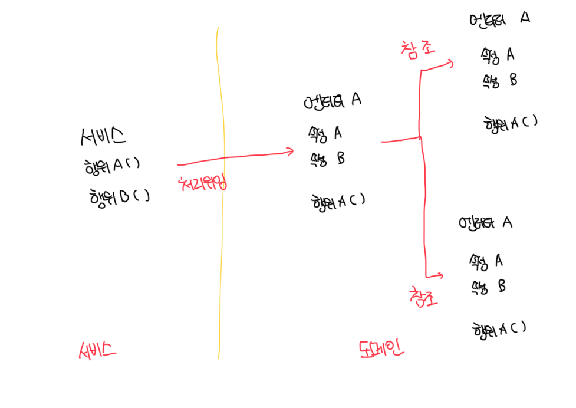
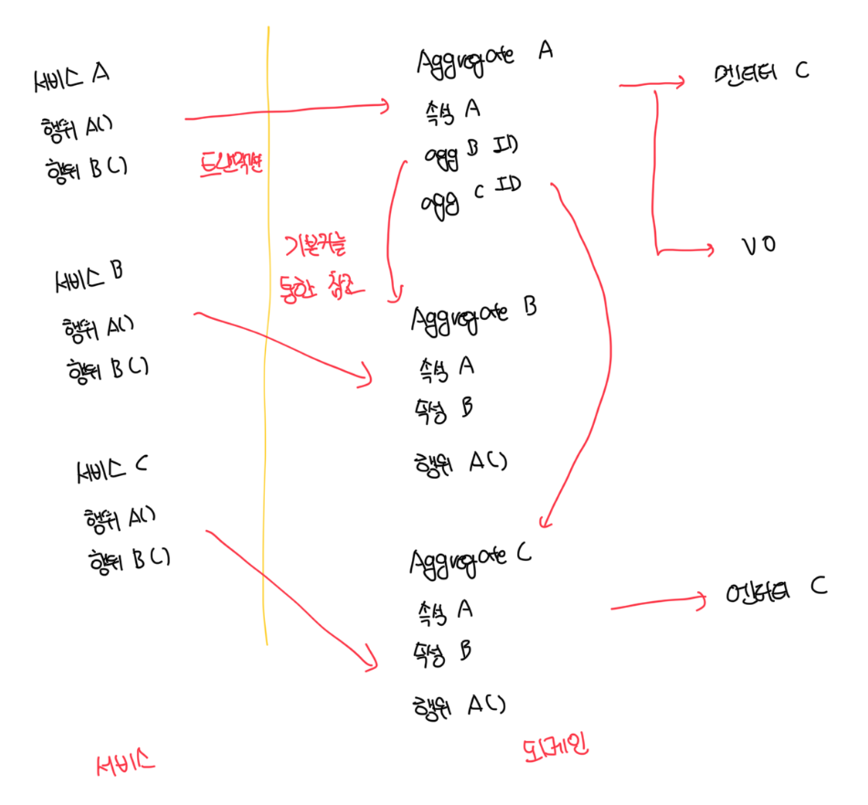

# 바람직한 마이크로서비스의 내부 아키텍쳐: 클린 마이크로서비스

- 내부 구조를 정의할 때 반드시 고려해야 할 한 가지는 마이크로서비스 시스템에서 정의해야 할 마이크로서비스의 내부 구조는 다양할 수 있다는 점이다
- 이러한 이유는 마이크로서비스는 자율적인 마이크로서비스 팀에 의한 `폴리글랏`한 내부 구조를 가질 수 있기 때문이다
- 마이크로서비스에서 각 서비스는 각기 목표와 활용도에 따라서 명확하게 분리되어야 하고, 각 서비스의 목적에 따라 적절한 개발 언어 및 저장소와 내부 아키텍쳐를 정의하는 것이 바람직하다
- 조회나 아주 간단한 기능의 경우는 헥사고날 또는 클린 아키텍쳐를 고수할 필요가 없다. 복잡한 경우는 사용하는게 좋다
- 내부 영역에는 또 다른 인터페이스가 있는데 이는 저장소 처리를 위한 인터페이스로 `Repository`라고 불린다
  - 이는 외부가 아닌 내부에 정의하는데 비즈니스를 처리하는 데 필요한 기본적인 저장소 처리 사항을 추상화해서 정의한다
- 외부에는 저장소 처리뿐 아니라 다양한 인/아웃바운드를 처리하는 어댑터가 위치한다
  - REST API 처리, 이벤ㅌ, 프록시, 메세지 컨슈머 등이 존재한다
  - 모든 아웃바운드 어댑터는 DIP 원칙을 적용해서 외부 영역에서 내부 영역에 의존하도록 설계한다

 

# 내부 영역 - 업무 규칙

- 서비스와 도메인은 클린 아키텍처의 우스케이스와 엔티티의 역할과 같다
- 도메인은 비즈니스 개념을 표현하고 서비스는 도메인을 활용해서 시스템 흐름 처리를 수행함

 

### 트랜잭션 스크립트 패턴

- 트랜잭션 스크립트 패턴은 비즈니스 개념을 표현하는 도메인 객체가 행위를 가지고있지 않음
- 모든 비즈니스 행위, 즉 무엇인가를 수행하는 책임은 서비스에 달려있음
- 시간이 지날수록 서비스가 비대해지고 도메인 정보는 점점 정보 묶음의 역할만 수행하게 될뿐임
- 서비스는 곧 유스케이스이며, 유스케이스가 비슷할수록 중복된 코드가 계속 생겨날수도 있음. 이는 유지보수를 어렵게함
- 절차식 프로그래밍과 유사하기 때문에 쉽게 접근이 가능하고 기존 디비 중심 아키텍쳐인경우 더더욱 쉬움
- 하지만 비즈니스가 복잡해지는 경우 서비스 코드의 양이 점점 증가하고 디비 중심 아키텍쳐에서 겪었던 문제를 만나기 쉬움
- `간단한 비즈니스를 처리할때만 적용하는게 좋은 패턴`임

 

### 도메인 모델 패턴

- 도메인 객체가 디비뿐만 아니라 비즈니스 행위를 가지고 있으며 도메인 객체가 소유한 데이터는 도메인 객체가 제공하는 행위에 의해 은닉됨
- 도메인 객체는 각 비즈니스 개념 및 행위에 대한 책임을 수행, 서비스는 비즈니스 유스케이스를 구현하기 위해 서비스의 행위를 도메인 객체부분에 일부 위임하여 처리함
- 서비스의 책임들이 도메인으로 적절히 분산되어서 서비스가 비대해지지 않고 서비스 메소드는 단순해짐
- 여기서 더 진화해서 도메인 주도 설계의 애그리게이트 패턴을 적용할 수 있는 구조가됨
- 객체지향에 대한 경험과 역량이 필요하고 복잡한 비즈니스 로직이 많은 마이크로서비스 구조로 선택하는것이 좋음

 

### 도메인 주도 설계의 애그리게이트 패턴

- 루트 엔티티를 를 중심으로 개념의 집합을 분리한 패턴
- 애그리게이트 패턴에서는 애그리게이트를 한 단위로 일관되게 처리하기 위해서 일부 규칙을 부여함
  - 애그리게이트 루트만 참조 하고함
  - 애그리게이트 내부 상세 클래스를 바로 참조하지 않고 루트를 통해서만 참조해야함, 수정시에도 마찬가지임
  - 애그리게이트 간 참조는 객체를 직접 참조하는 대신 기본키를 통해서 참조해야함
  - 하나의 트랜잭션으로 하나의 애그리게이트만 생성 및 수정을 진행함

 

# 외부 영역 - 세부사항

- 외부 영역은 인바운드 어댑터와 아웃바운드 인터페이스를 구현하는 다양한 어댑터로 구성함
- 즉 내부 영역이 먼저 정의된 후 외부 영역의 세부사항은 늦게 정의돼도 상관없도록 해야함

 

### API 퍼블리싱 어댑터

- REST API를 발행하는 인바운드 어댑터, 내부 영역의 서비스 인터페이스를 호출해서 REST 형식의 API로 제공해줌
- 이 떄 엔티티를 직접 제공하는게 아닌 API의 필요에 맞는 DTO를 생성해서 엔티티를 변환 및 매핑해서 전달하는것이 좋음

 

### API 프록시 어댑터

- 다른 서비스의 API를 호출하는 아웃바운드 어댑터로 내부 영역에 정의된 프록시 인터페이스를 구현함
- 다른 서비스의 API는 REST 일수도, SOAP 일수도 있으니 기술에 맞는 적절한 통신 방법을 구현해야함

 

### 저장소 처리 어댑터

- 트랜잭션 스크립트의 경우는 SQL 매핑 방식을 주로 사용하고, 도메인 모델 패턴의 경우는 ORM 매핑 방식을 주로 사용함
  - 이는 자유롭게 선택 가능
- 복잡한 쿼리가 많이 사용되는 경우 ORM 보다는 SQL이 더 유연하고 좋음

 

### 도메인 이벤트 발행 어댑터

- 도메인에서 발생하는 이벤트는 `주문됨`, `주문 취소됨` 같은 명칭으로 구현되고 컨슈머에게 전달되기 위해 도메인 이벤트 발행 어댑터를 통해 발행됨
- 애그리게이트 패턴의 경우 도메인 이벤트는 애그리게이트에서 발생한 사건이 됨
- 실제 이벤트 생성은 내부에서 진행되며, 도메인 이벤트 발행 어댑터는 내부 영역의 이벤트 인터페이스를 통해 아웃바운드로 특정 메세지 큐 또는 스트림 저장소에 발행하는 역할을 수행함

 

### 도메인 이벤트 핸들러

- 도메인 이벤트 발행 어댑터가 있다면 당연히 수신할 수 있는 인바운드 어댑터도 필요함
- 도메인 이벤트 핸들러는 외부에서 발행된 도메인 이벤트를 구독해서 내부 영역으로 전달하는 역할을 수행함
