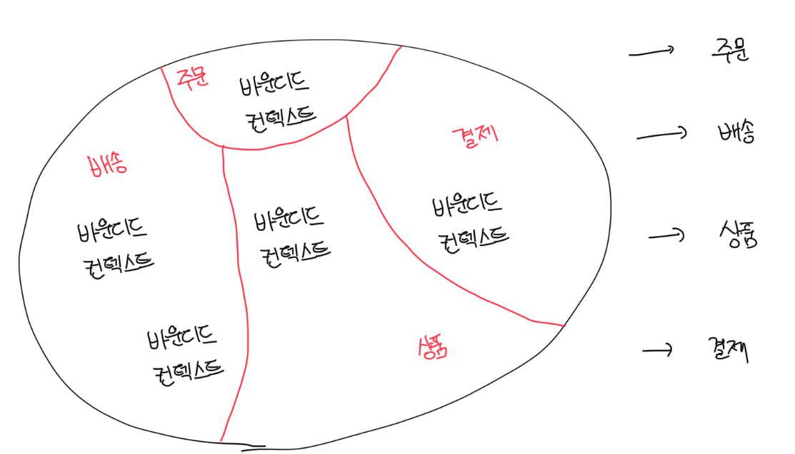

# 모듈화

- 모듈화의 근본적 가치는 각 모듈을 기능적으로 응집성 높게 만들고, 기능이 타 모듈 간으 의존도를 낮추는 것임
- 동일하게 마이크로서비스 설계에서도 가장 중요한 관심사도 어떻게 기능적으로 응집성 있는 마이크로서비스를 도출하고 타 서비스간 의존도를 낮출것인가임
- 내부 구조를 구성하는 각 요소들도 모듈화가 되어야하고 응집성있고 서로 의존성이 낮은 모듈들이 모여 마이크로서비스를 이뤄야함
- DDD의 전략적 설계와 전술적 설계는 이를 위한 적절한 가이드를 준다

 

# 비즈니스 능력에 근거한 도출

- 비즈니스 부서가 가진 역할, 처리 능력을 체게적으로 분해할 수 있으며 보통 이를 `업무 기능 분해`라고 부름
- `업무 기능 분해`는 업무 흐름에 따라 업무를 최상위에서 하위까지 대, 중, 소의 크기로 분리하고 수행하는 일들을 체게적으로 정렬함
- 이는 직관적으로 서비스 식별이 가능하지만 대, 중, 소의 분류 중 어떤 레벨을 서비스로 식별해야 하는지 고민이 될수도 있음

| 1레벨 | 2레벨     | 3레벨          |
| ----- | --------- | -------------- |
| 주문  | 주문 관리 | 주문 처리      |
| 주문  | 주문 관리 | 주문 처리      |
| 배송  | 배송관리  | 배송 이력      |
| 배송  | 배송관리  | 배송 처리      |
| 배송  | 배송관리  | 배송 업체 관리 |

 

# DDD의 바운디드 컨텍스트 기반 도출

- 마이크로서비스를 도출할 때는 서비스가 소유권을 가진 데이터를 독립적으로 식별하는것이 중요함
- 서비스가 보유한 기능에 의해서만 접근 가능한(캡슐화) 데이터를 파악할 필요가 있음

 

# 마이크로서비스는 얼마나 작아야될까

- 마이크로서비스의 크기는 코드의 크기처럼 `양적`으로 판단하는게 아닌 전체 업무 맥락에서 `질적`으로 판단해야한다
- 질적 파단 요소는 자율적으로 수행 가능한 업무의 단위, 개념의 일관성이나 기능의 응집성 등을 말하는데 이는 비즈니스 도메인이나 조직의 성숙도에 따라 상대적임
