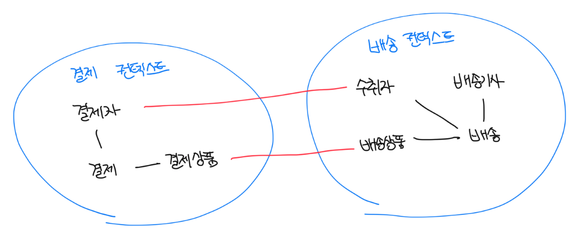
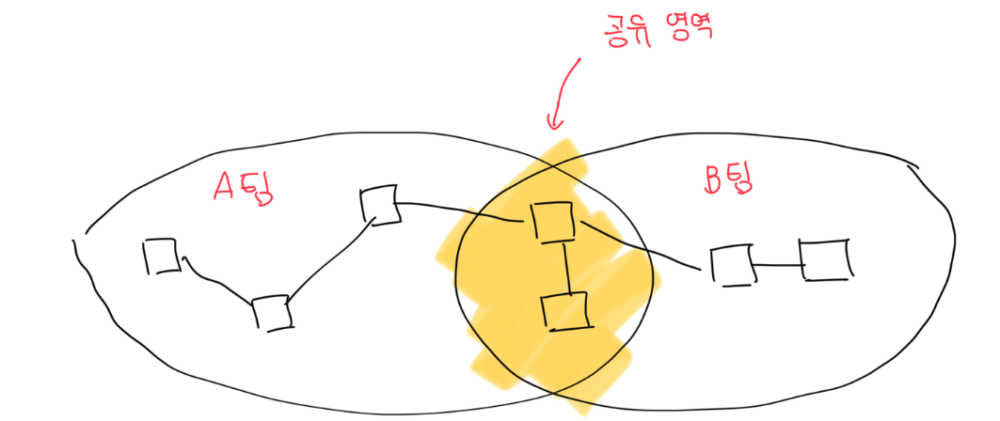
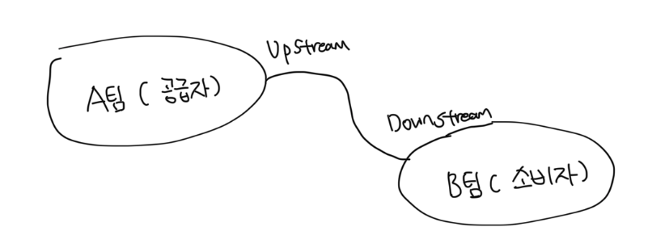
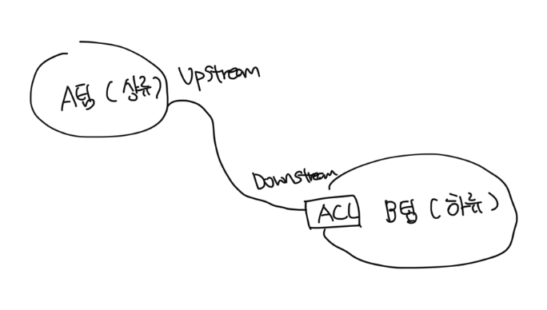
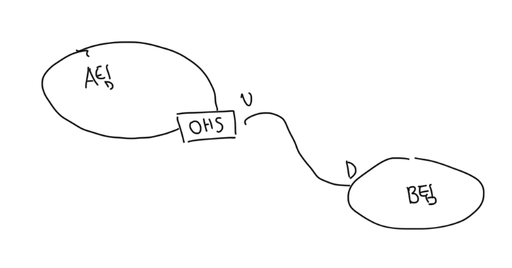
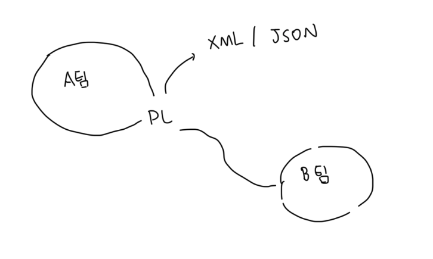
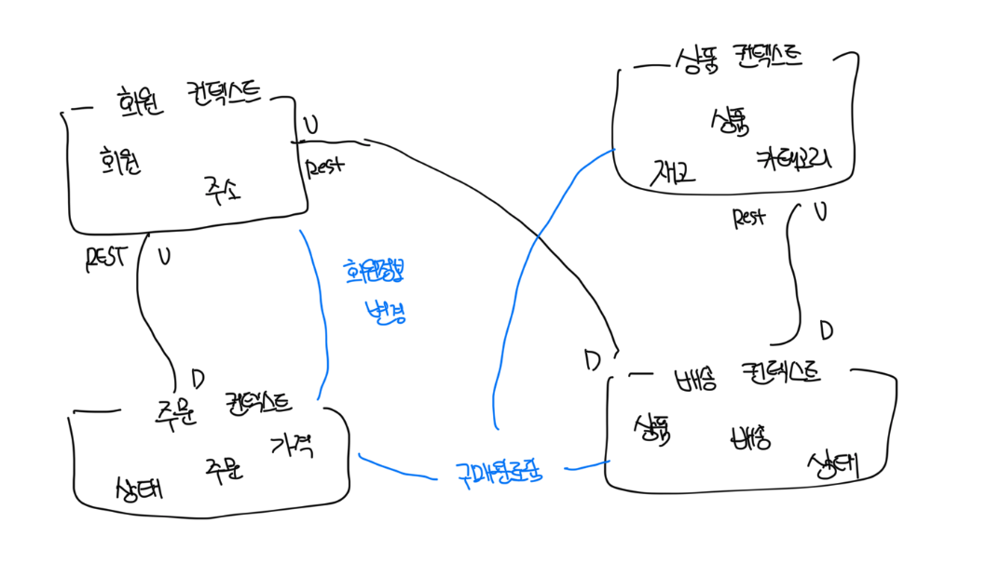

# 도메인과 서브도메인

- DDD는 하나의 큰 도메인을 전략적으로 중요한 것들을 찾고, 중요도에 따라서 도메인을 나눈다
- 각 도메인을 각각 하나씩 해결하는 방법을 기본으로 삼는데 이 방법을 사용하려면 비즈니스를 논리적으로 구분이 가능해야함
- 많은 개념들이 하나로 엮인 복ㅈ바한 비즈니스 도메인을 논리적으로 구분되는 여러 개의 하위 영역으로 구분하는데 이를 `서브도메인` 이라고 부름

 

### 핵심 서브도메인

- 다른 경쟁자와 차별화를 만들 비즈니스 영역
- 기업의 프로젝트 목록에서 높은 우선순위를 갖는 영역이자 소프트웨어 개발에서 전략적으로 가장 큰 투자가 필요한 영역

 

### 지원 서브도메인

- 비즈니스에 필수적이지만 핵심은 아닌 부분
- 핵심 도메인을 성공시키기 위해서 꼭 필요한 영역으로 핵심 서브도메인 다음으로 중요함

 

### 일반 서브도메인

- 비즈니스에 특화된 부분으 아니지만 전체 비즈니스 솔루션에는 필요한 부분
- 기존에 존재하는 제품을 구매해서 대체가 가능함

 

# 유비쿼터스 언어와 도메인 모델, 바운디드 컨텍스트

### 유비쿼터스 언어

- DDD에서는 여러 이해관계자들이 해당 도메인에서의 의도를 명확히 반영하고 도메인의 핵심 개념을 잘 전달할 수 있도록 `유비쿼터스 언어`를 사용함
- 모두가 공통의 언어를 사용하면 고객, 설계자, 개발자끼리 용어에 따른 오해를 없앨 수 있음
- 이는 특정 도메인의 업무 개념을 표현하는 언어인데 한마디로 도메인에 특화된 개념이 유비쿼터스 언어로 정의되어야함
- 예를 들면 결제 도메인에서의 고객과 배송 도메인에서 고객의 의미는 다른데 같은 언어를 사용하지 않도록 해서 혼동을 피해야함

 

### 도메인 모델

- 특정 비즈니스 맥락에서 통용되는 개념들의 관계를 잘 정의한 모영, 도메인 모델을 보면 해당 비즈니스 이해가 가능하도록 작성해야함
- 도메인과 관련된 업무를 수행하는 제품 책임자, 도메인 전문가, 개발자를 비롯한 모든 구성원들이 업무를 이해하는 기본 모형이 됨
- 설계물과 코드의 용어가 상이해서 상이해서 해석을 위한 표준 용어사전을 참조해야 했던 관행을 지양해야한다
- 하나의 도메인에서 사용되는 유비쿼터스 언어는 팀의 의사소통 및 실제로 동작하는 코드에서도 살아 숨 쉬어야 한다

 

### 바운디드 컨텍스트

- 도메인 모델을 구성하다보면 당연히 각 도메인 모델과 다른 도메인 모델과의 경게가 보임
- 이곳에서 사용하는 언어와 저곳에서 사용하는 언어와 개념이 상이한 이 경계가 바로 바운디드 컨텍스트임
- 새로운 팀원이 와도 소스코드에 존재하는 도메인 모델을 이해하고 이 모델로 도메인 전문가와 의사소통이 가능하다면 매우 좋음

 

# 컨텍스트 매핑

- 바운디드 컨텍스트 식별시는 각 컨텍스트는 내부적으로 응집성이 높고 다른 컨텍스트와는 의존관계가 낮아야 한다는 원칙하에 설계함
- 그렇다고해서 각 컨텍스트가 연관이 없는건 아니며 큰 도메인을 여러개의 컨텍스트로 식별하면 비즈니스를 위해서 여러 개의 컨텍스트를 연계해야하는 경우도 발생함
- DDD에선 이러한 관계를 `컨텍스트 매핑`이라고 부르며 이에 따른 산출물을 `컨텍스트 맵`이라고 부름

 

### 공유 커널

- 바운디드 컨텍스트 사이에 공통적인 모델을 공유하는 객체
- 2개 이상의 팀에서 작지만 공통의 모델을 공유하는 관계를 나타냄
- 보통 공통 라이브러리가 이에 해당되는데 이 부분이 변경되면 여러 관련 컨텍스트에 영향을 미치므로 해당 코드 빌드/테스트는 한 팀이 맡아서 수행해야함

 

### 소비자와 공급자

- 공급하는 컨텍스트는 `상류`, 소비하는 컨텍스트는 `하류`라고 부름
- 데이터의 흐름은 `상류 -> 하류`이고 반대는 가능하지 않기에 일방적으로 의존함
- 공급자는 소비자가 원하는 기능을 제공해줘야함

 

### 준수자

- 소비자와 공급자와 유사하지만 상류 팀이 하류 팀의 요구를 지원하지 않거나 못하는 경우 사용
- 이런 상황에서 하류팀은 상류팀에서 제공하는 모델을 그대로 사용하게됨

 

### 충돌 방지 게층

- 하류 팀이 상류 팀의 모델에 영향을 받을 떄 하류 팀의 고유 모델을 지키기 위한 번역 계층을 만드는 것
- 두 개의 게층 사이의 차이를 번역하고, 하류 모델의 독립성을 유지해줌
- 상류 모델의 변경없이 하위 모델과 통합하기 위한 데이터를 변환하는 메커니즘을 구현한 것임
- 보통 레거시 시스템을 새로운 시스템과 통합하기 위해서 많이 사용함

 

### 공개 호스트 서비스

- 바운디드 컨텍스트에 대한 접근을 제공하는 ㅍ로토콜이나 인터페이스를 정의함
- 하류의 컨텍스트가 상위 컨텍스트에서 제공하는 기능을 용이하게 사용할 수 있도록 공개되어 있음
- 일반적으로 다른 컨텍스트에서 사용할 수 있는 공유된 API가 여기에 해당함

 

### 발행된 언어

- 하류의 컨텍스트가 상류 컨텍스트가 제공하는 기능을 사용하게 하기 위해서 간단한 사용과 번역을 가능케 하는 문서화된 정보 교환 언어
- 일반적으로 XML, JSON 등 을 사용하고 주로 `공개 호스트 서비스`와 짝을 이루어서 사용함

 

# 컨텍스트 맵

- 하나의 큰 도메인을 여러 개의 바운디드 컨텍스트로 식별하고 이들 간의 관계를 표현한 그림
- 위에 존재하는 여러개의 매핑 관계로 작성이 가능함

