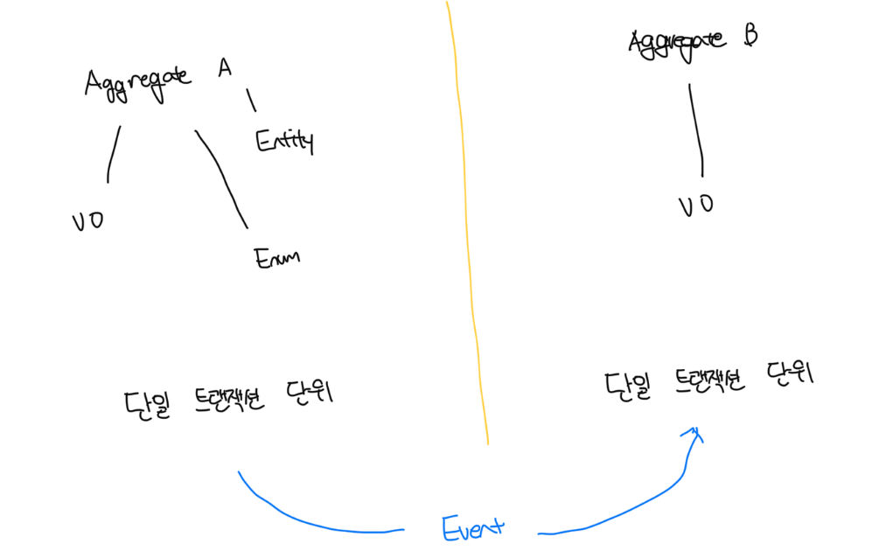
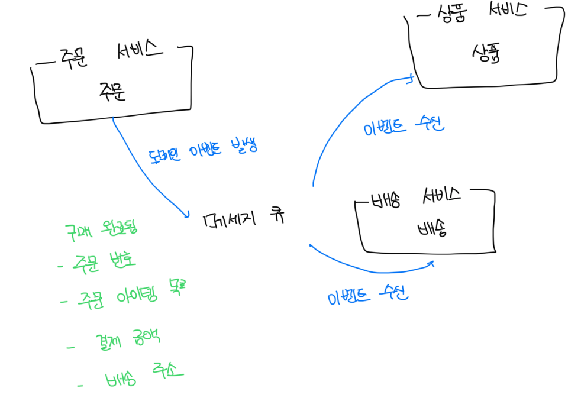

# 도메인 모델링

- 도메인 모델 중심의 아키텍쳐에선 서비스가 모든 로직을 처리하지 않고 비즈니스 로직이 도메인 모델로 위임되어 적절히 분산된다
- 트랜잭션 스크립트 패턴에서 DTO는 데이터 묶음으로서 역할만 수행하며 서비스가 많은 로직을 보유해 시스템이 복잡할수록 비대해진다
- 단순한 로직은 트랜잭션 스크립트 구조로 충분하지만 비즈니스가 복잡해질수록 비즈니스 개념들을 잘 구조화할 수 있는 도메인 모델 구조가 효과적이다
- 도메인 모델 구조는 백엔드 개발자의 객체지향 설계 및 문화에 능숙해야 하므로 팀의 역량 수준도 잘 고려해야한다

 

# DDD의 전술적 설계(도메인 모델링 구성요소)

- 기존의 일반적인 모델링 기법은 자유도가 높아 문제 영역을 파고들수록 여러 층의 복잡한 게층 구조를 만들게 될 가능성이 높음
- 이를 정리하기 위해서 객체들의 역할에 따른 유형을 정리하고, 규칙에 따라 모델링하면 단순하고 이해하기 쉬운데 이러한 기법을 DDD 전술적 설게에서 제공한다

 

### 엔티티

- 다른 엔티티와 구별할 수 있는 식별자를 가진 도메인의 실체 개념을 표현하는 객체
- 식별자는 고유하지만 엔티티의 속성 및 상태는 계속 변할 수 있음
- 도메인에서 개별성이 있는 개념을 엔티티로 식별하며, 고유 식별자와 변화 가능성이 `엔티티`와 `값 객체`를 구분하는 차이점임

 

### 값 객체

- 각 속성이 개별적으로 변화하지 않는 개념적 완전성을 모델링한다
- 값 객체는 속성와 속성의 합에 의해 전체 개념이 부여되며 개별 속성이 별개로 수정되지 않고 전체가 한번에 생성되거나 삭제되는 객체다
- 식별자의 차이에 따라서 구별되지 않고 속성과 속성으로 이루어진 값의 비교에 의해 동일함이 결정된다

 

### 표준 타입

- 대상의 타입을 나타내는 서술적 객체로 엔티티나 값 객체의 속성을 구분하는 용도로 사용한다
- 만약 전화번호를 모델링 했다면 이 전화번호가 `집 전화`인지 `회사 전화`인지 구분할 필요가 있다
- 자바 진영에서는 보통 ENUM을 활용해서 표준 타입으로 정의한다

 

### 애그리게이트

- 엔티티와 값 객체로 모델링을 진행하면 자연스럽게 객체 간의 계층 구조가 생성됨, 이처럼 `연관된 엔티티와 값 객체들의 묶음`이 애그리게이트임
- 내부 엔티티 중 가장 상위의 엔티티를 애그리게이트 루트로 정하고, 이 루트를 통해서만 내부의 엔티티나 값 객체 변경이 가능함
- 만약 하나의 컨텍스트 내부에 여러개의 애그리게이트가 존재한다면 직접 참조하지 않고 식별자를 통해서 간접적으로 참조한다
- 만약 여러개의 에그리게이트 간 일관성이 필요하다면 이 때는 `도메인 이벤트`를 통해서 일관성을 유지한다

 

### 도메인 서비스

- 비즈니스 로직 처리가 특정 엔티티나 값 객체에 속하지 않을 때 단독 객체를 만들어서 처리하게 되는데 이를 `도메인 서비스`라고 부름
- 도메인 서비스는 상태를 관리하지 않으며 행위만 존재함
- 도메인 로직을 처리할 때 엔티티나 값 객체와 함께 특정 작업을 처리하고 상태를 본인이 가지고 있지 않고 엔티티나 값 객체에게 전달하게됨

 

### 도메인 이벤트

- 도메인 이벤트는 DDD 및 이벤트 스토밍에서 말하는 도메인 이벤트의 구현 객체다
- 서비스 간 정합성을 일치시키기 위해서 단일 애그리게이트의 주요 상태 값을 담아서 전달되도록 모델링한다

