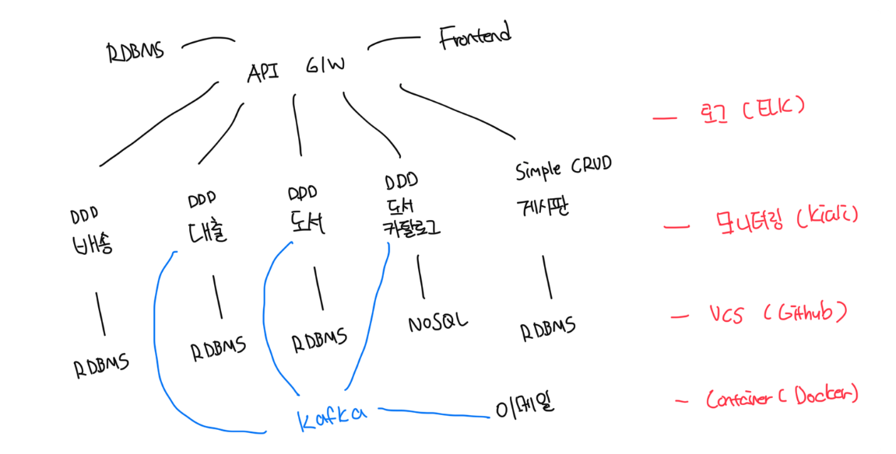

# 외부 아키텍쳐 정의

- `백엔드 마이크로서비스`는 도메인인 배송, 대출 도서 등으로 구성, 사용자와 로그인은 별도의 바운디드 컨텍스트이나 편의성을 위해 하나의 마이크로 서비스로 구성
- `API 게이트웨이`는 로드 밸런싱, 라우팅을 수행
- `프론트엔드 + 사용자/로그인 백엔드 + API 게이트웨이`는 하나의 서비스에 통합해서 구현하고 API 게이트웨이 역할도 같이 구현
- `서비스 저장소` : 서비스의 저장소는 RDBMS를 사용하고 도서 카탈로그는 읽기 최적화를 위해서 NoSQL 사용
- `서비스 통신` : 비동기 통신을 위한 메세지 큐는 Kafka 사용
- 기타 도커, ELK, Github 등 사용

