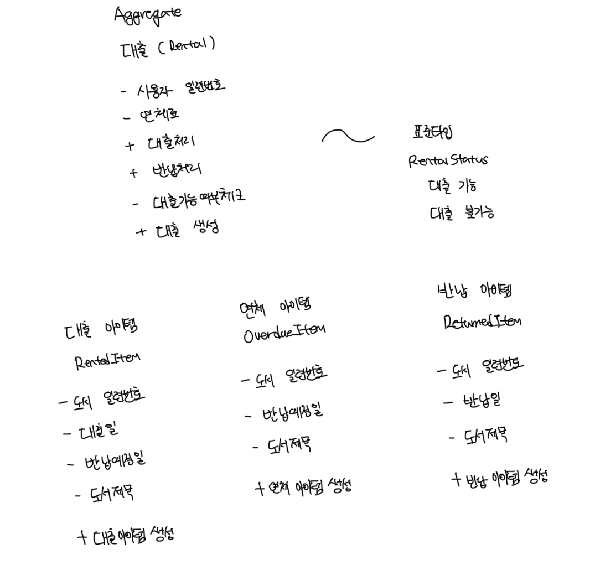

# 구현 기능

### 도서 대출

- 대출 처리에 대한 비즈니스 로직
- 대출 시 도서 서비스와 연계해서 상세 도서 정보 조회(동기 호출)
- 대출 시 도서 서비스와 연계해 재고 감소 처리(카프카를 통한 비동기 메세지 전송)
- 대출 시 카탈로그 서비스에 대출 도서 집계 처리(카프카를 통한 비동기 메세지 전송)

 

### 도서 반납

- 반납 처리에 대한 비즈니스 로직 구현
- 반납 시 도서 서비스와 연계해 재고 증가 처리(카프카를 통한 비동기 메세지 전송)
   

### 도서 연체

- 연체 처리에 대한 비즈니스 로직 구현
- 연체 시 대출 불가 처리

 

### 연체 해제

- 연체 해제를 위해 사용자 서비스와 연계해 포인트를 통해 결제 처리(동기 호출)

 

# 내부 아키텍쳐 결정

- 도서 대출 서비스에는 도메인 모델 중심의 헥사고날 아키텍쳐 적용
- 저장소 매커니즘으로는 ROM 사용, 동기 통신은 axios, 비동기 통신을 위한 매커니즘은 Kafka 사용

 

# API 설계

### 도서 대출

- POST /rentals/{userId}/rentedItem/{book}
- 응답 : 정상 처리 시 도서대출정보를 반환

 

### 도서 반납

- DELETE /rentals/{userId}/rentedItem/{book}
- 응답 : 정상 처리 시 도서대출정보를 반환

 

### 도서 연체 처리

- POST /rentals/{userId}/OverdueItem/{book}
- 응답 : 연체처리된 도서 일련번호

 

### 연체 아이템 반납처리

- DELETE /rentals/{userId}/OverdueItem/{book}
- 응답 : 정상 처리시 도서대출정보를 반환

 

# 도메인 모델링

- 데이터에 모델링에 익숙한 사람은 비즈니스를 테이블화하고 정규화 하려고 할것임
- 하지만 이러면 특정 디비에 의존하며 도메인 모델링의 목적은 누구라도 쉽게 이해할 수 있도록 객체 모델을 만드는것임
- 도메인 모델에서는 비즈니스 개념을 표현하는데, 이는 객체로 표현되며 애그리게이트, 엔티티, 값 객체, 표준 타입 패턴을 적용함

 

### Rental

- Rental Aggregate는 `대출`, `반납`이라는 책임을 가지는 어그리게이트 루트다
- RentedItem, OverdueItem, ReturnedItem과는 1:N 관계로 구성된다
- 모든 사용자는 대출을 위해서 Rental이라는 엔티티를 하나씩 소유한다. Rental은 대출, 연체, 반납 해제의 책임을 가진다
- 개인당 5권까지 대출이 가능하고 1권이라도 연체되면 대출이 불가능하다. 이는 RentalStatus로 규정한다

 

# 유스케이스 흐름

### 도서 대출

- 대출 가능 여부 체크
- 도서 대출
  - 대출도서 생성
  - 대출카드 저장
- 도서상태변경 이벤트 전송
- 도서카탈로그변경 이벤트 전송

 

### 도서 반납

- 도서 반납
  - 반납도서 생성
  - 대출도서 삭제
- 대출카드 저장
- 도서상태변경 이벤트 전송
- 도서카탈로그변경 이벤트 전송

 

# 중단..
