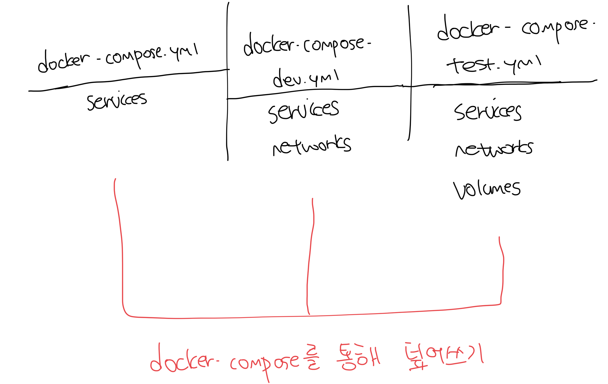
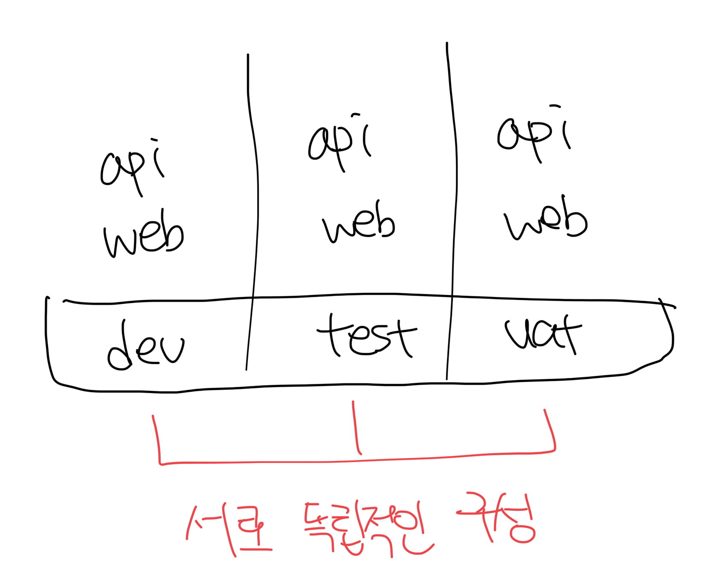

# 한개의 앱을 여러개의 설정으로 켜야할때

- 대부분은 컴포즈 파일을 환경마다 하나씩 두는 방법을 쓴다
- 위 방법은 컴포즈 파일 내용이 90% 이상 중복된다
- 좀 더 나은 방법으로는 나중에 지정된 파일의 내용이 이전 파일의 내용을 덮어쓰기(override) 하는 방식이 있다



<br>

# 덮어쓰기 구성하기

- 오버라이드 파일에는 해당 환경에서 변경할 항목만 기술하면 된다
- config 부명령을 통해서 내용이 유용한지 검증이 가능함
  - 해당 명령은 검증 및 결과물을 출력만하고 실제로 실행되진 않음
- 덮어쓰기할 순서대로 `-f` 플래그를 통해 파일을 나열해야된다
  - 순서가 잘못되는 경우는 이상한 결과물이 나올수도있다

```yml
# docker-compose.yml
services:
  todo-web:
    image: diamol/ch06-todo-list
    ports:
      - 80
    environment:
      - Database:Provider=Sqlite
    networks:
      - app-net

networks:
  app-net:

# docker-compose-v2.yml
services:
  todo-web:
    image: diamol/ch06-todo-list:v2
```

<br>

### docker-compose config

- 2개의 docker-compose 스크립트가 병합되어 보여진다

```bash
imkdw@dongwoo  ~/080258/ch10/exercises/todo-list   main ±  docker-compose -f docker-compose.yml -f docker-compose-v2.yml config
name: todo-list
services:
  todo-web:
    environment:
      Database:Provider: Sqlite
    image: diamol/ch06-todo-list:v2
    networks:
      app-net: null
    ports:
      - mode: ingress
        target: 80
        protocol: tcp
networks:
  app-net:
    name: todo-list_app-net
```

<br>

# 실전예제

- 각 환경 설명
  - `docker-compose.yml` : 베이스 파일
  - `docker-compose-dev.yml` : 개발용 파일, 헬스/디펜던시 체크 비활성화
  - `docker-compose-test.yml` : CI 환경을 위한 파일, API 포트 미공개
  - `docker-compose-uat.yml` : 인수 테스트를 위한 파일, 모든 테스트를 꼼꼼하게함
- 이렇게 구동된 모든 서비스는 독립적이다
- 이렇게 운영환경을 제외한 다른 환경에서 도커 컴포즈는 매우 효율적이다

```bash
# 개발용 실행
imkdw@dongwoo  ~/080258/ch10/exercises/numbers   main ±  docker-compose -f docker-compose.yml -f docker-compose-dev.yml -p dev up -d
[+] Running 3/3
 ✔ Network numbers-dev          Created                                                                                                                0.0s
 ✔ Container dev-numbers-api-1  Started                                                                                                                0.2s
 ✔ Container dev-numbers-web-1  Started                                                                                                                0.2s

# 테스트용 실행
imkdw@dongwoo  ~/080258/ch10/exercises/numbers   main ±  docker-compose -f docker-compose.yml -f docker-compose-test.yml -p test up -d
[+] Running 3/3
 ✔ Network numbers-test          Created                                                                                                               0.0s
 ✔ Container test-numbers-api-1  Started                                                                                                               0.2s
 ✔ Container test-numbers-web-1  Started                                                                                                               0.2s

 # 인수테스트용 실행
imkdw@dongwoo  ~/080258/ch10/exercises/numbers   main ±  docker-compose -f docker-compose.yml -f docker-compose-uat.yml -p uat up -d
[+] Running 3/3
 ✔ Network numbers-uat          Created                                                                                                                0.0s
 ✔ Container uat-numbers-web-1  Started                                                                                                                0.2s
 ✔ Container uat-numbers-api-1  Started                                                                                                                0.2s

# 구동중인 도커 컨테이너 확인
imkdw@dongwoo  ~/080258/ch10/exercises/numbers   main ±  docker ps
CONTAINER ID   IMAGE                        COMMAND                   CREATED          STATUS                            PORTS                                     NAMES
12177abd711e   diamol/ch08-numbers-web:v3   "/bin/sh -c 'dotnet …"   4 seconds ago    Up 3 seconds                      0.0.0.0:80->80/tcp, :::80->80/tcp         uat-numbers-web-1
bc9639f21161   diamol/ch08-numbers-api:v3   "dotnet Numbers.Api.…"   4 seconds ago    Up 3 seconds (health: starting)   0.0.0.0:8090->80/tcp, [::]:8090->80/tcp   uat-numbers-api-1
a8bfac36e518   diamol/ch08-numbers-web:v3   "/bin/sh -c 'dotnet …"   10 seconds ago   Up 4 seconds (health: starting)   0.0.0.0:8080->80/tcp, [::]:8080->80/tcp   test-numbers-web-1
da23f7df8924   diamol/ch08-numbers-api:v3   "dotnet Numbers.Api.…"   10 seconds ago   Up 10 seconds (healthy)           80/tcp                                    test-numbers-api-1
986ef1d84f1f   diamol/ch08-numbers-web:v3   "dotnet Numbers.Web.…"   19 seconds ago   Up 18 seconds                     0.0.0.0:8088->80/tcp, [::]:8088->80/tcp   dev-numbers-web-1
67cf89522e88   diamol/ch08-numbers-api:v3   "dotnet Numbers.Api.…"   19 seconds ago   Up 18 seconds                     0.0.0.0:8087->80/tcp, [::]:8087->80/tcp   dev-numbers-api-1
```



<br>

# 주의점

- 단순한 `docker-compose down` 명령으로는 실행중인 컨테이너 종료가 불가능하다
- up 구문 실행시 입력한 명령문을 그대로 down으로 바꾸거나 `-p` 플래그로 프로젝트를 명시해줘야한다

```bash
imkdw@dongwoo  ~/080258/ch10/exercises/numbers   main ±  docker-compose -p dev down
[+] Running 3/2
 ✔ Container dev-numbers-web-1  Removed                                                                                                                0.2s
 ✔ Container dev-numbers-api-1  Removed                                                                                                                0.2s
 ✔ Network numbers-dev          Removed                                                                                                                0.1s

imkdw@dongwoo  ~/080258/ch10/exercises/numbers   main ±  docker-compose -p test down
[+] Running 3/3
 ✔ Container test-numbers-web-1  Removed                                                                                                              10.2s
 ✔ Container test-numbers-api-1  Removed                                                                                                               0.2s
 ✔ Network numbers-test          Removed                                                                                                               0.1s

imkdw@dongwoo  ~/080258/ch10/exercises/numbers   main ±  docker-compose -p uat down
[+] Running 3/3
 ✔ Container uat-numbers-web-1  Removed                                                                                                               10.2s
 ✔ Container uat-numbers-api-1  Removed                                                                                                                0.2s
 ✔ Network numbers-uat          Removed                                                                                                                0.1s

imkdw@dongwoo  ~/080258/ch10/exercises/numbers   main ±  docker ps
CONTAINER ID   IMAGE     COMMAND   CREATED   STATUS    PORTS     NAMES
```
