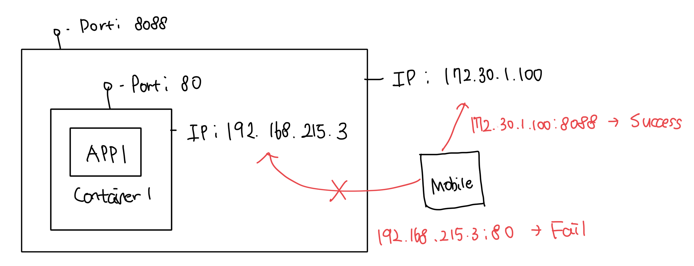

# 모든 도커 컨테이너 확인하기

- `docker conatiner ls --all`을 이용해서 확인이 가능하다
- 여기서 2가지 알아야하는 점이 존재한다
  - 컨테이너 내부의 앱이 실행중이여야 컨테이너도 시행이 유지된다
    - 종료된 컨테이너는 더이상 CPU나 메모리 자원을 사용하지 않는다
  - 컨테이너가 종료되도 사라지지 않는다
    - 나중에 다시 실행하거나 로그를 확인하는 등 작업이 가능하다
    - 하지만 계속 남아있어서 운영체제의 저장공가늘 차지하게된다

<br>

# 컨테이너에서 간단한 웹 사이트 호스팅하기

- `--detach`: 컨테이너를 백그라운드에서 실행하며 컨테이너 ID를 출력하는 플래그
- `--publush`: 컨테이너의 포트를 호스트 컴퓨터에 공개하는 플래그

```
imkdw@dongwoo  ~  docker run --detach --publish 8088:80 diamol/ch02-hello-diamol-web
Unable to find image 'diamol/ch02-hello-diamol-web:latest' locally
latest: Pulling from diamol/ch02-hello-diamol-web
dce8679b510e: Pull complete
c111552b26df: Pull complete
ef4263ddbf41: Pull complete
cac4170335ae: Pull complete
0a26a833371b: Pull complete
994988584430: Pull complete
Digest: sha256:fe5a4c954fe2df5cadeea304ab632533f8ece9e31bd219ea22fdbf8b597571eb
Status: Downloaded newer image for diamol/ch02-hello-diamol-web:latest
066b8d99bf049c42cf82995f6cc4a2131800481c3d2aa8851c78b328122381ee
```

<br>

### 컨테이너 포트를 호스트 컴퓨터에 공개하는 원리

- 도커를 설치하면 호스트 컴퓨터의 네트워크 계층에 도커가 끼어들게 된다
- 호스트 컴퓨터에서 들고나는 네트워크 트래픽을 도커가 가로채서 필요한것만 컨테이너에 전달이 가능하다
- 기본적으로 컨테이너는 외부에 노출되지 않으므로 외부에서 도커의 IP로 직접접근은 불가능하다



<br>

### docker stats <container_id>

- 컨테이너의 상태를 확인하는 명령어
- 실시간으로 CPU, 메모리, 네트워크, 디스크 사용량 확인이 가능함
- 출력 결과는 리눅스와 윈도우에서 조금 상이함

```
~ docker stats 06

CONTAINER ID   NAME           CPU %     MEM USAGE / LIMIT    MEM %     NET I/O           BLOCK I/O        PIDS
066b8d99bf04   kind_khorana   0.00%     3.23MiB / 5.189GiB   0.06%     4.04kB / 2.64kB   5.69MB / 4.1kB   109
```

<br>

### 모든 도커 컨테이너 삭제

- `$()` 문법은 출력을 다른 명령으로 전달하는 역할을 함
- 아래 명령어는 존재하는 모든 컨테이너 목록을 만들고, 그걸 제거하는 명령이다
- 컨테이너를 한번에 정리가 가능하지만, 삭제 전 아무 확인절차가 없으므로 주의해야한다

```
 ✘ imkdw@dongwoo  ~  docker rm --force $(docker container ls --all --quiet)
8ae8aac5d26f
066b8d99bf04
840925fb1055
f48db9608988
d37b24b40c09
0264c09ff63e
e00a0c5ef157
6f6c3b39e0c9
a2d1a275c2d4
577e48d535f7
1de943992dac
30614a62b73e
33ac23d75dfc
4e23f69e2d90
```
