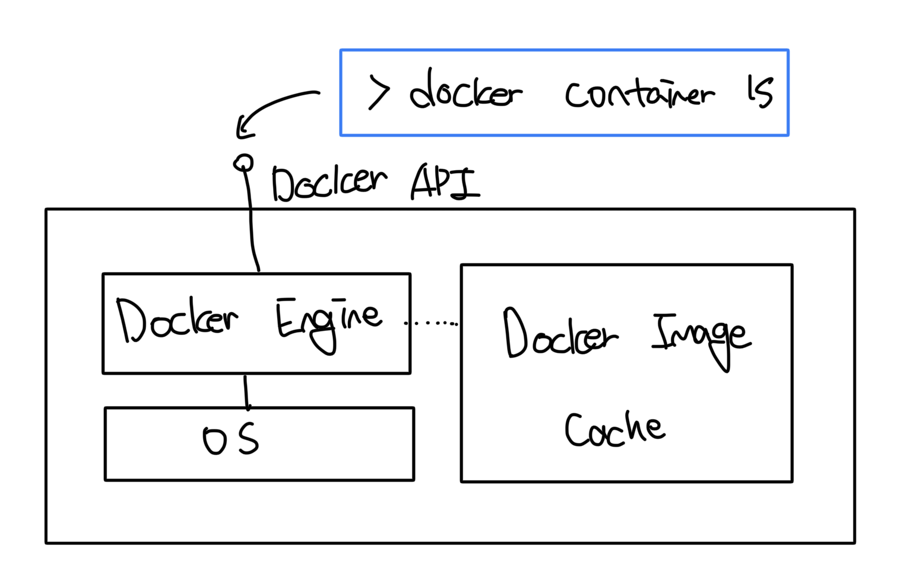

# 도커가 컨테이너를 실행하는 원리

### 도커 엔진

- 도커의 관리 기능을 담당하는 컴포넌트
- 로컬 이미지 캐싱을 담당한다
  - 새로운 이미지가 필요하다면 이미지를 다운로드
  - 기존에 존재한다면 그대로 사용
- 호스트 OS와 함께 컨테이너와 가상 네트워크 등 도커 리소스를 만드는 일도 담당
- 항시 동작하는 백그라운드 프로세스

 

### 도커 API

- 표준 HTTP 기반 REST API
- 도커 엔진은 도커 API를 통해서 맡은 기능을 수행하게 된다
- 도커 엔진의 설정을 수정하면 해당 API를 네트워크를 경유해서 외부 컴퓨터로 부터 호출가능 여부를 제어할 수 있음

 

### 도커 CLI

- 도커 API의 클라이언트
- 실제 명령을 실행할 때 실제로 도커 API를 호출하는게 도커 CLI다

 

# 오픈소스인 도커 API

- 도커는 모든 API의 명세가 공개되어 있다
- 도커 CLI외에도 다른 클라이언트(UCP, Potainer 등) 사용이 가능하다
