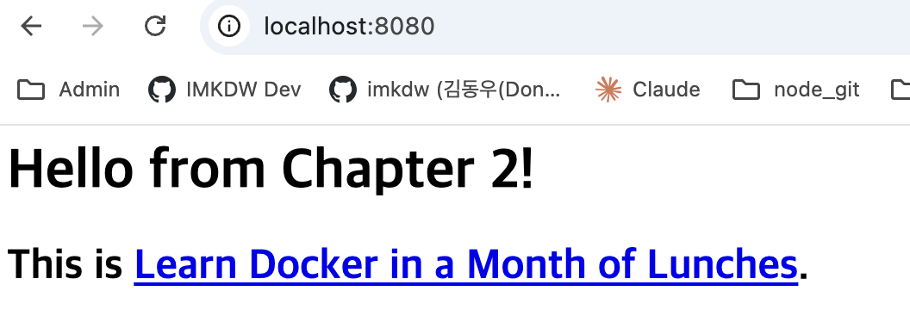
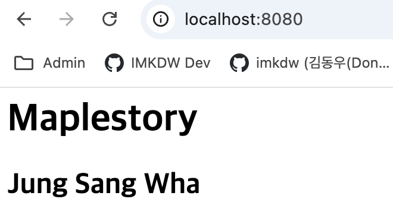

# 컨테이너 파일 시스템 다루기

- 웹 사이트 컨테이너를 실행하고 index.html 파일을 교체해서 웹 페이지 내용 수정하기
- index.html 파일은 /usr/local/apache2/htdocs에 위치함

<br>

# 기존 웹 사이트



<br>

# 풀이

### 1. 웹 사이트 컨테이너를 백그라운드로 실행

```
 imkdw@dongwoo  ~  docker run -d -p 8080:80 diamol/ch02-hello-diamol-web
b04b0fbe9e7eeb151111f80c4c1f5d8f1547878d036ce9f02cdc440342e9bd20
```

<br>

### 2. 새로운 index.html 파일을 특정 경로에 복사하기

- `docker exec <container_id> ls /usr/local/apache2/htdocs`로 기존 파일 확인이 가능함

```
 ✘ imkdw@dongwoo  ~  docker exec b04 ls /usr/local/apache2/htdocs
index.html
```

- 이후 로컬에서 index.html 파일을 생성하고 위 경로에 파일을 복사해줌

```
imkdw@dongwoo  ~  docker container cp index.html b04:/usr/local/apache2/htdocs/index.html
Successfully copied 2.05kB to b04:/usr/local/apache2/htdocs/index.html
```

<br>

# 파일 변경 후 웹 사이트


