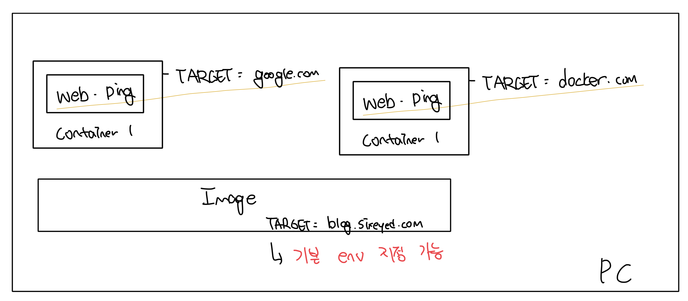

# 도커 허브

- 이미지를 제공하는 저장소를 레지스트리(registry)라고 부른다
- 도커 허브는 무료로 제공되는 공개 레지스트리다
- `docker pull` 명령어를 통해서 이미지를 다운받을 수 있다

<br>

# 이미지를 다운로드 하는 방식

### 이미지 다운로드 명령어 : docker pull <image_name>

```bash
 imkdw@dongwoo  ~  docker pull diamol/ch03-web-ping
Using default tag: latest
latest: Pulling from diamol/ch03-web-ping
0362ad1dd800: Pull complete
b09a182c47e8: Pull complete
39d61d2ed871: Pull complete
b4e2115e274a: Pull complete
f5cca017994f: Pull complete
f504555623f6: Pull complete
Digest: sha256:2f2dce710a7f287afc2d7bbd0d68d024bab5ee37a1f658cef46c64b1a69affd2
Status: Downloaded newer image for diamol/ch03-web-ping:latest
docker.io/diamol/ch03-web-ping:latest
```

<br>

### 이미지에 존재하는 레이어들

- 이미지는 논리적으로는 하나의 대상이다
- 하지만 실제 다운로드 할때는 다인 파일이 아닌 여러개의 파일을 동시에 다운로드한다
  - 각각의 파일을 이미지 레이어라고 부른다
  - 이미지는 물리적으로 여러개의 레이어로 구성되고, 도커가 이를 조립해서 컨테이너 내부 파일시스템을 만든다
  - 모든 레이어를 다운로드 하면 전체 이미지 사용이 가능하다

<br>

# 다운로드한 앱 사용해보기

### 컨테이너 실행

- 이전에 사용한 `docker run ...` 명령어를 통해서 실행한다
- 새로운 플래그가 존재한다
  - `-d`: `--detach`의 약자다
  - `--name <name>` : 컨테이너의 지름을 지정함, 이전까지는 id로 사용했으나 이젠 이름으로 사용이 가능해진다

```bash
 imkdw@dongwoo  ~  docker run -d --name web-ping diamol/ch03-web-ping
d348908135694fd1ce0c15d67696b9296e0f9c4cbbfc43bd821082091cc6b9fd
```

<br>

### 컨테이너 로그 확인

- `blog.sixeyed.com`에 ping을 3초 간격으로 보내고 있음을 확인 가능하다

```bash
 ✘ imkdw@dongwoo  ~  docker logs web-ping
** web-ping ** Pinging: blog.sixeyed.com; method: HEAD; 3000ms intervals
Making request number: 1; at 1729920300685
Got response status: 200 at 1729920301186; duration: 501ms
Making request number: 2; at 1729920303688
Got response status: 200 at 1729920303735; duration: 47ms
Making request number: 3; at 1729920306694
Got response status: 200 at 1729920306737; duration: 43ms
// more...
```

<br>

# 환경변수(Environment Variable)

- OS에서 제공하는 key-value 쌍이다
- 도커 컨테이너도 별도의 환경변수를 가질 수 있고, 이는 호스트 OS와는 별개로 동작한다



<br>
  
### 환경변수를 수정해서 ping 발송대상 수정하기
- `--env` 플래그로 환경변수 설정이 가능하다
- 아래 예시에서는 `TARGET` 환경변수를 `google.com`으로 변경한다

```bash
imkdw@dongwoo  ~  docker rm -f web-ping
web-ping

imkdw@dongwoo  ~  docker run -d --name web-ping --env TARGET=google.com diamol/ch03-web-ping
f9e1e18d0c55beb2b0a13a98fdb2948766ce89a6f63d33fe97fe2335ee895b83

imkdw@dongwoo  ~  docker logs web-ping
** web-ping ** Pinging: google.com; method: HEAD; 3000ms intervals
Making request number: 1; at 1729920538090
Got response status: 301 at 1729920538418; duration: 328ms
```

<br>
