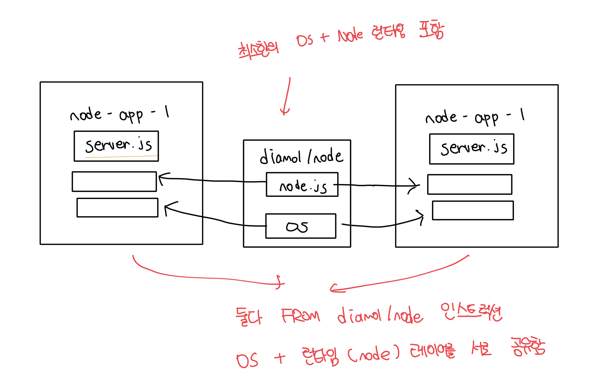

# 도커 이미지의 히스토리 확인

- 아래 명령어는 한 줄마다 한 레이어에 대한 정보가 출력된다
- Dockerfile에서 사용하는 인스트럭션은 이미지 레이어와 1:1 관계를 가진다

```bash
imkdw@dongwoo  ~  docker image history web-ping
IMAGE          CREATED         CREATED BY                                       SIZE      COMMENT
f33fa7470151   9 minutes ago   CMD ["node" "/web-ping/app.js"]                  0B        buildkit.dockerfile.v0
<missing>      9 minutes ago   COPY app.js . # buildkit                         846B      buildkit.dockerfile.v0
<missing>      9 minutes ago   WORKDIR /web-ping                                0B        buildkit.dockerfile.v0
<missing>      9 minutes ago   ENV INTERVAL=3000                                0B        buildkit.dockerfile.v0
<missing>      9 minutes ago   ENV METHOD=HEAD                                  0B        buildkit.dockerfile.v0
<missing>      9 minutes ago   ENV TARGET=blog.sixeyed.com                      0B        buildkit.dockerfile.v0
<missing>      5 years ago     /bin/sh -c #(nop)  CMD ["node"]                  0B
<missing>      5 years ago     /bin/sh -c #(nop)  ENTRYPOINT ["docker-entry…   0B
<missing>      5 years ago     /bin/sh -c #(nop) COPY file:238737301d473041…   116B
<missing>      5 years ago     /bin/sh -c apk add --no-cache --virtual .bui…   5.11MB
<missing>      5 years ago     /bin/sh -c #(nop)  ENV YARN_VERSION=1.16.0       0B
<missing>      5 years ago     /bin/sh -c addgroup -g 1000 node     && addu…   65.1MB
<missing>      5 years ago     /bin/sh -c #(nop)  ENV NODE_VERSION=10.16.0      0B
<missing>      5 years ago     /bin/sh -c #(nop)  CMD ["/bin/sh"]               0B
<missing>      5 years ago     /bin/sh -c #(nop) ADD file:66f49017dd7ba2956…   5.29MB
```

<br>

# 도커 이미지와 레이어

- 도커 이미지는 도커 레이어가 모인 논리적 대상이다
- 이미지 레이어는 도커 엔진의 캐시에 물리적으로 저장된 파일이다
- 이미지 레이어는 어러 이미지와 컨테이너에서 공유된다
- `docker image ls`를 통해 확인한 이미지 크기는 논리적 용량이고 실제 용량이 아니다

<br>

### 도식화



<br>

### 주의점

- 이미지 레이어를 여러개의 이미지가 공유한다면 공유되는 레이어는 수정이 불가능해야 한다
- 만약 수정이 가능해서 수정되는 경우는 해당 레이어를 공유받고 있는 다른 이미지에도 영향을 미친다
- 도커는 이미지 레이어를 읽기전용으로 만들어서 이러한 문제를 방지해준다
