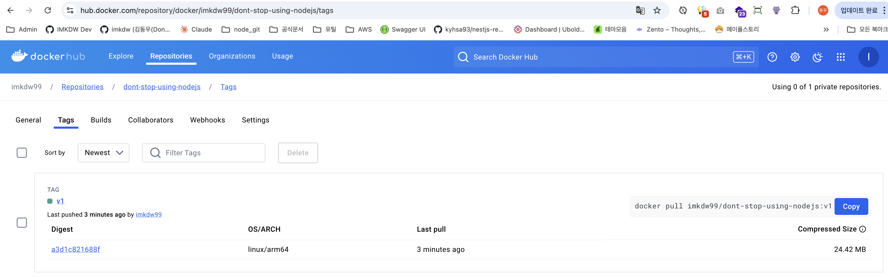

# 도커 허브 설정하기

- 먼저 도커 허브 회원가입이 필요하다

<br>

```bash
# dockerId 환경변수 설정하기
imkdw@dongwoo  ~  export dockerId="imkdw99"

# 도커 허브 로그인
imkdw@dongwoo  ~  docker login --username $dockerId
Password: ***************
Login Succeeded
```

<br>

# 기존 이미지에 태그 부여하기

```bash
docker image tag <origin_image> <new_image:tag>
```

```bash
docker image tag temp-nodejs $dockerId/do
nt-stop-using-nodejs:v1
```

<br>

# 이미지 배포하기

```bash
 ✘ imkdw@dongwoo  ~/study  ↱ main  docker image push $dockerId/dont-stop-using-nodejs:v1
The push refers to repository [docker.io/imkdw99/dont-stop-using-nodejs]
23c3905ddd3b: Pushed
8fb816c99d6c: Pushed
0a6a364b44af: Mounted from diamol/node
20e8cfeb051c: Mounted from diamol/node
0c7669bfb3ce: Mounted from diamol/node
6d626da635fc: Mounted from diamol/node
v1: digest: sha256:a3d1c821688f55267ce06d4405a1c2acda563a5cc8db211f036f1a6010ddac3c size: 1571
imkdw@dongwoo  ~/study  ↱ main 
```

<br>

# 배포된 이미지 주소

`https://hub.docker.com/repository/docker/{$dockerId}/dont-stop-using-nodejs/tags`



<br>

# 배포된 이미지 실행해보기

```bash
 ✘ imkdw@dongwoo  ~  docker run imkdw99/dont-stop-using-nodejs:v1
Unable to find image 'imkdw99/dont-stop-using-nodejs:v1' locally
v1: Pulling from imkdw99/dont-stop-using-nodejs
0362ad1dd800: Already exists
b09a182c47e8: Already exists
39d61d2ed871: Already exists
b4e2115e274a: Already exists
f74e0639f9d6: Already exists
cff596a0aadb: Already exists
Digest: sha256:a3d1c821688f55267ce06d4405a1c2acda563a5cc8db211f036f1a6010ddac3c
Status: Downloaded newer image for imkdw99/dont-stop-using-nodejs:v1
Don't stop using node.js
```
