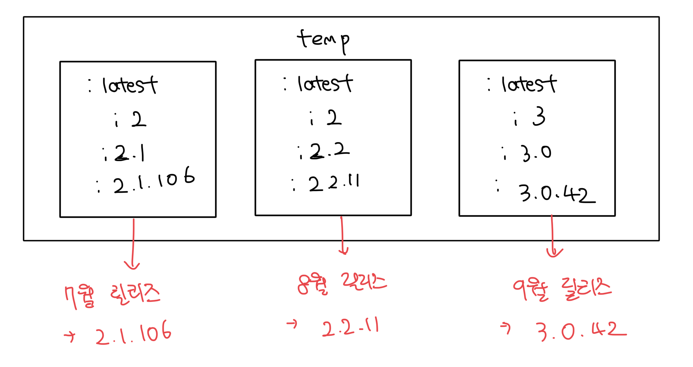

# 이미지 태그의 특성

- 어떠한 문자열도 포함시킬수 있음
- 같은 이미지에 여러개의 태그도 부여가 가능함
- 태그를 통해서 버전을 구별하고, 이미지를 사용하는 사람들은 어떤 이미지를 사용할지 찾을 수 있음

<br>

# 버저닝 방식

- 대부분의 SW 처럼 semver 방식이 표준임
  - `[major]`.`[minor]`.`[patch]` 방식
  - `patch` : 버그만 수정됨
  - `minor` : 추가된 기능은 있으나 기존 기능은 모두 유지함
  - `major` : 완전히 다른 기능을 가짐

```bash
docker image tag temp registry.local:5000/temp/ui:latest
docker image tag temp registry.local:5000/temp/ui:2
docker image tag temp registry.local:5000/temp/ui:2.1
docker image tag temp registry.local:5000/temp/ui:2.1.106
```

<br>

# 버전업에 따른 태그 변화 예시

> 1달에 한번 릴리즈 할때마다 버전이 바뀐다고 가정함

- 해당 방식을 통해서 유저에게 얼마나 최신버전을 따라갈지 선택권 제공이 가능해짐
- 실제 semver 형식의 버전 말고는 모두 별명 역할이다
  - patch 업데이트 자동 수령 : 2.1 사용
  - minor 업데이트 자동 수령 : 2 사용


