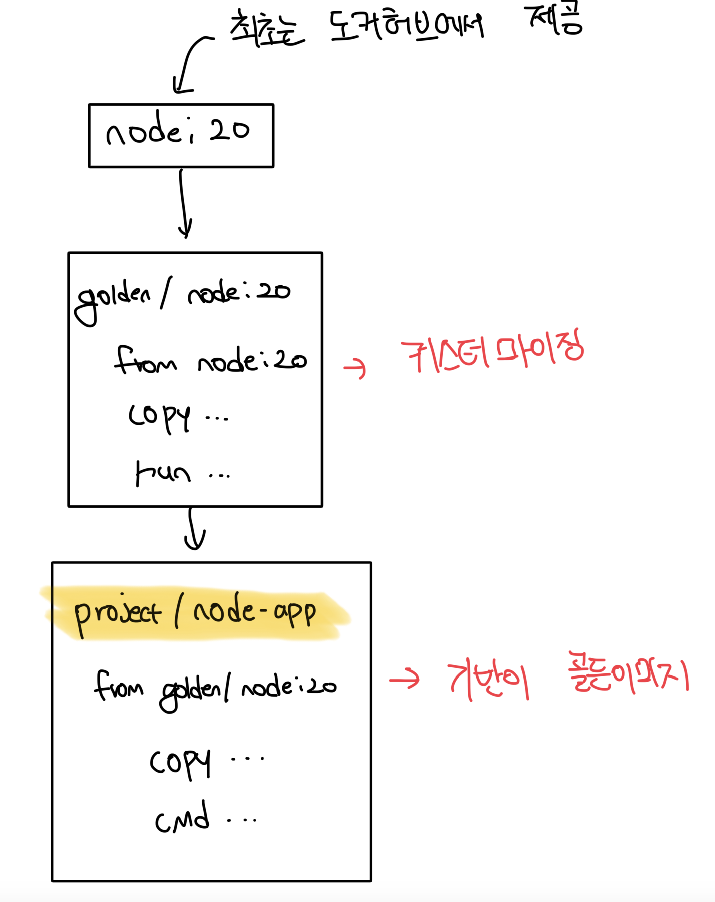

# 도커 허브의 신뢰성

- 누구나 이미지를 만들고 레지스트리에 푸시가 가능함
- 해커의 관점에서 본다면 멀웨어르르 배포하기에 제격인 조건임
- 도커 허브는 이러한 피해를 방지하기 위해서 `검증된 퍼블리셔`와 `공식 이미지` 제도가 존재함

 

### 검증된 퍼블리셔(Verfieid Publisher)

- IBM, MS, Oracle 등 신뢰할 수 있는 큰 기업을 `검증된 퍼블리셔`로 지정함
- 이들이 배포하는 이미지는 사전에 취약점 탐지 등 승인 절차를 통해서 공개됨
- 만약 컨테이너에서 새로 나온 최신 버전의 SW 사용이 필요하다면 검증된 퍼블리셔가 배포하는 인증된 이미지를 사용하는게 최선임

 

### 공식 이미지(Official Image)

- 주로 오픈소스 소프트웨어가 주로 배포되며, 해당 프로젝트 개발팀과 도커팀이 함께 이미지를 관리함
- 마찬가지로 취약점 탐색을 거쳐서 주기적으로 업데이트되고, 잘 최적화된 Dockerfile로 구성됨

 

# 골든 이미지(Golden Image)

- 대부분의 경우 공식 이미지를 통해서 무언가를 빌드하지만 언젠가는 좀 더 많은걸 통제하고싶은 시기가 찾아옴
- 이 때 개발자는 자신이 선호하는 기반 이미지로 전환하는데, 이걸 `골든 이미지`라고 부름
- 기반 이미지에 내가 원하는 환경설정값 등 자신이 필요한 설정을 추가하는것 뜻함
- 공식 이미지의 이점을 그대로 누리면서 필요한 설정을 추가할 수 있는게 장점임

