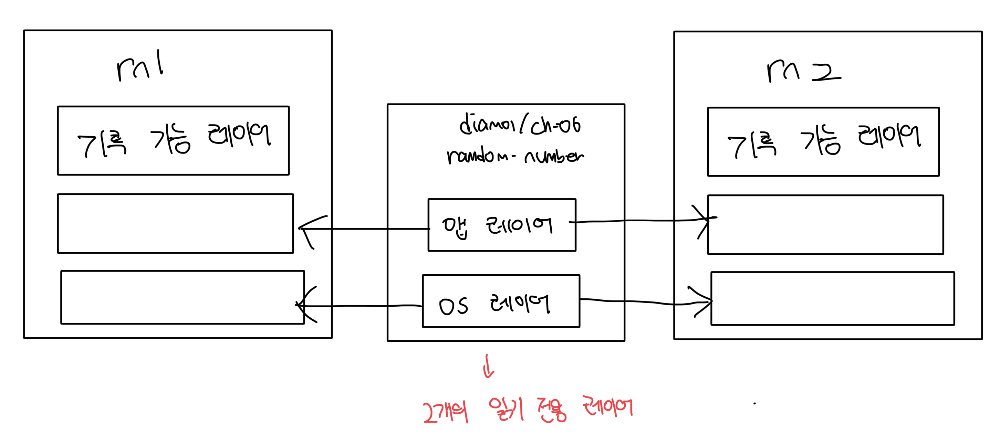

# 컨테이너의 파일 시스템

- 컨테이너의 디스크는 이미지 레이어를 순서대로 연결해서 만든 가상 파일 시스템이다
- 모든 컨테이너는 독립된 파일 시스템을 갖는다
- 초기에 동일한 이미지로부터 실행된 컨테이너는 모두 같은 내용을 갖지만, 특정 컨테이너의 파일을 수정해도 다른 컨테이너에는 영향을 미치지 않는다

<br>

### 컨테이너의 파일시스템이 독립적임을 확인해보기

- 같은 이미지로 시작한 컨테이너지만 내부 내용물은 서로 다르다
- 이로써 각 컨테이너는 독립적인 저장공간을 가진다고 증명이 가능하다

```bash
imkdw@dongwoo  ~  docker run --name rn1 diamol/ch06-random-number
imkdw@dongwoo  ~  docker run --name rn2 diamol/ch06-random-number

imkdw@dongwoo  ~  docker cp rn1:/random/number.txt number1.txt
Successfully copied 2.05kB to /Users/imkdw/number1.txt
imkdw@dongwoo  ~  docker cp rn2:/random/number.txt number2.txt
Successfully copied 2.05kB to /Users/imkdw/number2.txt

imkdw@dongwoo  ~  cat number1.txt
10341

imkdw@dongwoo  ~  cat number2.txt
8719
```

<br>

# 컨테이너 파일시스템 구성

- 기본적으로 이미지 레이어와 컨테이너의 기록 가능 레이어로 구분이 가능하다

<br>

### 이미지 레이어

- 모든 컨테이너가 공유한다
- 읽기전용으로 수정이 불가능하다

<br>

### 기록 가능 레이어

- 각각의 컨테이너마다 다르다
- 내부 데이터 수정이 가능하다
- 컨테이너가 삭제되면 해당 레이어도 물리적으로 삭제된다
  - 컨테이너와 동일한 라이프사이클을 가진다



<br>

# 이미지 레이어 수정하기

- 읽기 전용이라 수정이 안되는게 맞지만 `기록 중 복사(copy-on-write)` 방법을 사용해서 수정이 가능함
- 컨테이너나 앱에서는 해당 과정이 드러나지 않지만, 도커가 스토리지를 사용할 수 있는 매우 좋은 방법임
- 컨테이너 속 파일을 수정하면 해당 컨테이너에는 영향을 미친다
  - 이미지를 공유하는 다른 컨테이너나 이미지는 영향을 받지 않는다
  - 수정된 파일은 해당 컨테이너의 기록 가능 레이어에만 존재하기 때문이다

<br>

### 예제

- 최초 컨테이너 실행시에는 `https://...` 문구가 적혀있다
- 이후에 "asdf" 문구가 포함된 파일을 f1 컨테이너에 복사했다
- f1 컨테이너 실행시 이전에 복사한 내용이 출력되는걸 확인할 수 있다

```bash
imkdw@dongwoo  ~  docker run --name f1 diamol/ch06-file-display
https://www.manning.com/books/learn-docker-in-a-month-of-lunches

imkdw@dongwoo  ~  echo "asdf" > url.txt

imkdw@dongwoo  ~  docker container cp url.txt f1:/input.txt
Successfully copied 2.05kB to f1:/input.txt

imkdw@dongwoo  ~  docker container start --attach f1
asdf
```

<br>

# 컨테이너 스토리지 라이프사이클 확인하기

- 최초 구동이후에 f3 컨테이너의 파일을 복사하니 컨테이너와 동일한 내용이 보인다
- 이후에 f3 컨테이너를 삭제하고나니 `No such container: f3` 에러가 발생한다
- 이로써 컨테이너의 파일시스템은 컨테이너와 동일한 라이프사이클을 지닌것을 확인할 수 있다

```bash
✘ imkdw@dongwoo  ~  docker run --name f3 diamol/ch06-file-display
https://www.manning.com/books/learn-docker-in-a-month-of-lunches

imkdw@dongwoo  ~  docker container cp f3:/input.txt .
Successfully copied 2.05kB to /Users/imkdw/.

imkdw@dongwoo  ~  cat input.txt
https://www.manning.com/books/learn-docker-in-a-month-of-lunches

imkdw@dongwoo  ~  docker rm -f f3
f3

imkdw@dongwoo  ~  docker container cp f3:/input.txt .
Error response from daemon: No such container: f3
```

<br>

# 컨테이너의 영속성?

- 만약 도커로 DB를 운영도중에 컨테이너를 교체한다고 가정해보자
  - 교체되면 지워지고 다시 띄워지는거라 내부 내용이 전부 삭제된다
- 이런 상황을 감안해서 도커는 `도커 볼륨(Docker Volume)`과 `마운트(Mount)` 를 추가할 수 있다
  - 위 2개의 요소는 컨테이너와 다른 라이프사이클을 가지므로 지속돼야할 데이터를 저장할 수 있다
