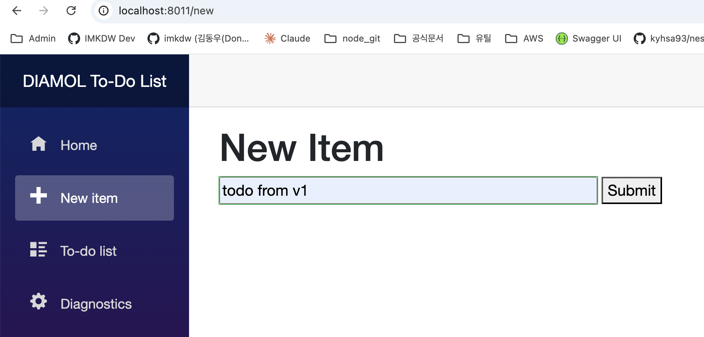
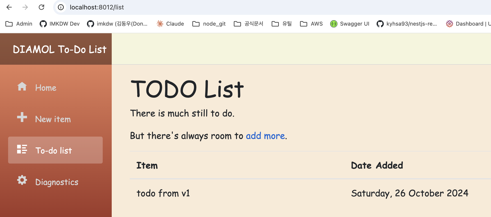

# 도커 볼륨

- 도커 볼륨은 도커에서 스토리지를 다루는 단위다
- 마치 컨테이너를 위한 USB라고 이해하면 쉽다

<br>

# 컨테이너에서 도커 볼륨 사용하기

<br>

### 수동으로 직접 생성해서 컨테이너에 연결하기

- `docker volume create <volume_name>`으로 볼륨 생성이 가능함
- `-v` 플래그를 사용해서 컨테이너 시작시 볼륨 마운트가 가능함
- 아래는 v1 컨테이너에서 데이터 추가시 v2에도 반영(디스크 공유)되는걸 나타냄

```bash
# 도커 볼륨 생성
imkdw@dongwoo  ~  docker volume create todo-list
todo-list

# v1 컨테이너 시작
imkdw@dongwoo  ~  docker run -d -p 8011:80 -v todo-list:/data --name todo-v1 diamol/ch06-todo-list
7d0dcc71e0a98fe8a315a98d9d30a9504ad2e1c777c47add41c5c7a9810b91b1

# v2 컨테이너 시작
imkdw@dongwoo  ~  docker run -d -p 8012:80 -v todo-list:/data --name todo-v2 diamol/ch06-todo-list:v2
66b19a7f8118ee52addfa0bb570e883faec599c3505272b277f5a67696b70878
```




<br>

### Dockerfile에서 VOLUMN 인스트럭션 사용하기

- VOLUME 인스트럭션은 `VOLUME <target-directory>` 형식으로 사용한다

```dockerfile
# 일부 내용

# set in the base image - `/data` for Linux, `C:\data` for Windows
VOLUME $SQLITE_DATA_DIRECTORY

# ...
```

```bash
# 명시적인 연결은 없지만 Dockerfile을 통해서 볼륨이 연결됨
imkdw@dongwoo  ~  docker run -d --name todo1 -p 8010:80 diamol/ch06-todo-list
cbb8096739d34b4cc51a5dcc48b2c3c38b0c64a2721c260c9316d8785843e4c1

# mounts 항목에서 볼륨 관련된 정보 확인이 가능하다
imkdw@dongwoo  ~  docker inspect --format '{{.Mounts}}' todo1
[{volume 5baf8fce2819f63c731417e0be889db779460f88316ffc44d099c2ce9150f8f3 /var/lib/docker/volumes/5baf8fce2819f63c731417e0be889db779460f88316ffc44d099c2ce9150f8f3/_data /data local  true }]

# 볼륨은 도커에서 이미지나 컨테이너와 동급인 요소다
imkdw@dongwoo  ~  docker volume ls
DRIVER    VOLUME NAME
local     5baf8fce2819f63c731417e0be889db779460f88316ffc44d099c2ce9150f8f3
```
