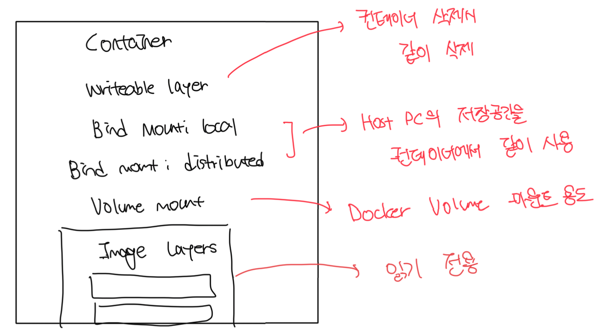

# 유니언 파일 시스템(Union File System)

- 모든 컨테이너는 도커가 다양한 출처로부터 모아 만든 단일 가상 디스크로 구성된 파일시스템을 가짐
  - 해당 파일 시스템을 `유니언 파일 시스템` 이라고 부름
- 유니온 파일 시스템은 OS마다 다르게 구성되어있음
  - 하지만 사용자 입장에서는 크게 생각하지 않아도됨. 도커가 알아서 잘 해줌
- 파일 시스템 중 기록 가능 레이어는 하나만 가질 수 있고 나머진 여러개가 가능함

 

# 컨테이너 스토리지 구성시 고려사항

### 기록 가능 레이어

- 캐싱 등 단기 저장에 적합한 레이어
- 각 컨테이너마다 독립적이다
- 생명주기가 컨테이너와 동일해서 컨테이너가 삭제되면 같이 삭제된다

 

### 로컬 바인드 마운트

- 호스트 PC와 컨테이너 간 데이터를 공유하기 위해서 사용함
- 예를 들면 개발한 내용을 컨테이너와 로컬에서 공유하면 빌드없이 바로 실행이 가능함

 

### 분산 바인드 마운트

- 네트워크 스토리지와 컨테이너 간 데이터 공유를 위해 사용함
- 가용성이 높지만 로컬 시스템에 비해 지원하지 않는 기능이 있을수도 있음

 

### 볼륨 마운트

- 앱의 데이터를 볼륨에 영구히 저장할 수 있음(영속성)
- 컨테이너를 교체하는 식으로 앱을 업데이트해도, 이전 버전 컨테이너의 데이터를 그대로 유지가 가능함

 

### 이미지 레이어

- 컨테이너의 초기 파일 시스템을 구성함
- 읽기 전용으로 여러개의 컨테이너가 공유함
