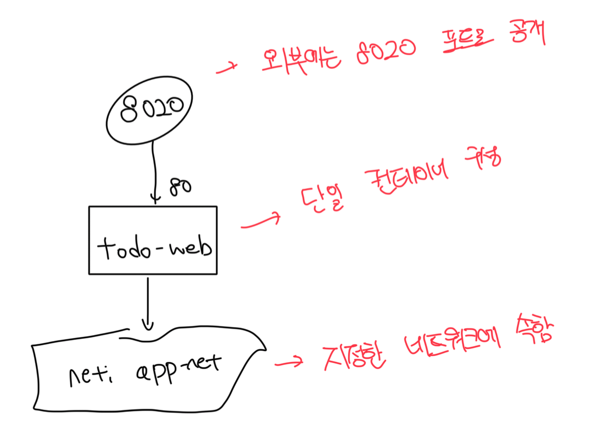

# Docker Compose란

- 앱의 원하는 상태, 즉 모든 컴포넌트가 실행중일때 어떤 상태여야 하는지 기술하는 파일
- `docker run` 옵션을 사용해야할때 지정해야하는 모든 옵션을 모아놓은 단순한 형식의 파일

<br>

# docker-compose.yml

```yml
version: "3.7"

services:
  todo-web:
    image: diamol/ch06-todo-list
    ports:
      - "8020:80"
    networks:
      - app-net

networks:
  app-net:
    external:
      name: nat
```

<br>

### version

- 도커 컴포즈 파일 형식의 버전을 나타냄
- 정의가 따르는 형식 버전을 지정할 필요가 있음
- **24.10.27 기준 deprecated될 예정임**

<br>

### services

- 앱을 구성하는 모든 컴포넌트를 열거하는 부분
- 실제 컨테이너가 아닌 서비스 개념을 단위로 삼음
- 하나의 서비스를 같은 이미지로 여러개의 컨테이너에서 실행이 가능함

<br>

### networks

- 서비스 컨테이너가 연결된 도커 네트워크를 열거하는 부분

<br>

# docker-compose를 통한 컨테이너 실행

- `external` 필드는 이미 존재하는 네트워크가 있을때 생성하지 말라는 뜻임
  - 윈도우의 경우는 도커 설치시 nat 네트워크가 자동 생성되서 그걸 사용함
- `docker-compose up` 명령어로 서비스 구동이 가능함
  - `docker-compose.yml` 파일을 찾아서 해당 내용대로 컨테이너가 구동됨

```bash
# 리눅스는 기본 nat 네트워크가 없으니 만들어줌
imkdw@dongwoo  ~/080258/ch07/exercises/todo-list   main  docker network create nat
06c43e2120053bdbd3ebfd598ed7682dc1eb4c5f9b0dc8e36eb866bbd29b242e

# 도커 컴포즈 실행
imkdw@dongwoo  ~/080258/ch07/exercises/todo-list   main  docker-compose up

[+] Running 1/0
 ✔ Container todo-list-todo-web-1  Created                                                                                                             0.1s
Attaching to todo-web-1
todo-web-1  | warn: Microsoft.AspNetCore.DataProtection.Repositories.FileSystemXmlRepository[60]
todo-web-1  |       Storing keys in a directory '/root/.aspnet/DataProtection-Keys' that may not be persisted outside of the container. Protected data will be unavailable when container is destroyed.
todo-web-1  | warn: Microsoft.AspNetCore.DataProtection.KeyManagement.XmlKeyManager[35]
todo-web-1  |       No XML encryptor configured. Key {3744bf4f-933a-4fc1-ae0f-d8a704c53c04} may be persisted to storage in unencrypted form.
todo-web-1  | info: Microsoft.Hosting.Lifetime[0]
todo-web-1  |       Now listening on: http://[::]:80
todo-web-1  | info: Microsoft.Hosting.Lifetime[0]
todo-web-1  |       Application started. Press Ctrl+C to shut down.
todo-web-1  | info: Microsoft.Hosting.Lifetime[0]
todo-web-1  |       Hosting environment: Production
todo-web-1  | info: Microsoft.Hosting.Lifetime[0]
todo-web-1  |       Content root path: /app
```



<br>

# 도커 컴포즈의 장점

- readme 파일에 포트나 구동방법 등을 명시하지 않아도 명령어 한줄로 앱을 띄울수있음
- 특히나 여러개의 서비스로 구성된 앱에서는 컴포즈 파일을 통해서 원활한 작업이 가능함
