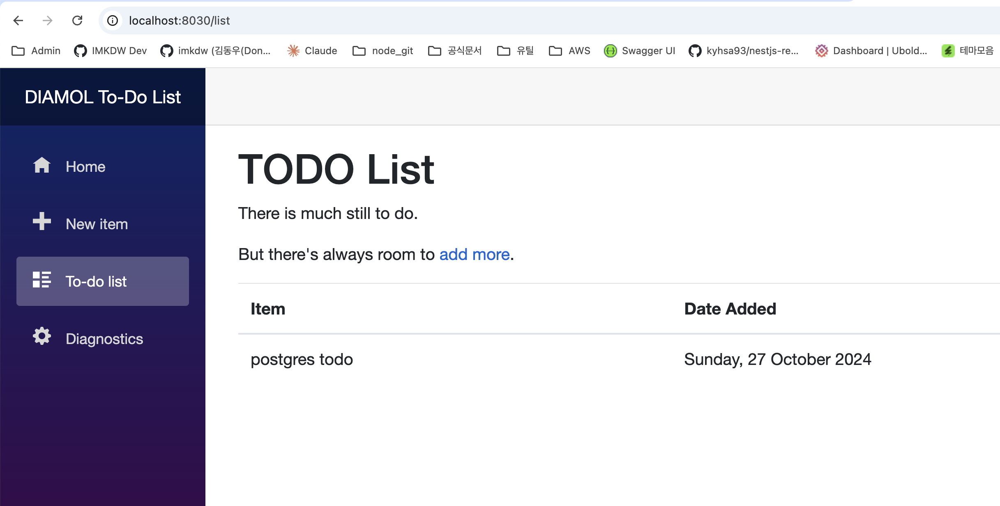
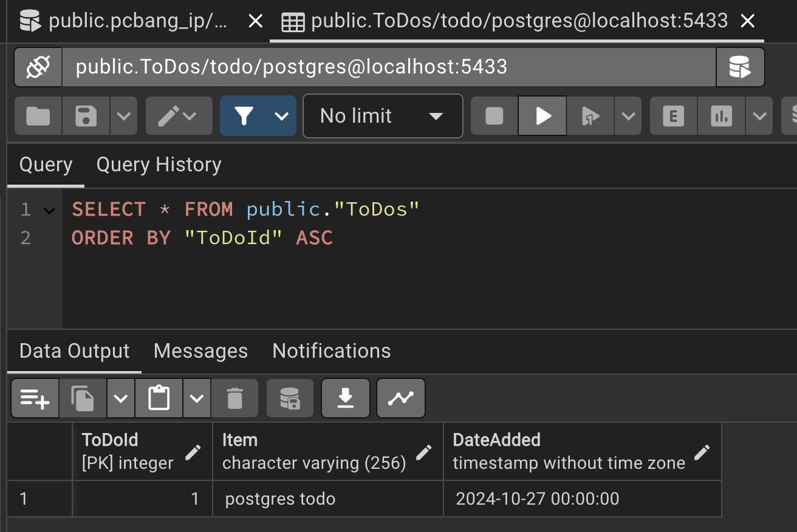

# 도커 컴포즈로 설정값 지정

- 환경변수의 경우는 주로 클러스터 환경에서 쿠버네티스나 도커 스웜 같은 컨테이너 플랫폼을 토애서 제공된다
- 다만 도커를 단일 PC에서 구동하는 경우는 그냥 파일을 통해서 제공해도 무방하다
- 또한 패키징된 앱과 설정값을 분리할 수 있다는게 도커의 핵심적인 장점 중 하나다
  - 개발 환경에서 계속해서 테스트하고 검증된 이미지를 그대로 프로덕션에서도 사용이 가능하다

```yml
services:
  todo-db:
    image: diamol/postgres:11.5
    ports:
      - "5433:5432"
    networks:
      - app-net

  todo-web:
    image: diamol/ch06-todo-list
    ports:
      - "8030:80"
    environment:
      - Database:Provider=Postgres
    depends_on:
      - todo-db
    networks:
      - app-net
    secrets:
      - source: postgres-connection
        target: /app/config/secrets.json

networks:
  app-net:

secrets:
  postgres-connection:
    file: ./config/secrets.json
```

```json
{
  "ConnectionStrings": {
    "ToDoDb": "Server=todo-db;Database=todo;User Id=postgres;Password=postgres;"
  }
}
```

```bash
imkdw@dongwoo  ~/080258/ch07/exercises/todo-list-postgres   main  docker-compose up -d
[+] Running 3/3
 ✔ Network todo-list-postgres_app-net       Created                                                                                                    0.0s
 ✔ Container todo-list-postgres-todo-db-1   Started                                                                                                    0.2s
 ✔ Container todo-list-postgres-todo-web-1  Started                                                                                                    0.2s

# db와 웹서버 2개가 활성화된다
imkdw@dongwoo  ~/080258/ch07/exercises/todo-list-postgres   main  docker-compose ps
NAME                            IMAGE                   COMMAND                   SERVICE    CREATED         STATUS         PORTS
todo-list-postgres-todo-db-1    diamol/postgres:11.5    "docker-entrypoint.s…"   todo-db    7 seconds ago   Up 6 seconds   0.0.0.0:5433->5432/tcp, [::]:5433->5432/tcp
todo-list-postgres-todo-web-1   diamol/ch06-todo-list   "dotnet ToDoList.dll"     todo-web   7 seconds ago   Up 6 seconds   0.0.0.0:8030->80/tcp, [::]:8030->80/tcp
```

<br>

# SQLite 대신 Postgres

- 실제 추가된 데이터가 도커를 통해 실행된 postgres에 저장된다



