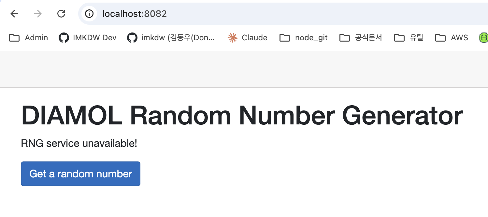

# 분산 앱에서 발생할 수 있는 문제

- 예를 들어 API 서버와 웹 서버를 띄운다고 가정한다
- 아직 API 서버가 준비되지 않았거나 에러가 발생했을 때 웹 서버를 시작한다면 문제가 발생한다
- 이는 이상이 생긴 컨테이너를 교체할 때는 처음 앱을 실행할때 처럼 컨테이너 간 의존관계를 고려하지 않기 때문이다

<br>

### 문제 상황

- 기존에 존재하는 API 서버를 삭제하고 진행한다
- 실제로 웹에 접속은 가능하지만 숫자를 요청하면 에러가 발생함

```bash
# 싹 다 삭제
imkdw@dongwoo  ~/080258/ch08/exercises/numbers   main  docker rm -f $(docker ps -aq);
a598b37fbf04

# 웹 서버 실행
imkdw@dongwoo  ~/080258/ch08/exercises/numbers   main  docker run -d -p 8082:80 diamol/ch08-numbers-web
da49926d76a9fbfdfd9ffa0502aa82f2fa64e6403d6eb931e1cd0e04b4a6336e

# 정상적으로 웹 서버가 구동되는 모습
imkdw@dongwoo  ~/080258/ch08/exercises/numbers   main  docker ps
CONTAINER ID   IMAGE                     COMMAND                   CREATED          STATUS          PORTS                                     NAMES
da49926d76a9   diamol/ch08-numbers-web   "dotnet /app/Numbers…"   33 seconds ago   Up 32 seconds   0.0.0.0:8082->80/tcp, [::]:8082->80/tcp   lucid_gates
```



<br>

# 의존관계 만족여부 추가하기

- 별도의 인스트럭션이 존재하는건 아니며 앱 실행 명령에 로직을 추가하는 방법으로 구현함

```dockerfile
FROM diamol/dotnet-aspnet

ENV RngApi:Url=http://numbers-api/rng

# curl 요청 및 dotnet 커맨드를 통해 의존관계 검증
CMD curl --fail http://numbers-api/rng && \
    dotnet Numbers.Web.dll

WORKDIR /app
COPY --from=builder /out/ .%
```

<br>

### 결과는

- `Could not resolve host: numbers-api` 에러가 발생하고 컨테이너도 종료됬다

```bash
imkdw@dongwoo  ~  docker run -d -p 8084:80 diamol/ch08-numbers-web:v2
99ef0031200058c49993d233a9b30109dd017fe8780f386be43d976f38b68357

imkdw@dongwoo  ~  docker ps -a
CONTAINER ID   IMAGE                        COMMAND                   CREATED         STATUS                     PORTS     NAMES
99ef00312000   diamol/ch08-numbers-web:v2   "/bin/sh -c 'curl --…"   4 seconds ago   Exited (6) 3 seconds ago             sharp_tesla
 imkdw@dongwoo  ~  docker logs 99e
  % Total    % Received % Xferd  Average Speed   Time    Time     Time  Current
                                 Dload  Upload   Total   Spent    Left  Speed
  0     0    0     0    0     0      0      0 --:--:-- --:--:-- --:--:--     0curl: (6) Could not resolve host: numbers-api
```

<br>

# 결론

- 헬스체크와 의존체크를 갖췄다면 이제 컨테이너 플랫폼 환경에 적합한 앱이라고 할 수 있음
- 외부 도구를 사용할수도 있지만 단순한 방법으로도 원하는 목적 달성이 가능하니 별도 외부 도구에 의존할 필요는 없음
