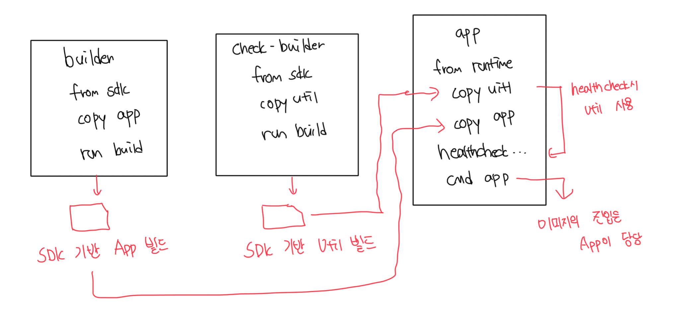

# 유틸리티 함수를 만드는 이유

- 모순이긴 하지만 전 장에서 curl 같은걸 써도 충분하다고 했다
- 하지만 실무에서는 테스트를 위해서 curl을 사용하지 않는다
  - 보안 정책상의 이유로 포함이 불가능하다
- 도커 이미지에는 앱을 구동하기 위한 최소한의 내용만 들어가야한다
- 위 같은 이유로 앱과 같은 언어로 구성된 별도의 유틸리티를 사용하는게 낫다

<br>

# 커스텀 유틸리티의 장점

- 앱과 같은 코드/도구라서 별도의 추가적인 SW를 포함하지 않아도 됨
- 쉘스크립트로 표현하기 까다로운 로직을 작성할 수 있음
- 앱과 같은 설정을 통해서 누락하는 부분을 최소화할수 있음
- 앱과 같은 환경에서 실제 컨테이너 실행 전 모든 사항 검증이 가능함

<br>



<br>

# 커스텀 유틸리를 적용한 컨테이너 시작

- `--health-inverval` 플래그로 헬스체크 주기로 5초로 줄임

```dockerfile
# 커스텀 유틸리티로 HEALTHCHECK 인스트럭션에서 curl 대체하기
FROM diamol/dotnet-aspnet

ENTRYPOINT ["dotnet", "Numbers.Api.dll"]
HEALTHCHECK CMD ["dotnet", "Utilities.HttpCheck.dll", "-u", "http://localhost/health"]

WORKDIR /app
COPY --from=http-check-builder /out/ .
COPY --from=builder /out/ .
```

```bash
imkdw@dongwoo  ~  docker run -d -p 8080:80 --health-interval 5s diamol/ch08-numbers-api:v3
2303367050b92d28d7c6aa7177488b2677b058c87791e97fe0fcde80ca5f1faa

# 헬스체크 성공
imkdw@dongwoo  ~  docker ps
CONTAINER ID   IMAGE                        COMMAND                   CREATED         STATUS                   PORTS                                     NAMES
2303367050b9   diamol/ch08-numbers-api:v3   "dotnet Numbers.Api.…"   6 seconds ago   Up 5 seconds (healthy)   0.0.0.0:8080->80/tcp, [::]:8080->80/tcp   stupefied_poincare

# ==========
# curl http://localhost:8080/rng
# API 호출 4번 진행 -> 에러상태 진입
# ==========

# ==========
# 15초(5s * 3) 대기
# ==========

# 헬스체크 비정상
imkdw@dongwoo  ~  docker ps
CONTAINER ID   IMAGE                        COMMAND                   CREATED          STATUS                      PORTS                                     NAMES
2303367050b9   diamol/ch08-numbers-api:v3   "dotnet Numbers.Api.…"   40 seconds ago   Up 39 seconds (unhealthy)   0.0.0.0:8080->80/tcp, [::]:8080->80/tcp   stupefied_poincare
```

<br>

# 웹 서버 실행시 의존관계 체크하기

```dockerfile
# app image
FROM diamol/dotnet-aspnet

ENV RngApi__Url=http://numbers-api/rng

CMD dotnet Utilities.HttpCheck.dll -c RngApi:Url -t 900 && \
    dotnet Numbers.Web.dll

WORKDIR /app
COPY --from=http-check-builder /out/ .
COPY --from=builder /out/ .
```

```bash
imkdw@dongwoo  ~  docker run -d -p 8081:80 diamol/ch08-numbers-web:v3
bc43d083bb63cc48610e71ef56560ff9c80a6d676573b017a9bdf071b4d6ebf9

# 기존 API 서버는 헬스체크에 실패하여 (unhealty) 상태로 구동중
# 신규로 실행한 웹 서버는 의존관계 체크에 실패해서 Exited 상태
imkdw@dongwoo  ~  docker ps -a
CONTAINER ID   IMAGE                        COMMAND                   CREATED         STATUS                     PORTS                                     NAMES
bc43d083bb63   diamol/ch08-numbers-web:v3   "/bin/sh -c 'dotnet …"   6 seconds ago   Exited (1) 5 seconds ago                                             stoic_jang
2303367050b9   diamol/ch08-numbers-api:v3   "dotnet Numbers.Api.…"   6 minutes ago   Up 6 minutes (unhealthy)   0.0.0.0:8080->80/tcp, [::]:8080->80/tcp   stupefied_poincare

# 커스텀 유틸리티 함수에서의 예외처리 메세지
imkdw@dongwoo  ~  docker logs bc4
HTTPCheck: error. Url http://numbers-api/rng, exception Name or service not known
```

<br>

# 커스텀 유틸리티의 장점

- 컨테이너 플랫폼마다 헬스체크 및 디펜던시 체크를 정의하고 실행하는 방법이 모두 다름
- 커스텀 유틸리티를 사용하면 플랫폼 관계없이 어떤 환경에서도 그대로 동작시킬수 있음
