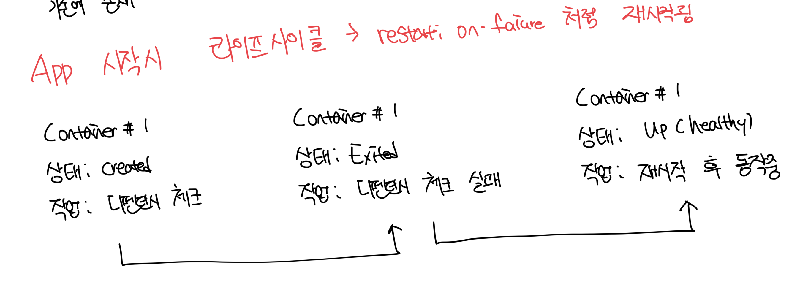
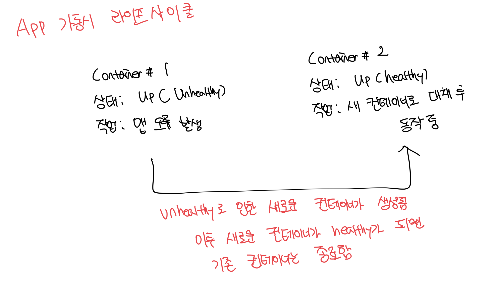

# 헬스체크와 디펜던시 체크가 활약하는 부분

- 위 2개의 기능을 사용하면 굳이 플랫폼의 실행순서를 보장할 필요가 없음
- 대규모 시스템이라도 최대한 빠르게 뜨고 반복적인 체크를 통해서 빠르게 상태를 Up 시키면됨
- 만약 클러스터링된 여러개의 컨테이너중에서도 에러가 발생하면 빠르게 다른 컨테이너로 또 띄울 수 있음

 

# 자기 수복 능력

- 일시적인 에러를 플랫폼에서 해결해주는 것

