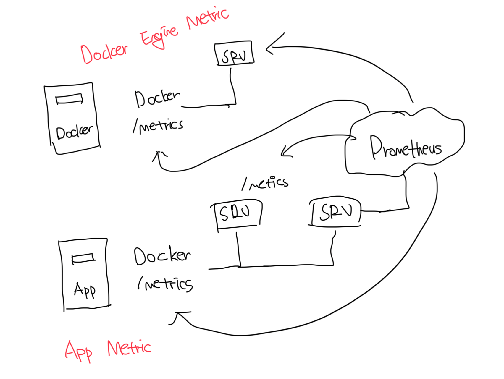
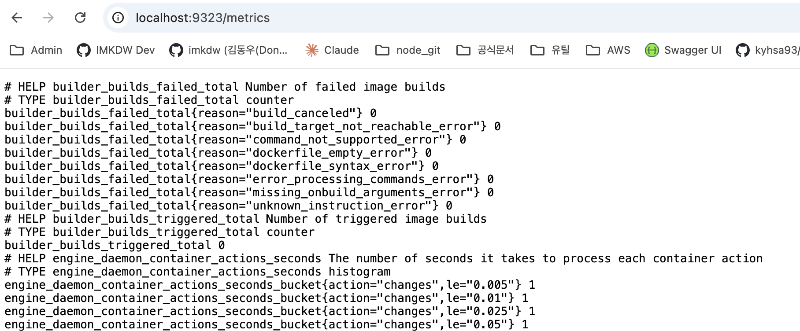
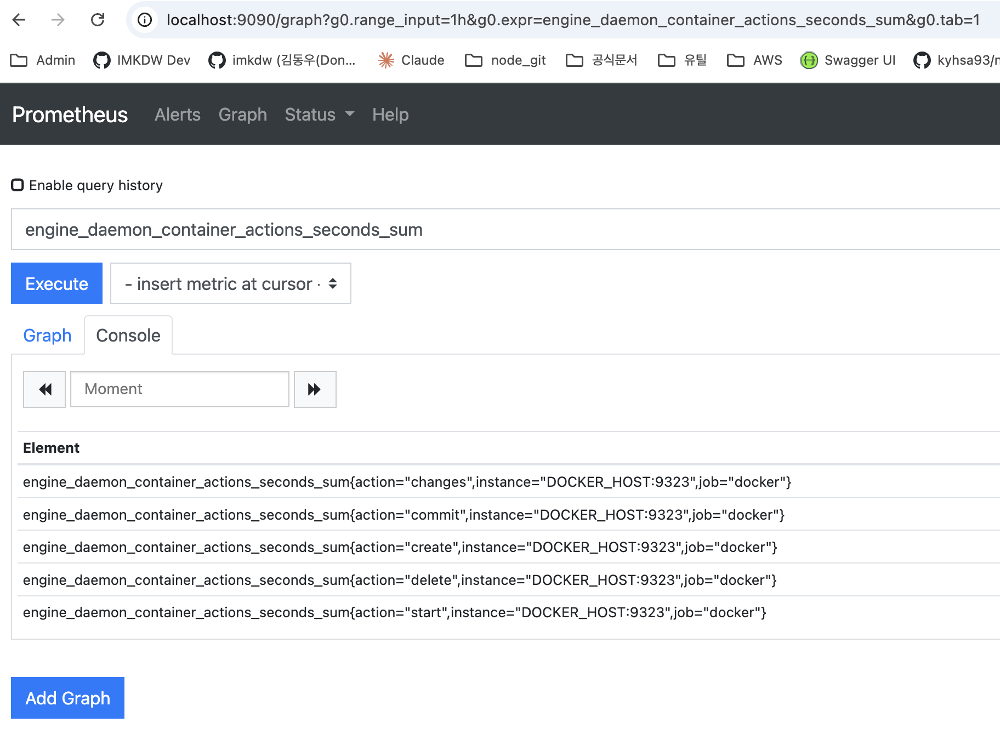

# 일반 환경에서의 모니터링

- 단일 서버에서 앱이 동작하는 경우 모니터링이라고 하면 디스크 공간, RAM, CPU 등이 존재한다
- 보통 대시보드가 존재하고 임계치를 넘어가면 알람이 발생하는 구조다

<br>

# 컨테이너 환경에서의 모니터링

- 정적인 컨테이너나 IP 없이도 실행중인 앱에 대해서 확인할 수 있는 모니터링 방식이 필요하다

<br>

# 프로메테우스(Prometheus)

- CNCF에서 개발을 담당하고이고 널리 사용되고 있다
- 마찬가지로 컨테이너에서 동작하기 때문에 분산 앱에서 어렵지않게 모니터링을 추가할 수 있다
- 앱의 프로그래밍 언어에 상관없이 모든 앱을 표준적인 형태로 모니터링이 가능해서 일관성을 보장해준다
- 또한 도커 엔진의 측정값도 추출이 가능하다



<br>

# 도커 엔진 메트릭 수집 설정

### orbstack 기준

- ~/.orbstack/config/docker.json 수정
- `orb restart docker` 실행

```json
{
  "metrics-addr": "0.0.0.0:9323"
}
```

<br>



<br>

# 프로메테우스에서 로컬PC 정보 수집하기

```bash
# 현재 PC의 IP 정보 설정(MacOS)
imkdw@dongwoo  ~  hostIP=$(ifconfig en0 | grep -e 'inet\s' | awk '{print $2}')

# 현재 PC의 IP
imkdw@dongwoo  ~  echo $hostIP
172.30.1.6

# prometheus 실행
imkdw@dongwoo  ~  docker run -e DOCKER_HOST=$hostIP -d -p 9090:9090 diamol/prometheus
84b8bb606d242604aaa828ff9043a899bb1aa45200b6ef86ce825862db96c2f3
```


