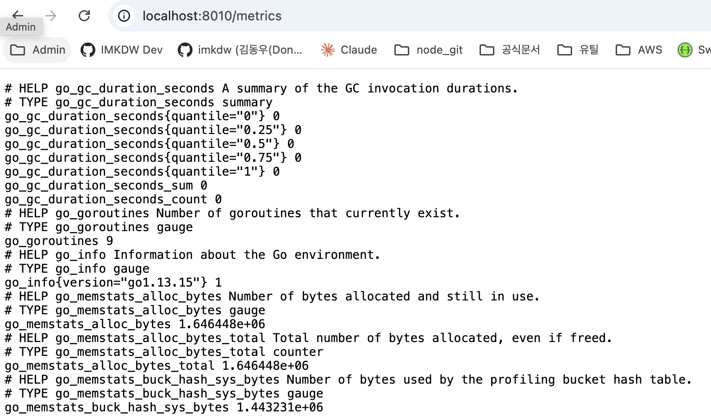

# 앱의 측정값

- 앱의 유용한 정보를 측정값으로 구성할려면 API 엔드포인트로 출력이 필요해서 도커엔진 측정값 보다는 좀 더 복잡하다
- 각 프로그래밍 언어별로 공식 또는 비공식 라이브러리가 존재한다
- 보통 수집한 정보는 런타임 수준의 측정값이다. 아래는 예시다
  - Go: 활성 상태인 고루틴의 개수
  - Java : JVM의 메모리 사용량

 

### 수집하는 정보들

- docker-compose를 통해 실행하면 localhost:8010/metrics에서 확인이 가능하다

 

# 도움이 될만한 지표들

- 연산 중심의 정보 : 컴포넌트가 처리중인 이벤트 수, API 평균 응답시간 등
- 비즈니스 중심의 정보 : 활성화된 사용자 수, 새로운 서비스를 사용하는 사용자 수 등
- 어떤 정보를 수집할지는 앱마다 다 다르다
