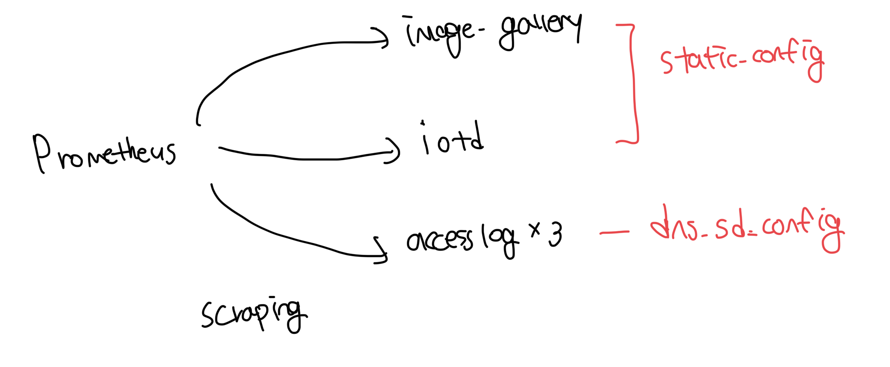
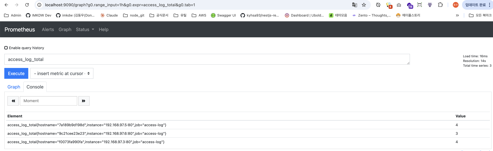
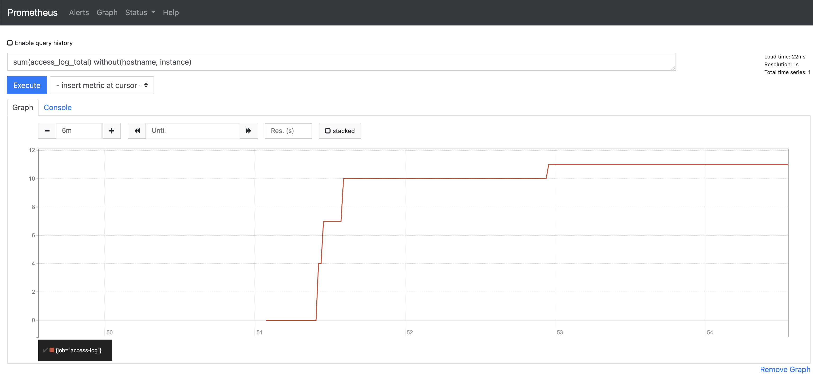

# 프로메테우스의 데이터 수집

- 프로메테우스는 대상 시스템에서 데이터를 받아다가 수집하는 폴링 방식으로 동작함
  - 해당 과정을 스크래핑(scraping) 이라고 부름

<br>

# 프로메테우스 설정

- `scrape_interval`: 스크래핑 주기를 기본값인 10초로 지정함
- `static_config`: 정적 설정으로 단일 컨테이너를 지정함
- `dns_sd_config`: 도커의 DNS 디스커버리 기능을 통해 여러개의 컨테이너를 지정

```yml
global:
  scrape_interval: 10s

scrape_configs:
  - job_name: "image-gallery"
    metrics_path: /metrics
    static_configs:
      - targets: ["image-gallery"]

  - job_name: "iotd-api"
    metrics_path: /actuator/prometheus
    static_configs:
      - targets: ["iotd"]

  - job_name: "access-log"
    metrics_path: /metrics
    scrape_interval: 3s
    dns_sd_configs:
      - names:
          - accesslog
        type: A
        port: 80

  - job_name: "docker"
    metrics_path: /metrics
    static_configs:
      - targets: ["DOCKER_HOST:9323"]
```



<br>

### 수집 잘되는지 보기

```yml
services:
  accesslog:
    image: diamol/ch09-access-log
    ports:
      - "80"
    networks:
      - app-net

  iotd:
    image: diamol/ch09-image-of-the-day
    ports:
      - "8011:80"
    networks:
      - app-net

  image-gallery:
    image: diamol/ch09-image-gallery
    ports:
      - "8010:80"
    depends_on:
      - accesslog
      - iotd
    networks:
      - app-net

  prometheus:
    image: diamol/ch09-prometheus
    ports:
      - "9090:9090"
    environment:
      - DOCKER_HOST=${HOST_IP}
    networks:
      - app-net

networks:
  app-net:
    external:
      name: nat
```

```bash
 imkdw@dongwoo  ~/080258/ch09/exercises   main  docker-compose -f docker-compose-scale.yml up -d --scale accesslog=3
[+] Running 6/6
 ✔ Container exercises-iotd-1           Started                                                                                                        0.3s
 ✔ Container exercises-accesslog-1      Started                                                                                                        0.6s
 ✔ Container exercises-prometheus-1     Started                                                                                                        0.3s
 ✔ Container exercises-accesslog-2      Started                                                                                                        0.3s
 ✔ Container exercises-accesslog-3      Started                                                                                                        0.4s
 ✔ Container exercises-image-gallery-1  Started                                                                                                        0.6s

# API 호출하기
imkdw@dongwoo  ~/080258/ch09/exercises   main  for i in {1..10}; do curl http://localhost:8010 > /dev/null; done
```

인스턴스별로 골고루 로드밸런싱이 잘 된 모습


<br>

# 그래프 추가하기

- 아래 쓰인 `sum()` 함수는 프로메테우스에서 사용하는 `PromQL`이라는 언어다
- 사실 이러한 UI를 대시보드라고 할순 없어서 메트릭 데이터를 기반으로 UI에 표기하는 `Grafana`가 존재한다


