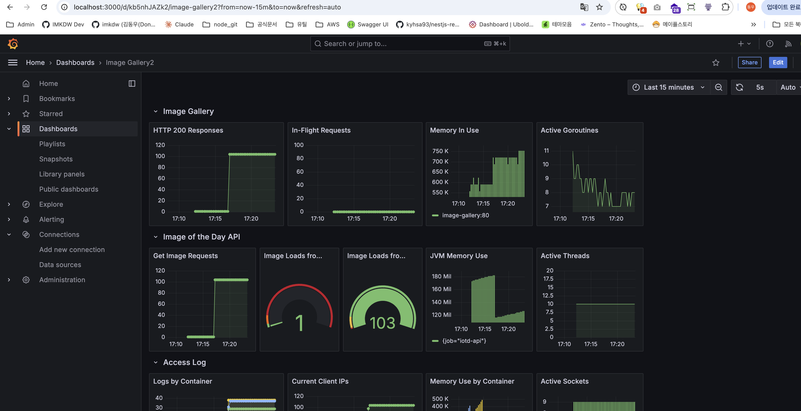

# 그라파나가 포함된 컨테이너 실행

```bash
# IP 설정(MacOS)
imkdw@dongwoo  ~/080258/ch09/exercises   main  export HOST_IP=$(ipconfig getifaddr en0)

# IP가 잘 설정된 모습
imkdw@dongwoo  ~/080258/ch09/exercises   main  echo $HOST_IP
172.30.1.6

# grafana가 포함된 컨테이너 실행
imkdw@dongwoo  ~/080258/ch09/exercises   main  docker-compose -f docker-compose-with-grafana.yml up -d --scale accesslog=3

# 부하 발생시키기
imkdw@dongwoo  ~/080258/ch09/exercises   main  for i in {1..20}; do curl http://localhost:8010 > /dev/null; done
```

<br>

# Grafana 접속

- docker-compose에 기재된 주소인 `http://localhost:3000` 접속
- 이후에 `data source` 설정 및 대시보드 json import 처리



<br>

# 대시보드 팁

- 정보는 모두 `PromQL`을 통해 만들어지는데 이 때 복잡한 쿼리가 중요한게 아님
- 어떤 측정값을 보여줄지 잘 골라서 시각화하는게 중요함
