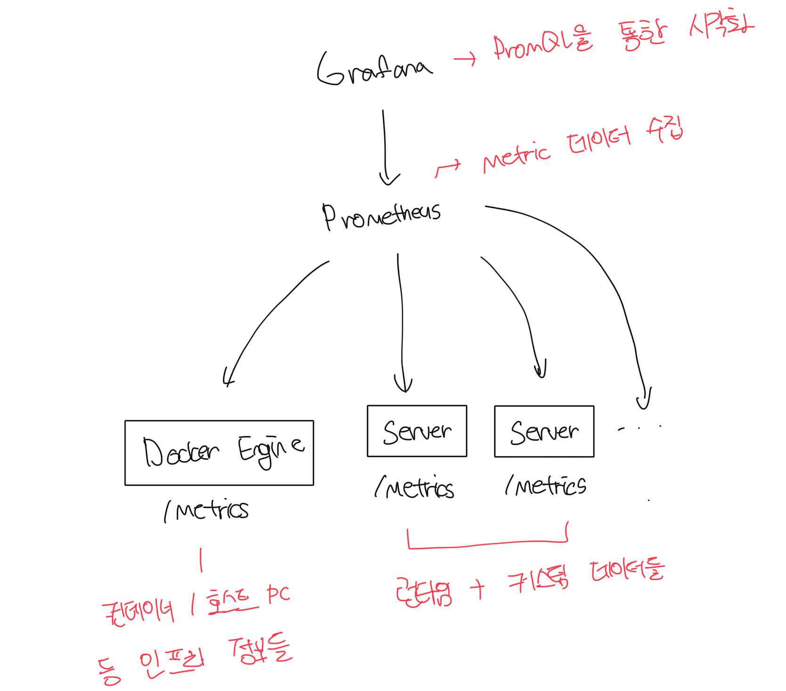

# 투명성(Observability)

- 간단한 개념 검증 수준의 앱에서 실제 프로덕트로 나아가기 위해서는 투명성이 필요하다
- 실제 운영 환경에서는 대시보드가 꼭 필요한데 그 중에서도 앱의 전체 상황을 조망하는 대시보드가 중요하다
- 측정값 중 가장 앱에 중요한 데이터를 모아 하나의 화면으로 구성할 수 있어야한다

 

# 투명성 아키텍쳐 한눈에 보기

