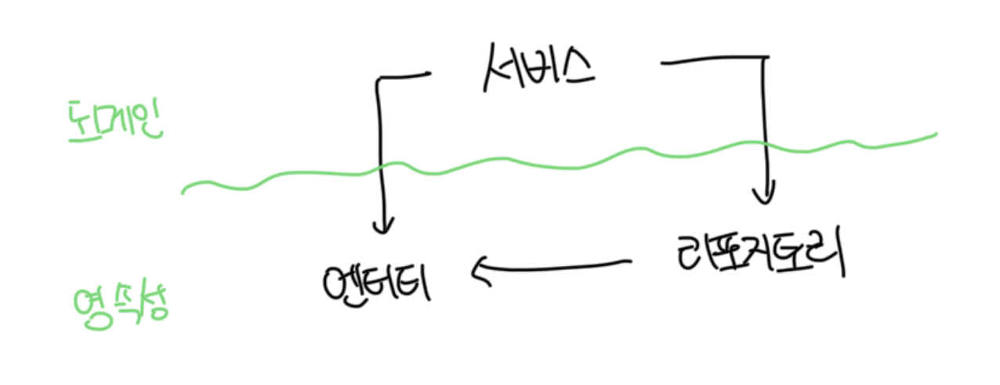

# 계층형 아키텍쳐란

- 웹, 도메인, 영속성 3개의 계층으로 나누어진 아키텍쳐
- 구성만 잘 한다면 견고한 아키텍쳐 패턴이다
- 하지만 갈수록 코드에 나쁜 습관이 스며들고, 시간이 지날수록 유지보수가 힘들어지는 허점들을 노출함

 

# 계층형 아키텍쳐는 디비 주도 설계를 유도함

- 모든것이 영속성 계층을 토대로 만들어짐
- 앱을 만들때는 `상태(state)`가 아닌 `행동(behaviro)`을 중심으로 구성해야함
- 계층형 아키텍쳐의 경우는 자연스럽게 디비 구조를 생각하고 도메인 로직을 구성하게됨
- 비즈니스 관점에서 생각한다면 다른 무엇보다 도메인 로직을 먼저 만들어야함

 

### 디비 중심 설계가 되어버리는 가장 큰 원인

- `ORM(Object Relational Mapping)`을 사용하기 때문임
- ORM 프레임워크를 계층형 아키텍쳐와 결합하는 경우는 비즈니스 규칙을 영속성 관점과 섞고 싶은 유횩에 빠짐
- 서비스는 영속성 모델을 비즈니스 모델처럼 사용하게 되어버리고, 영속성 계층과 관련된 작업들을 해야만함

 

# 지름길을 택하기 쉬워짐

- 기본적인 원칙은 특정한 계층에서는 같은 게층에 있는 컴포넌트나 아래 계층에만 의존한다는 원칙이 있다
- 하지만 시간이 지날수록 이러한 원칙이 깨지고 복잡해진다
- 영속성 계층은 컴포넌트를 아래로 내릴수록 비대해진다

 

# 테스트하기 어려워진다

### 도메인 로직을 웹 계층에 구현

- 단 하나의 필드를 조작하는것 만으로 도메인 로직을 웹 계층에 구현하게됨
- 만약 유즈케이스가 확장되면 더 많은 도메인 로직이 웹 계층에 작성될것임
- 앱 전반에 걸쳐서 책임이 섞이고 핵심 도메인 로직들이 퍼져나갈 확률이 높음

 

### 웹 계층 테스트에서 도메인 계층뿐 아니라 영속성 계층도 모킹

- 단위 테스트에대한 복잡도가 올라간다
- 테스트에 대한 설정이 복잡한것은 결국 테스트를 전혀 만들지 않는 방향으로 가는 첫걸음이됨
- 점점 코드가 복잡해지고 테스트 작성시 종속성을 이해하고 목을 만드는 시간이 더 걸리게됨

 

# 유스케이스를 숨긴다

- 대부분의 개발자는 새로운 유즈케이스 구현을 선호하지만 현실은 수정에 대한 시간이 더 오래 걸린다
- 유즈케이스가 간단해서 도메인 계층을 생략했다면 웹 계층에 존재할수도 있고, 영속성 계층에 존재할수도 있다
- 이런 경우 이미 어디에 기능을 구현할지 매우 어려워진 상태인데 시간이 지나면 모든 기능을 담당하는 서비스가 만들어지기도 한다
- 만약 `UserService`가 아닌 `RegisterUserService` 처럼 서비스가 유스케이스를 하나씩만 담당하면 매우 수월해질것이다

 

# 동시 작업이 어려워짐

- 디비를 기반으로 설계하는 방법은 영속성 로직과 도메인 로직이 뒤섞여서 각 측면을 개별적으로 개발이 불가능함
- 코드에 넓은 서비스가 있다면 더더욱 불가능하고 결국 같은 코드를 수정해서 `병합 충돌`이 발생한다
