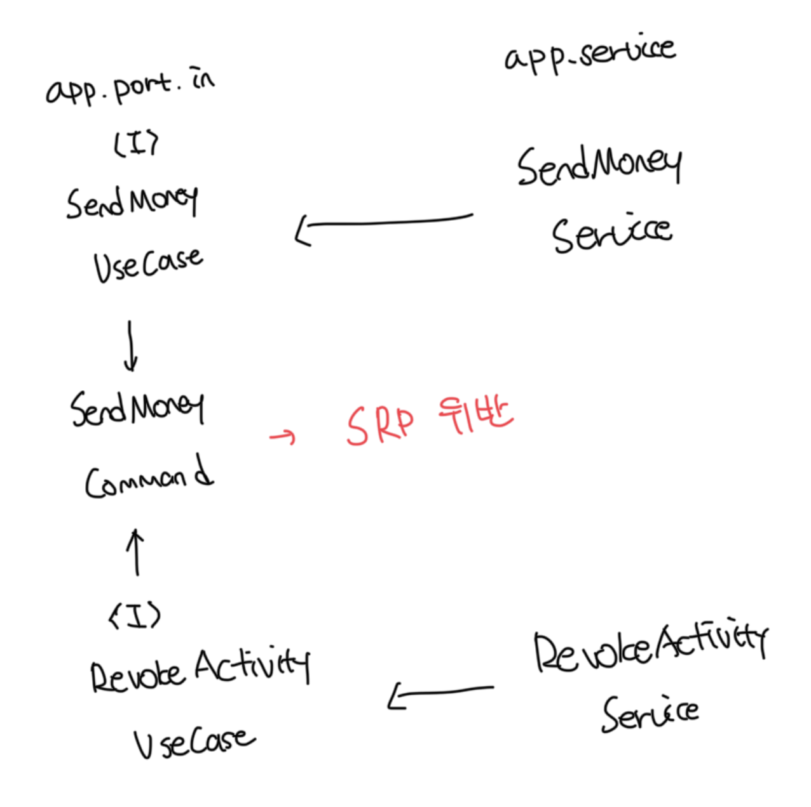
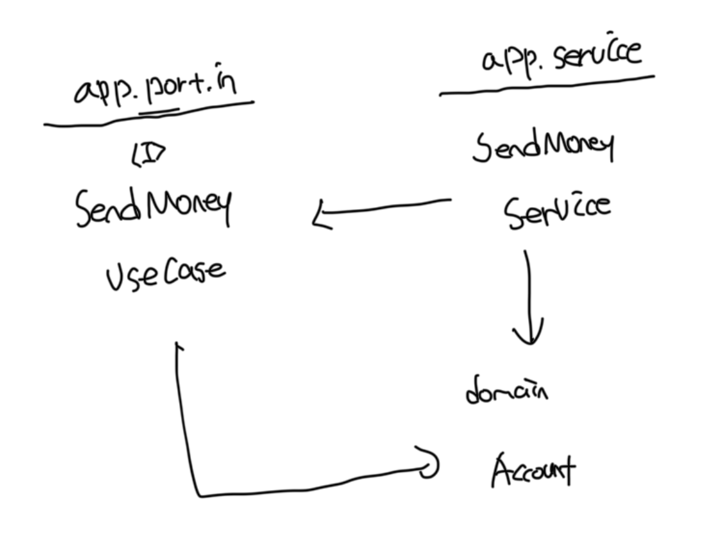
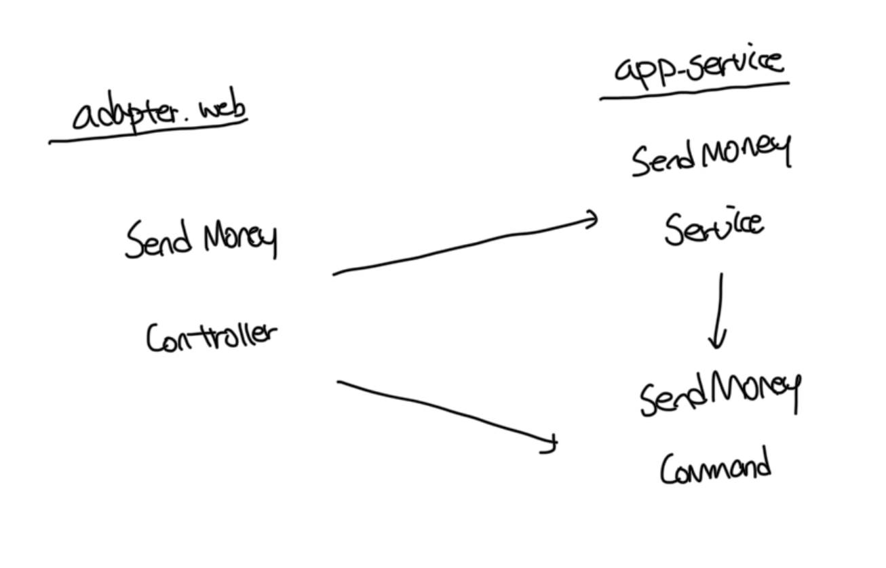
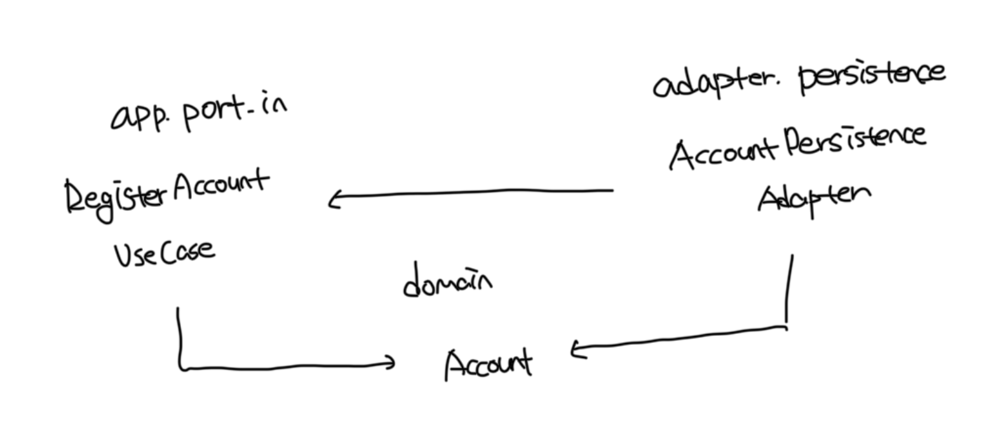

# 유스케이스 간 모델 공유하기

- 아래 예제에서는 공유하는 Command가 변경되는 경우 2개의 유스케이스가 모두 변경된다
- 유스케이스간 입출력 모델을 공유하는건 유스케이스들이 기능적으로 묶여있을때 유효하다
  - 즉 특정 세부사항을 변경할 경우 실제로 두 유스케이스 모두에 영향을 주고싶을때다

 

# 도메인 엔티티를 입출력 모델로 사용하기

- 인커밍 포트는 도메인 엔티티에 의존성을 가진다. 즉 `Account` 엔티티는 변경해야되는 또 다른 이유가 생긴다
- 간단한 CRUD 유스케이스에서는 인터페이스에 도메인 엔티티가 있는게 괜찮을수도 있다
- 하지만 복잡한 도메인 로직 구현이 필요하다면 유스케이스 인터페이스에 대한 전용 입출력 모델을 사용하는게 좋다
- 초기에는 단순한 CRUD로 시작하게되지만, 점점 복잡도가 높아지는 애자일 환경에서 어느 시점에 독립적인 전용 입력 모델을 사용할지 잘 파악하는게 중요하다

 

# 인커밍 포트 건너뛰기

- 인커밍 포트는 의존성 역전에 필수적인 요소는 아니고 인커밍 어댑터가 앱 서비스에 바로 접근이 가능하다
- 추상화 계층을 줄이는게 좋아보일수도 있으나 인커밍 포트는 앱 중심에 접근하는 진입점을 정의하는 역할을 한다
- 또한 아키텍쳐를 쉽게 강제할수가 있다. 앱 게층에 대한 모든 진입점을 정의하는 것이 아주 의식적인 결정이 왼다

 

# 앱 서비스 건너뛰기

- 위 방식은 공유해야하는 모델이 Account 도메인 엔티티이므로 도메인을 모델을 입력 모델로 사용하는 케이스가 된다
- 또한 중간의 앱 서비스 계층이 없으므로 유즈케이스라는게 사라진다
- 점점 고도화되면서 단순 CRUD가 아닌 복잡한 도메인 로직이 필요하다면 영속성 계층에 작성하는게 아닌 유즈케이스 계층에 작성하는게 좋다
