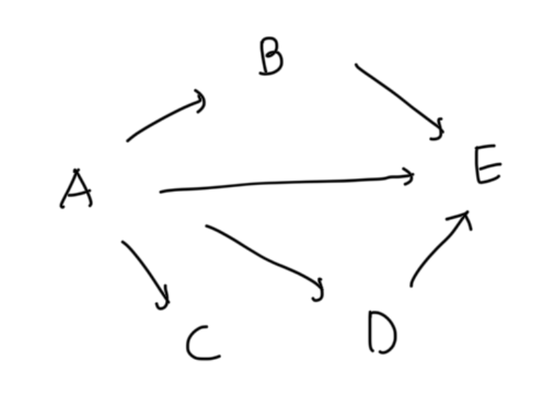
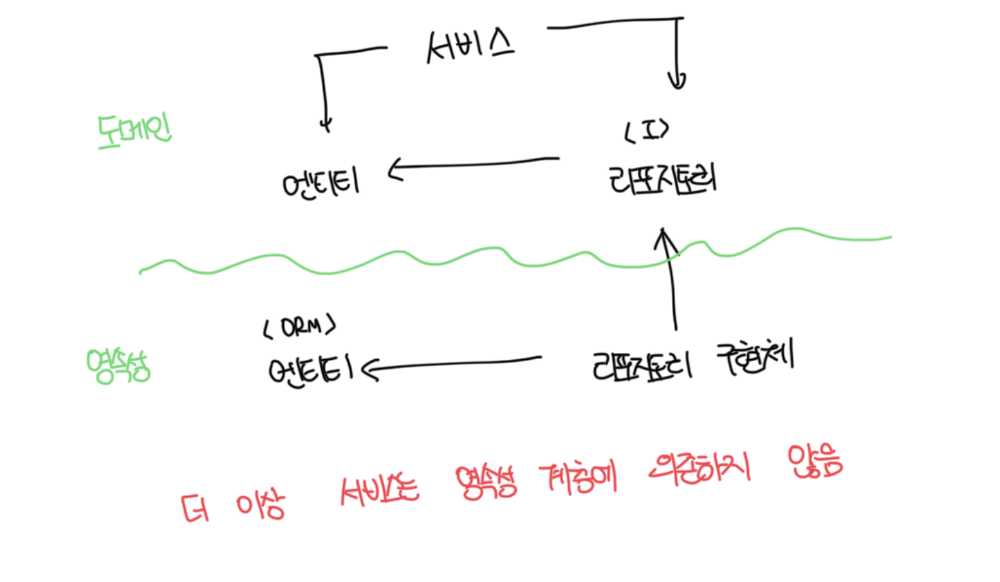

# SRP(단일 책임 원칙)

- 컴포넌트는 오직 한가지 일만 해야하고, 변경해야 하는 이유는 오직 하나뿐이여야 한다

 

### 예제

- E를 의존이 없기때문에 변경할 유일한 이유는 E에 새로운 기능이 추가됬을때다
- A의 경우 모든 컴포넌트에 의존하고있어서 다른 어떤 컴포넌트가 바뀌든지 같이 바뀌어야한다

 

# 의존성 역전 원칙

- 계층형 아키텍쳐에서는 의존성이 항상 다음 계층인 아래 방향을 가르킨다
- 상위 계층들이 하위 계층들에 비해 변경할 이유가 더 많다는 증거다
- 이러면 영속성 계층을 변경할 때 마다 도메인 계층도 바꿔야하는데, 영속성 코드가 바뀐다고해서 도메인 코드까지 바꾸고싶지는 않다
- 의존성 역전 원칙은 코드상의 어떤 의존성이든 그 방향을 바꿀 수 있다는 말이다
  - 외부 라이브러리 처럼 코드에 대한 제어권이 없다면 힘들다

 

# 클린 아키텍쳐

- 도메인 코드가 바깥으로 향하는 어떤 의존성도 없어야 함을 의미함
- 의존성 역전의 도움으로 모든 의존성이 도메인 코드를 향하게됨
- 도메인 계층이 외부 계층과 철저하게 분리되므로 앱의 엔티티에 대한 모델을 각 계층에서 유지보수 해줘야함
  - 예를 들면 영속성 계층과 도메인 계층의 모델은 다르기때문에 따로 만들어줘야함
- 다소 추상적인 내용이 많아서 이러한 원칙을 조금 더 구체적으로 만들어주는 헥사고날 아키텍쳐가 존재함

 

 

# 헥사고날 아키텍쳐(포트 앤 어댑터 아키텍쳐)

- 클린아키텍쳐와 동일하게 모든 의존성은 도메인으로 향함
- 육각형의 외부에는 앱과 상호작용하는 다양한 어댑터들이 존재함
- 왼쪽의 어댑터는 앱을 주도하는 어댑터고, 오른쪽은 앱에 의해 주도되는 어댑터다

