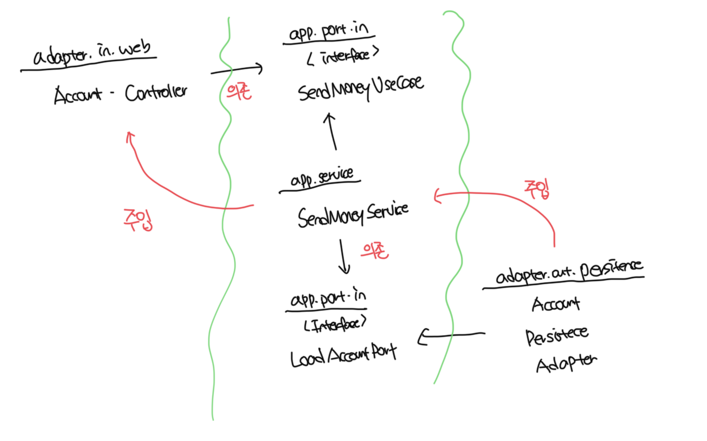

# 계층으로 구성하기

- 앱의 기능 조각이나 특성을 구분짓는 패키지 경계가 없음
- 앱이 어떤 유스케이스를 제공하는지 파악이 불가능함
- 영속성 어댑터가 도메인 계층에 어떤 기능을 제공하는지 한눈에 볼 수 없음
  - 인커밍 포트와 아웃고잉 포트가 코드속에 숨겨짐

```
└── buckpal/
    ├── domain/
    │   ├── Account
    │   ├── Activity
    │   ├── AccountRepository
    │   └── AccountService
    ├── persistence/
    │   └── AccountRepositoryImpl
    └── web/
        └── AccountController
```

<br>

# 기능으로 구성하기

- 기능에 의한 패키징 방식은 계층에 의한 패키징 방식보다 가시성을 떨어트림
- 어댑터를 나타내는 패키지명이 없고, 인커밍/아웃고잉 포트 확인이 불가능함
- 도메인 코드와 영속성 코드 간 의존성을 역전시켜서 `SendMoneyService`가 `AccountRepository` 인터페이스만 알고있음에도 불구고 도메인 코드가 실수로 영속성 코드에 의존하는걸 막을 수 없음

```
└── buckpal/
    └── account/
        ├── Account
        ├── AccountController
        ├── AccountRepository
        ├── AccountRepositoryImpl
        └── SendMoneyService
```

<br>

# 아키텍쳐적으로 표현력 있는 패키지 구조

```
└── buckpal/
    └── account/
        └── adapter/
            └── in/
                ├── web/
                │   └── AccountController
                ├── out/
                │   └── persistence/
                │       ├── AccountPersistenAdapter
                │       └── SpringDataAccountRepository
                ├── domain/
                │   ├── Account
                │   └── Activity
                └── application/
                    ├── SendMoneyService
                    └── port/
                        ├── in/
                        │   └── SendMoneyUseCase
                        └── out/
                            ├── LoadAccountPort
                            └── UpdateAccountStatePort
```

- `account`: Account와 관련된 유즈케이스를 구현한 모듈임을 나타냄
- `domain`: 도메인 모델이 속한 패키지
- `application`: 도메인 모델을 둘러싼 서비스 계층을 포함
- `SendMoneyService`: 인커밍 포트 인터페이스인 유즈케이스를 구현하고 아웃고잉 포트 인터페이스이자 영속성 어댑터에 의해 구현된 `LoadAccountPort`, `UpdateAccountStatePort`를 사용함
- `adapter`: 인커밍 포트를 호출하는 인커핑 어댑터와 앱 계층의 아웃고잉 포트에 대한 규칙을 제공하는 아웃고잉 어댑터를 포함

<br>

# 의존성 주입의 역할

- 컨트롤러는 유스케이스의 인터페이스를 필요로 하기때문에 서비스를 주입함
- 서비스는 아웃포트의 인터페이스를 필요로 하기때문에 영속성 어댑터를 주입함


