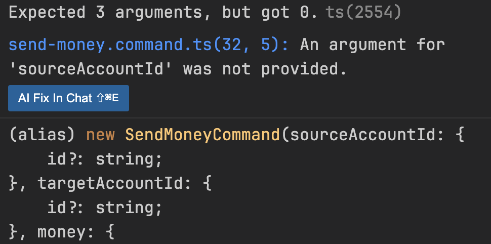

# 도메인 모델 구현하기

- 한 계좌에서 다른 계좌로 송금하는 유즈케이스를 구현한다
- 입금과 출금이 가능한 Account 엔티티를 만들고 출금 계좌에서 돈을 출금하고 입금 계좌로 돈을 입금하는 흐름이다
- 입금, 출금이 가능한 `Account` 엔티티가 준비되면 이를 중심으로 유스케이스 구성을 위한 바깥 방향으로 나갈 수 있다

```ts
/**
 * 실제 계좌의 현재 스냅숏을 제공
 * 계좌에 대한 모든 입금/출금은 해당 엔티티에 포작됨
 */
export default class Account {
  private id: AccountId;

  /**
   * activityWindow의 첫번째 활동 바로 전의 잔고를 표현하는 금액
   */
  private baselineBalance: Money;

  /**
   * 지난 며칠 혹은 몇 주간의 계좌의 활동을 보유함
   * 모든 활동을 항상 메모리에 올리는것은 효율적이지 않음
   */
  private activityWindow: ActivityWindow;

  // getter, setter 생략

  /**
   * 계좌의 현재 잔고를 계산한다
   */
  calculateBalance(): Money {
    return Money.add(
      this.baselineBalance,
      this.activityWindow.calculateBalance(this.id)
    );
  }

  /**
   * 출금을 처리한다
   * 1. 만약 현재 출금이 가능한 상태가 아니라면 false를 반환한다
   * 2. 출금이 가능하다면 새로운 출금 활동을 생성하고 activityWindow에 추가한다
   * 3. true를 반환한다
   */
  withdraw(money: Money, tagetAccountId: AccountId): boolean {
    if (!mayWithdraw(money)) {
      return false;
    }

    const withdrawal = new Activity(
      this.id,
      this.id,
      tagetAccountId,
      new Date(),
      money
    );

    this.activityWindow.addActivity(withdrawal);
    return true;
  }

  /**
   * 입금을 처리한다
   * 1. 새로운 입금 활동을 생성하고 activityWindow에 추가한다
   * 2. true를 반환한다
   */
  deposit(money: Money, sourceAccountId: AccountId): boolean {
    const deposit = new Activity(
      this.id,
      sourceAccountId,
      this.id,
      new Date(),
      money
    );

    this.activityWindow.addActivity(deposit);
    return true;
  }

  /**
   * 출금이 가능한지 확인한다
   * 1. 현재 잔고와 출금 금액을 비교한다
   * 2. 만약 출금이 가능하다면 true를 반환한다
   * 3. 그렇지 않다면 false를 반환한다
   */
  private mayWithdraw(money: Money): boolean {
    return Money.add(this.calculateBalance(), money.negate()).isPositive();
  }
}
```

<br>

# 유스케이스 둘러보기

- 절차
  - 입력을 받는다
  - 비즈니스 규칙을 검증한다
  - 모델 상태를 조작한다
  - 출력을 반환한다
- 유스케이스는 인커밍 어댑터로부터 입력을 받게된다
- 유즈케이스는 입력값에 대한 유효성을 검증하지 않고, 비즈니스 규칙을 검증한다
  - 해당 책임은 도메인 엔티티와 공유하게된다

<br>

### 송금하기 유스케이스

```ts
import { Injectable } from "@nestjs/common";
import { SendMoneyUseCase } from "./port/in/send-money.use-case.js";
import { LoadAccountPort } from "./port/out/load-account.port.js";
import { UpdateAccountStatePort } from "./port/out/update-account-state.port.js";
import SendMoneyCommand from "./port/in/send-money.command.js";

@Injectable()
/**
 * 서비스는 인커밍 포트 인터페이스인 SendMoneyUseCase를 구현
 */
export default class SendMoneyService implements SendMoneyUseCase {
  constructor(
    /**
     * 영속성 계층으로 부터 계좌를 불러오가 위한 아웃고잉 포트 인터페이스
     */
    private readonly loadAccountPort: LoadAccountPort,

    private readonly accountLock: AccountLock,

    /**
     * 영속성 게층에 계좌 상태 업데이트를 위한 아웃고잉 포트 인터페이스
     */
    private readonly updateAccountStatePort: UpdateAccountStatePort
  ) {}

  sendMoney(command: SendMoneyCommand): boolean {
    // TODO: 비즈니스 규칙 검증
    // TODO: 모델 상태 조작
    // TODO: 출력 값 반환
  }
}
```


<br>

# 입력 유효성 검증

- 입력값에 대한 유효성 검사는 유즈케이스의 책임은 아니지만, 앱 계층의 책임에 해당되긴한다
- 앱 계층에서 유효성 검증을 하는 잉는 만약 그렇지 않은 경우 앱 코어의 바깥으로부터 유효하지 않은 입력값을 받게되고, 모델의 상태를 해칠수도 있음
- 이로써 유스케이스 구현체 주위에 사실상 `오류 방지 계층(anti corruption layer)`를 만들게 됨
  - 여기서의 계층은 하위 계층을 호출하는 계층이 아닌 잘못된 입력을 호출자에게 돌려주는 유스케이스 보호막이다

```ts
import { Injectable } from "@nestjs/common";
import { z } from "zod";

const AccountIdSchema = z.object({
  id: z.string().min(1),
});

const MoneySchema = z.object({
  amount: z.number().positive(),
});

const SendMoneyCommandSchema = z.object({
  sourceAccountId: AccountIdSchema,
  targetAccountId: AccountIdSchema,
  money: MoneySchema,
});

type AccountId = z.infer<typeof AccountIdSchema>;
type Money = z.infer<typeof MoneySchema>;

@Injectable()
/**
 * SendMoneyCommand는 유즈케이스 API의 일부이기 때문에 인커핑 포트 패키지에 속한다
 *
 * 유효성검증이 앱 코어에 남아있지만, 신성한 유스케이스 코드를 오염시키지는 않음
 */
export default class SendMoneyCommand {
  constructor(
    /**
     * Command에 포함된 멤버변수는 생성된 이후에 변경이 불가능하도록 상수화함
     */
    private readonly sourceAccountId: AccountId,
    private readonly targetAccountId: AccountId,
    private readonly money: Money
  ) {
    SendMoneyCommandSchema.parse({
      sourceAccountId,
      targetAccountId,
      money,
    });
  }
}
```

<br>

# 생성자의 힘

- 커맨드를 통해서 유효성검증을 하고있어서 유효하지 않은 상태의 객체를 만드는건 불가능해졌다
- 문제가 있다면 인자가 많을때인데 파라미터가 20개이면 모두 정의해야되는 상황이 발생함

<br>

### 빌더(Builder) 패턴

- 만약 생성자를 private으로 만들고 빌더 패턴을 사용하면 조금 더 가독성이 좋아질수도 있음
- 다만 빌드패턴의 경우 새로운 필드가 추가됬을때 `setter`를 까먹으면 런타임에러가 발생할 수 있음

```ts
const command = new SendMoneyCommandBuilder()
  .sourceAccountId(new AccountId(41L))
  .targetAccountId(new AccountId(42L))
  // ...more fileds
  .build()
```

<br>

# 모두 명시하기

- 최근 IDE의 발전으로 어떤 값을 전달해야되는지 잘 제공해줌
- 개인 취향이지만 이 정도면 컴파일러가 이끌수 있도록 하는것도 나쁘지않아보임



<br>

# 유스케이스마다 다른 입력모델

- 예를 들면 `계좌등록`과 `계좌수정`은 거의 동일한 계좌정보가 필요하다
  - 만약 두 유스케이스의 입력모델을 공유한다고 가정함
  - 소유자 ID에 대한 커맨드의 불변객체 필드가 nullable이 되어버림
  - 이는 코드스멜임
- 유효성검증을 진행시 생성, 수정에 따라서 커스텀 로직이 필요함
  - 신성한 비즈니스 코드를 입력 유효성 검증과 관련된 관심사로 오염시킴
- 각 유스케이스 전용 입력 모델은 유스케이스를 훨씬 명확하게 만들고 다른 유스케이스와 결합도 제거해서 불필요한 부수효과가 발생하지 않음

<br>

# 비즈니스 규칙 검증하기

- 비즈니스 규칙 검증은 입력값검증과 다르게 유스케이스 로직의 일부다
- 비즈니스 규칙은 유스케이스의 맥락 속에서 의미적인 유효성을 검증하는 행위다
- 가장 좋은 방법은 비즈니스 규칙을 도메인 엔티티 안에 넣는것이다
- 만약 힘든 경우는 유스케이스 고드에서 도메인 엔티티를 사용하기 전에 해도 된다

<br>

### 엔티티에서 검증

- 결국 도메인 모델을 로드해야 한다면 "출금 계좌는 초과 인출이 안된다" 규칙을 다뤘을 때처럼 도메인 엔티티 내에 비즈니스 규칙을 구현해야한다

```ts
export default class Account {
  // ...

  withdraw(money: Money, tagetAccountId: AccountId): boolean {
    if (!mayWithdraw(money)) {
      return false;
    }

    // ...
  }

  // ...
}
```

<br>

### 유스케이스에서 검증

```ts
export default class SendMoneyService implements SendMoneyUseCase {
  // ...

  sendMoney(command: SendMoneyCommand): boolean {
    requireAccountExist(command.getSourceAccountId());
    requireAccountExist(command.getTargetAccountId());

    // 도메인 엔티티 접근
  }

  // ...
}
```

<br>

# 풍부한 도메인 모델 vs 빈약한 도메인 모델

### 풍부한 도메인 모델

- 앱의 코어에 있는 엔티티에서 가능한 많은 도메인 로직이 구현되는 방식
- 유스케이스는 결국 도메인 모델을 호출하는데, 내부적인 상태변경은 도메인 모델에서 발생함
- 즉 유스케이스는 도메인 모델의 진입점으로 당작하게됨

<br>

### 빈약한 도메인 모델

- 도메인 로직이 유스케이스 클래스에 구현돼어있음
- 상태 조회 및 변경을 위한 간단한 getter, setter 메소드만 외부로 공개함
- 대부분의 책임이 유스케이스 클래스에 존재하고, 풍부함이 엔티티 대신 유스케이스에 존재함

<br>

### 어떤 모델을 써야할까

- 케바케로 각자의 필요에 맞는 스타일을 자유롭게 택해서 사용하면됨

<br>

# 유스케이스마다 다른 출력 모델

- 입력모델과 동일하게 출력모델도 각 유스케이스마다 존재하면 좋다
- 출력은 호출자에게 꼭 필요한 데이터만 들고있어야 한다
- 가능하면 적은 데이터만 반환하는게 좋다
- 또한 도메인 엔티티를 출력 모델로 사용하고싶을 수도 있는데 매우 안좋은 방법이다
- 도메인 엔티티를 변경할 이유가 필요 이상으로 늘어나는건 좋지않다

<br>

# 읽기 전용 유즈케이스

- 읽기 작업은 앱의 코어에 관점에서 봤을때는 간단한 데이터 쿼리다
- 쿼리를 위한 인커밍 포트를 만들고 이를 쿼리서비스에 구현하는 방식으로 가능하다
- 이런 방식은 CQS, CQRS 같은 개념과 아주 잘 맞는다

```ts
import { Injectable } from "@nestjs/common";
import { GetAccountBalanceQuery } from "./port/in/get-account-balance.query.js";
import { LoadAccountPort } from "./port/out/load-account.port.js";

@Injectable()
export default class GetAccountBalanceService
  implements GetAccountBalanceQuery
{
  constructor(private readonly loadAccountPort: LoadAccountPort) {}

  getAccountBalance(accountId: string): number {
    return this.loadAccountPort.loadAccount(accountId).calculateBalance();
  }
}
```
