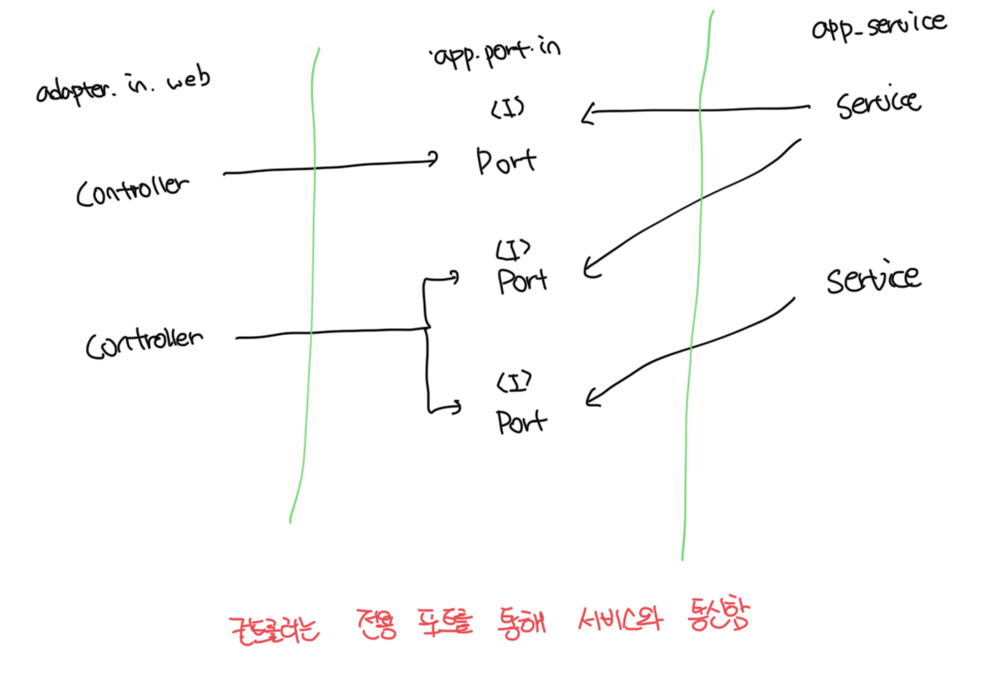
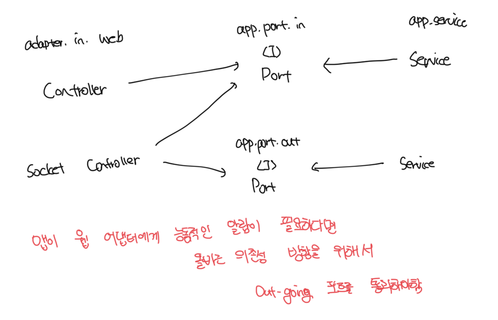

# 의존성 역전

- 웹 어댑터는 주도하는 혹은 인커밍 어댑터다
- 외부로부터 요청을 받아서 무슨 일을 해야할지 알려준다
- 아래 예시는 웹 어댑터와 인고잉 포트의 관계의 예시다



<br>

### 컨트롤러 -> 서비스 직접 의존

- 중간에 간접 계층을 넣는 이유는 앱 코어가 외부 세계와 통신할 수 있는곳에 대한 명세가 포트이기 때문임
- 의존성 역전 원칙이 적용되므로 컨트롤러는 인고잉 포트에 의존하게됨

<br>

### 웹소켓을 구성하는 아키텍쳐

- 웹소켓의 경우는 실시간 데이터를 사용자의 브라우저로 보내게됨
- 결국 서비스에서는 아웃고잉 포트를 통해서 웹소켓 컨트롤러로 데이터 전달이 필요함
- 결국 해당 포트는 인고잉인 동시에 아웃고잉의 역할까지 같이 수행하게됨



<br>

# 웹 어댑터의 책임

- 책임들
  - HTTP 요청을 객체로 매핑
  - 권한 검사
  - 입력값 유효성 검증
  - 입력을 유스케이스의 입력 모델로 매핑
  - 유스케이스 호출
  - 유스케이스 출력을 HTTP로 매핑
  - HTTP 응답을 반환
- 여기서의 검증은 입력 모델로 매핑할 때의 유효성 검증과는 다름
- 웹 어댑터의 검증은 입력 모델로 매핑하기 위해서 필요한 데이터를 검증하는것임
- 웹 어댑터를 생각하지 말고 유스케이스를 먼저 구현하면, 경계를 흐리게 만들 유횩에 빠지지 않을 수 있음

<br>

# 컨트롤러 나누기

- 웹 어댑터의 클래스는 한 개 이상의 클래스로 구성해도 된다
- 나눌경우 클래스들이 같은 소속이라는것을 표현하기 위해서 같은 패키지 수준에 놓는게 좋다
- 컨트롤러의 개수는 너무 적은것 보다는 너무 많은게 차라리 낫다

<br>

### 통합 컨트롤러 예시

```ts
import { Controller, Get, Param, Post } from "@nestjs/common";
import { SendMoneyUseCase } from "../../../application/port/in/send-money.use-case.js";
import SendMoneyCommand from "../../../application/port/in/send-money.command.js";
import { GetAccountBalanceQuery } from "../../../application/port/in/get-account-balance.query.js";

/**
 * 여러개의 엔드포인트가 하나의 컨트롤러에 모두 포함된다
 */
@Controller("accounts")
export default class AccountController {
  constructor(
    private readonly sendMoneyUseCase: SendMoneyUseCase,
    private readonly getAccountBalanceQuery: GetAccountBalanceQuery
  ) {}

  @Get(":id/balance")
  async getBalance(@Param("id") id: number): Promise<number> {
    return this.getAccountBalanceQuery.getAccountBalance(id);
  }

  @Post("send/:source_id/:target_id/:amount")
  sendMoeny(
    @Param("source_id") sourceId: number,
    @Param("target_id") targetId: number,
    @Param("amount") amount: number
  ): void {
    this.sendMoneyUseCase.sendMoney(
      new SendMoneyCommand(sourceId, targetId, amount)
    );
  }
}
```

<br>

### 유스케이스 별 컨트롤러 분리

- 서로 다른 연산에 대한 동시 작업이 쉬워진다

```ts
import { Controller, Param, Post } from "@nestjs/common";
import { SendMoneyUseCase } from "../../../application/port/in/send-money.use-case.js";
import SendMoneyCommand from "../../../application/port/in/send-money.command.js";

/**
 * 송금을 위한 단일 엔드포인트 컨트롤러
 */
@Controller("accounts")
export default class SendMoneyController {
  constructor(private readonly sendMoneyUseCase: SendMoneyUseCase) {}

  @Post("send/:source_id/:target_id/:amount")
  sendMoeny(
    @Param("source_id") sourceId: number,
    @Param("target_id") targetId: number,
    @Param("amount") amount: number
  ): void {
    const command = new SendMoneyCommand(
      new AccountId(sourceId),
      new AccountId(targetId),
      Money.of(amount)
    );

    this.sendMoneyUseCase.sendMoney(command);
  }
}
```
