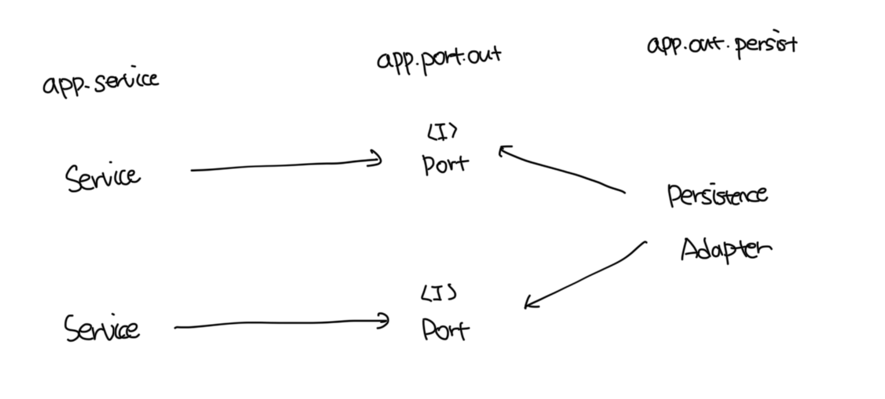
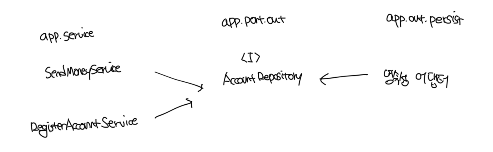
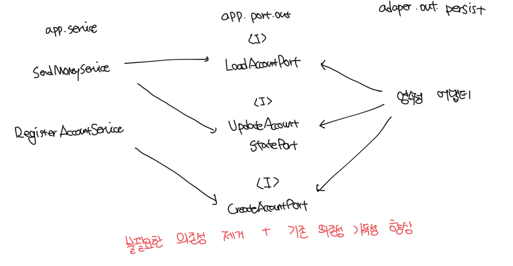
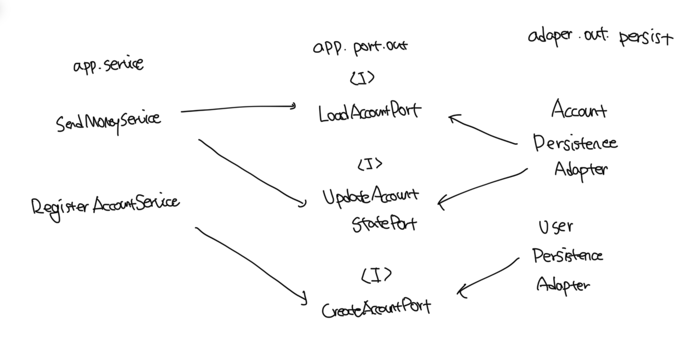

# 의존성 역전

- 각 서비스는 영속성 기능을 사용하기 위해서 아웃고잉 포트 인터페이스를 호출한다
- 이러한 구조에서는 포트가 계약을 만족하는 한, 코어에 영향 없이 영속성 코드를 마음껏 수정이 가능하다

 

# 영속성 어댑터의 책임

- 하는 일들
  - 입력을 받는다
  - 입력을 디비 포멧으로 매핑한다
  - 입력을 디비로 보낸다
  - 디비 출력을 앱 포맷으로 매핑한다
  - 출력을 반환한다
- 영속성 어댑터는 포트 인터페이스를 통해 입력을 받는데, 입력 모델은 인터페이스가 지정한 `도메인 엔티티` 또는 `데이터베이스 연산 전용 객체`가 된다
- 여기서 핵심은 어댑터의 입력 모델이 영속성 어댑터 내부에 있는게 아니라, 앱 코어에 있기떄문에 어댑터 내부를 변경하는게 코어에 영향이 없다는것이다
- 마지막으로 디비 응답을 포트에 정의된 출력 모델로 매핑해서 반환하게된다

 

# 포트 인터페이스 나누기

- 일반적으론느 엔티티가 필요한 모든 디비 연산을 하나의 레포지토리에 넣는게 일반적이다
  - 이런 경우 디비 연산에 의존하는 각 서비스는 인터페이스에서 단 하나의 메소드만 사용하지만 하나의 넓은 포트 인터페이스에 의존을 갖는다
  - 즉 불필요한 의존이 발생한다
- ISP(인터페이스 분리 원칙)는 이 문제의 답을 제시한다
  - 클라이언트가 오로지 자신이 필요로 하는 메소드만 알면 되도록 넓은 인터페이스를 특화된 인터페이스로 분리해야된다고 말한다

 

# 영속성 어댑터 나누기

- 모든 영속성 포트를 구현하는 한, 하나 이사으이 클래스 생성을 금지하는 규칙은 없음
- 예를 들어 아래 구성처럼 도메인 클래스 하나당 하나의 영속성 어댑터를 구현하는 방식도 가능함
- 영속성 어댑터들은 각 영속성 기능을 이용하는 도메인 경계를 따라서 자동으로 나눠짐

# Prisma 예제

> example/ch4에서 확인가능
