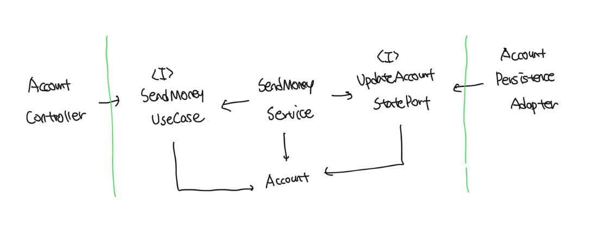
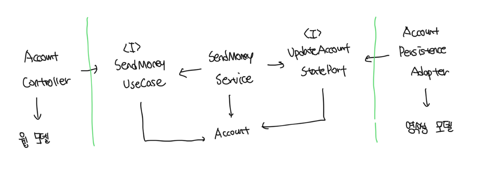
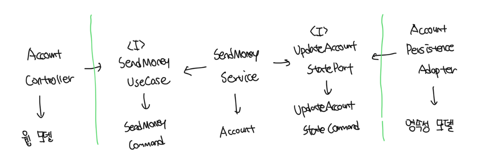
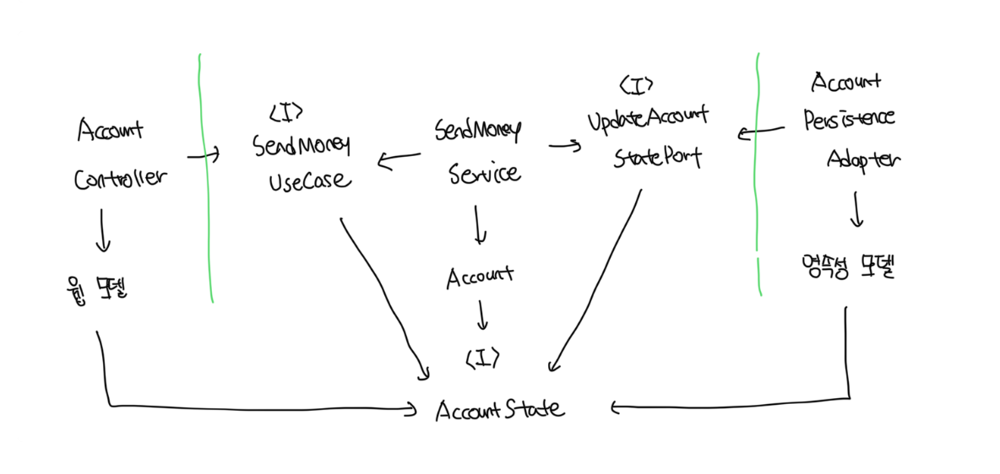

# 경계 간 매핑하기

- 개발자마다 경계 간 어떻게 매핑을 진행할지 의견이 갈린다
- 양쪽이 생각하는 의견을 얼추 맞지만 특정 상황에서 최적의 전략을 선택해야한다
- 또한 이러한 전략은 초기에 어떤 전략을 선택하더라도 나중에 언제든지 변경이 가능하다

 

### 매핑에 찬성하는 개발자

- 두 계층 간에 매핑을 하지 않으면 양 게층에서 같은 모델을 사용한다
- 이러면 두 게층이 강하게 결합되어버린다

 

### 매핑에 반대하는 개발자

- 두 계층 간 매핑을 하게되면 보일러 플레이트 코드를 너무 많이 만들게된다
- 많은 유스케이스들이 오직 CRUD만 수행하고 게층에 걸쳐 같은 모델을 사용하기 때문에 계층 사이 매핑은 과하다

 

# 매핑하지 않기 전략

- 웹 계층와 앱 계층 모두 동일한 도메인 모델인 `Account`에 접근한다
- `Account`는 웹, 앱, 영속성 계층과 관련된 이유로 인해 변경되어야 하므로 `SRP`를 위반한다
- 만약 모든 계층이 정확히 같은 구조의, 정확히 같은 정보를 필요한다면 해당 전략이 완벽한 선택지다
- 앱이나 도메인 게층에서 웹과 영속성 문제를 다루기 시작한다면, 곧바로 다른 전략을 취해야한다

 

# 양방향 매핑 전략

- 각 계층이 전용 모델을 가진 매핑 전략을 `양방향(Two-Way) 매핑 전략이라고 부른다`

 

### 장점

- 각 계층은 완전히 다른 모델을 가지고 있어서 각 계층이 전용 모델을 변경하더라도 다른 계층에는 영향이 없음(내용이 변경되지 않는한)
- 개념적으로는 `매핑하지 않기 전략` 다음으로 간단한 전략임

 

### 단점

- 너무 많은 보일러플레이트 코드가 생기게된다
- 이러한 문제를 위해서 매핑 프레임워크를 사용하더라도 두 모델간 매핑을 구현하는데 꽤 많은 시간이 듬
- 도메인 모델이 계층 경계를 넘어서 통신하는데 사용됨

 

# 완전 매핑 전략

- 각 유스케이스는 전용 필드와 유효성 검증 로직을 가지는 전용 커맨드를 가지게된다
- 이러한 완전한 매핑 전략에는 각 계층마다 의존하는 데이터가 다르므로 더 많은 코드가 필요해짐
- 하지만 장점은 유즈케이스의 요구사항을 함께 다뤄야 하는 매핑에 비해서 구현과 유지보수가 쉬워짐
- 이러한 전략은 웹 계층과 앱 계층 사이에 상태 변경 유즈케이스의 경계를 명확히 할때 가장 빛을 발함

 

# 단방향 매핑 전략

- 모든 계층의 모델들이 같은 인터페이스를 구현함
- 해당 인터페이스는 관련 있는 특성에 대한 `getter` 메소드를 제공해서 도메인 모델의 상태를 캡슐화함
- 도메인 모델 자체는 풍부한 행동 구현이 가능하고, 앱 계층내의 서비스에서는 이러한 행동에 접근이 가능해짐
- 도메인 객체가 인고잉/아웃고잉 포트가 기대하는 대로 상태 인터페이스를 구현하고 있어서 바깥 계층으로 도메인 객체를 전달할 때 매핑이 필요없음
- 이러한 전략은 계층 간의 모델이 비슷할 때 가장 효과적임

 

# 어떤 전략을 사용해야될까

- 언제 어떤 전략을 사용할지 결정하러면 팀 내에서 합의가 가능한 가이드라인을 정해둬야함
- 결국 정해진 답은 없으며 그때그때 다르다

 

### 변경 유스케이스를 작업할 때

- 웹 계층와 앱 게층 사이에는 유스케이스간 결합 제거를 위해서 `완전 매핑` 전략을 첫번째 선택지로 해야함
  - 유즈케이스별 유효성 검증이 명확해지고, 특정 유스케이스에서 필요하지 않은 필드를 다루지 않을수있음
- 앱과 영속성 계층 사이에서는 매핑 오버헤드를 줄이고 빠른 작업을 위해 `매핑하지 않기` 전략을 첫번째 선택지로 해야함
  - 만약 앱 계층에서 영속성 문제를 다뤄야 한다면 `양방향 매핑 전략`으로 바꿔서 영속성 문제를 격리시킬수 있음

 

### 쿼리 작업을 할때

- 매핑 오버헤드를 줄이고 빠르게 코드를 짜기 위해서 `매핑하지 않기` 전략이 `웹-앱 계층`, `앱 - 영속성 계층`에서 첫번째 선택지가 되야함
  - 하지만 앱 계층에서 영속성 문제나 웹 문제를 다뤄야한다면 `웹-앱 계층`, `앱-영속성 계층`에서 `앙뱡향 매핑`으로 전략을 바꿔야함
