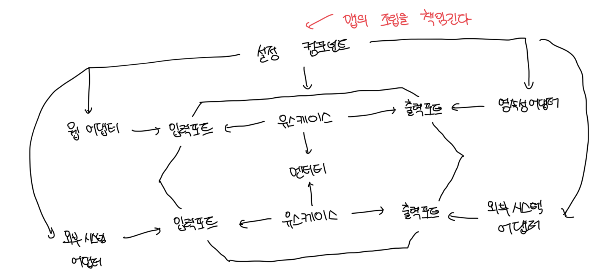

# 왜 조립까지 신경써야 할까?

- 물론 직접 클래스를 인스턴스화 시켜서 생성도 가능하다
- 하지만 결국 조립까지 신경쓰는 이유는 코드 의존성이 올바른 방향을 가리키게 하기 위해서다
- 유즈케이스는 인터페이스만 알아야 하고, 런타임에 이러한 인터페이스의 구현을 제공받는다
- 테스트를 작성할때도 이러한 특정 부분만 모킹처리하면 되기때문에 테스트가 용이해진다
- 결국 아키텍처에 대해 중립적이고 인스턴스 생성을 위해 모든 클래스에 대한 의존성을 가지는 `설정 컴포넌트`가 필요하다
- 또한 디비 접근정보 등 설정 파라미터의 소스에도 접근이 가능해야한다



<br>

# 평범한 코드로 조립하기

- 아래 코드처럼 직접 인스턴스화 하여 앱 조립은 가능하다
- 하지만 완전안 엔터프라이즈 앱을 실행하기 위해서는 수없이 많은 코드가 만들어진다

```ts
const accountRepository = new AccountRepository();
const activityRepository = new ActivityRepository();
const accountPersistenceAdapter = new AccountPersistenceAdapter(
  accountRepository,
  activityRepository
);
```

<br>

# Nest.js의 DI 컨테이너
