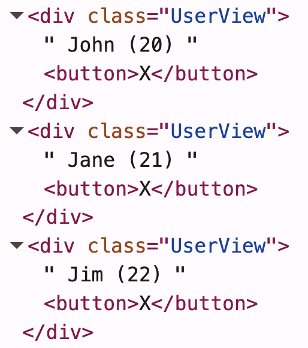

## Tagged Templates
- 템플릿 리터럴을 보다 유연하게 활용할 수 있는 도구
- 사용자 정의 함수를 통해서 템플릿 문자열과 삽입된 값을 처리할 수 있음

```ts
function upper(strs: TemplateStringsArray, ...vals: string[]) {
  console.log(strs); // 변수를 기준으로 나눈 문자열 배열 -> [ 'a: ', ', b:', '' ]
  console.log(vals); // 변수들의 값 배열 -> [ 'a', 'b' ]

  // 'a: ' + ${a} + ', b:' + ${b} + ''
  return strs[0] + (vals[0]?.toUpperCase() || "") + strs[1] + (vals[1]?.toUpperCase() || "") + strs[2];
}

const a = "a";
const b = "b";

const result = upper`a: ${a}, b: ${b}`;
console.log(result); // a: A, b: B
```

<br>

## 리스트 프로세싱으로 구현하기
```ts
import { flat, forEach, pipe, reduce, toArray, zip } from "@fxts/core";

function html(strs: TemplateStringsArray, ...vals: string[]) {
  vals.push("");
  return pipe(
    vals,
    zip(strs), // 커링을 통해서 실제 zip(strs)(vals)로 호출됨
    flat, // [[str1, val1], [str2, val2]] -> [str1, val1, str2, val2] 변환
    reduce((a, b) => a + b) // 평탄화된 이터레이터를 하나의 문자열로 합침
  );
}

const a = "A";
const b = "B";
const c = "C";

const result = html`<b>${a}</b><i>${b}</i><em>${c}</em>`;
console.log(result); // <b>A</b><i>B</i><em>C</em>
```

<br>

## push -> concat/append 변경하기
- concat의 경우 기존 배열을 변경하지 않고 지연 평가되는 이터레이터를 반환해서 부수효과 없이 동일한 결과를 얻을 수 있음
- 전체 배열을 새로 만들거나 모든 값을 재할당하지 않아서 메모리 사용 측면에서도 추가 부하가 없음

### concat 버전
```ts
import { concat, flat, forEach, pipe, reduce, toArray, zip } from "@fxts/core";

function html(strs: TemplateStringsArray, ...vals: string[]) {
  return pipe(
    concat(vals, [""]),
    zip(strs),
    flat,
    reduce((a, b) => a + b)
  );
}

const a = "A";
const b = "B";
const c = "C";

const result = html`<b>${a}</b><i>${b}</i><em>${c}</em>`;
console.log(result); // <b>A</b><i>B</i><em>C</em>
```

<br>

### append 버전
```ts
import { append, concat, flat, forEach, pipe, reduce, toArray, zip } from "@fxts/core";

function html(strs: TemplateStringsArray, ...vals: string[]) {
  return pipe(
    vals,
    append(""),
    zip(strs),
    flat,
    reduce((a, b) => a + b)
  );
}

const a = "A";
const b = "B";
const c = "C";

const result = html`<b>${a}</b><i>${b}</i><em>${c}</em>`;
console.log(result); // <b>A</b><i>B</i><em>C</em>
```

<br>

## XSS 공격 방지
- 악성 스크립트를 삽입해서 해당 페이지를 보는 다른 사용자에게 피해를 주는 공격 기법
- `<script>` 태그 등을 통해 임의의 자바스크립트 코드 실행이 가능함
- 이를 방지하기 위해서는 HTML 문법으로 해석되는 문자를 안전한 형태로 변환하는 작업이 필요함

<br>

### escape 함수 만들기
```ts
const escapeMap = {
  "&": "&amp",
  "<": "&lt;",
  ">": "&gt;",
  '"': "&quot;",
  "'": "&#39;",
  "`": "&#x60;",
};

const source = "(?:" + Object.keys(escapeMap).join("|") + ")"; // (?:&|<|>|"|'|`)
const testRegExp = RegExp(source);
const replaceRegExp = RegExp(source, "g");

function escapeHtml(val: unknown) {
  const string = `${val}`;
  return testRegExp.test(string)
    ? string.replace(replaceRegExp, (match) => escapeMap[match as keyof typeof escapeMap])
    : string;
}

console.log(escapeHtml('<script>alert("hello")</script>')); // &lt;script&gt;alert(&quot;hello&quot;)&lt;/script&gt;
console.log(escapeHtml('Hello & Welcome! "Have" a nice day')); // Hello &amp Welcome! &quot;Have&quot; a nice day
```

<br>

### 실제 HTML에 적용하기
```ts
import { append, flat, map, pipe, reduce, zip } from "@fxts/core";

function escapeHtml(val: unknown) {
  const escapeMap = {
    "&": "&amp",
    "<": "&lt;",
    ">": "&gt;",
    '"': "&quot;",
    "'": "&#39;",
    "`": "&#x60;",
  };

  const source = "(?:" + Object.keys(escapeMap).join("|") + ")"; // (?:&|<|>|"|'|`)
  const testRegExp = RegExp(source);
  const replaceRegExp = RegExp(source, "g");

  const string = `${val}`;
  return testRegExp.test(string)
    ? string.replace(replaceRegExp, (match) => escapeMap[match as keyof typeof escapeMap])
    : string;
}

function html(strs: TemplateStringsArray, ...vals: string[]) {
  return pipe(
    vals,
    append(""),
    map(escapeHtml),
    zip(strs),
    flat,
    reduce((a, b) => a + b)
  );
}

const a = '<script>alert("XSS")</script>';
const b = "Hello & Welcome!";

// <ul>
//  <li>&lt;script&gt;alert(&quot;XSS&quot;)&lt;/script&gt;</li>
//  <li>Hello &amp Welcome!</li>
// </ul>
console.log(html`
  <ul>
    <li>${a}</li>
    <li>${b}</li>
  </ul>
`);
```

<br>

## 중첩 데이터 처리로 컴포넌트 방식 개발 지원하기
- 현재 html 내부에 html을 중첩하는 경우 중첩된 html 내부에 있는 변수들이 모두 문자열로 처리되어 버림
- 이를 해결하기 위해서는 단순히 한 번의 중첩만 고려하는게 아닌 3단계 중첩처럼 여러 번 중첩도 고려해야함

```ts
type Menu = {
  name: string;
  price: number;
};

function menuHtml({ name, price }: Menu) {
  return html` <li>${name} - (${price.toString()})</li> `;
}

const menu: Menu = { name: "Choco", price: 8000 };

const a = '<script>alert("XSS")</script>';
const b = "Hello & Welcome!";

const result = html`
  <ul>
    <li>${a}</li>
    <li>${b}</li>
    ${menuHtml(menu)} ${html`<li>${html`<b>3단계 중첩</b>`}</li>`}
  </ul>
`;

console.log(result);
// <ul>
// <li>&lt;script&gt;alert(&quot;XSS&quot;)&lt;/script&gt;</li>
// <li>Hello &amp Welcome!</li>
//  &lt;li&gt;Choco - (8000)&lt;/li&gt;  &lt;li&gt;&amplt;b&ampgt;3단계 중첩&amplt;/b&ampgt;&lt;/li&gt;
// </ul>
```

<br>

## 구조의 문제는 객체지향, 로직의 문제는 함수형으로 해결
### Html 클래스
- toHtml의 경우 구조와 로직의 결합을 잘 보여줌
- 구조 자체는 데이터를 들고 있고 로직은 이 데이터를 어떻게 처리할지 결정함

```ts
class Html {
  constructor(private readonly strs: TemplateStringsArray, private readonly vals: unknown[]) {}

  private escape(val: unknown): string {
    return val instanceof Html ? val.toHtml() : escapeHtml(val);
  }

  toHtml() {
    return pipe(
      this.vals,
      map((val) => this.escape(val)),
      append(""),
      zip(this.strs),
      flat,
      reduce((a, b) => a + b)
    );
  }
}

function html(strs: TemplateStringsArray, ...vals: unknown[]) {
  return new Html(strs, vals);
}
```

<br>

### 중첩 문제를 해결한 html
- 구조 자체는 Html 클래스를 통한 객체지향적 접근으로 중첩 관계를 명확하게 풀어냄
- 로직으로는 함수형 파이프라인을 통해 예측 가능한 escape 처리 & 문자열 결합이 구현됨

```ts
type Menu = {
  name: string;
  price: number;
};

function menuHtml(menu: Menu) {
  return html`<li>${menu.name} - (${menu.price.toString()})</li>`;
}

const a = '<script>alert("XSS")</script>';
const b = "Hello & Welcome!";
const menu: Menu = { name: "Chocolate", price: 8000 };

const result = html`
  <ul>
    <li>${a}</li>
    <li>${b}</li>
    ${menuHtml(menu)} ${html`<li>${html`<b>3단계 중첩</b>`}</li>`}
  </ul>
`;

// <ul>
// <li>&lt;script&gt;alert(&quot;XSS&quot;)&lt;/script&gt;</li>
// <li>Hello &amp Welcome!</li>
// <li>Chocolate - (8000)</li> <li><b>3단계 중첩</b></li>
// </ul>
console.log(result.toHtml());
```

<br>

## 배열로 부터 html 문자열 만들기
- 현재 문제점은 html 템플릿 엔진이 인자로 주어진 값을 안전하지 않은 데이터로 간주하고 escape 처리를 하고있음
- toHtml 메서드의 결과는 단순 문자열로, 상위 html은 이 값을 문자열로 인식하고 escape 처리함
- 결국 단순히 reduce를 통해서 문자열을 합치는 방식만으로는 `이미 안전한 HTML` or `처리필요` 구분이 어려움
```ts
const menus: Menu[] = [
  { name: "Chocolate", price: 8000 },
  { name: "Vanilla", price: 5000 },
  { name: "Strawberry", price: 10000 },
  { name: "Mango", price: 15000 },
];

function menuBoardHtml(menus: Menu[]) {
  return html`
    <div>
      <h1>메뉴 목록</h1>
      <ul>
        ${menus.map(menuHtml).reduce((acc, cur) => acc + cur.toHtml(), "")}
      </ul>
    </div>
  `;
}

// <div>
// <h1>메뉴 목록</h1>
// <ul>
//   &lt;li&gt;Chocolate - (8000)&lt;/li&gt;&lt;li&gt;Vanilla - (5000)&lt;/li&gt;&lt;li&gt;Strawberry - (10000)&lt;/li&gt;&lt;li&gt;Mango - (15000)&lt;/li&gt;
// </ul>
// </div>
console.log(menuBoardHtml(menus).toHtml());
```

<br>

## 객체를 함수형으로 더하기
- 값을 합칠때 문자열이 아닌 Html 인스턴스끼리 결헙해서 `이미 안전한 HTML`을 유지함
- 이를 통해서 상태를 유지한 채 중첩된 데이터 처리와 이스케이프 로직을 깔끔하게 해결했음
- 이러한 사례는 어떤 타입의 값이라도 해당 값을 결합하는 메서드나 식을 제공햊면 reduce를 통해 누적이 가능하단걸 보여줌
```ts
function menuBoardHtml2(menus: Menu[]) {
  return html`
    <div>
      <h1>메뉴 목록</h1>
      <ul>
        ${menus.map(menuHtml).reduce((acc, cur) => html`${acc}${cur}`)}
      </ul>
    </div>
  `;
}

// <div>
// <h1>메뉴 목록</h1>
// <ul>
//   <li>Chocolate - (8000)</li><li>Vanilla - (5000)</li><li>Strawberry - (10000)</li><li>Mango - (15000)</li>
// </ul>
// </div>
console.log(menuBoardHtml2(menus).toHtml());
```

<br>

## 배열 처리를 클래스 내부로 이동해서 편의성 높이기
- 만약 배열이 입력되는 경우 내부적으로 HTML을 합칠때 `html'${a}${b}'`를 처리하도록 구현함

```ts
class Html {
  constructor(private readonly strs: TemplateStringsArray, private readonly vals: unknown[]) {}

  private escape(val: unknown): string {
    return val instanceof Html ? val.toHtml() : escapeHtml(val);
  }

  private combine(vals: unknown) {
    return Array.isArray(vals) ? vals.reduce((a, b) => html`${a}${b}`) : vals;
  }

  toHtml() {
    return pipe(
      this.vals,
      map((val) => this.escape(this.combine(val))),
      append(""),
      zip(this.strs),
      flat,
      reduce((a, b) => a + b)
    );
  }
}

function menuBoardHtml(menus: Menu[]) {
  return html`
    <div>
      <h1>메뉴 목록</h1>
      <ul>
        ${menus.map(menuHtml)}
      </ul>
    </div>
  `;
}

// <div>
// <h1>메뉴 목록</h1>
// <ul>
//   <li>Chocolate - (8000)</li><li>Vanilla - (5000)</li><li>Strawberry - (10000)</li><li>Mango - (15000)</li>
// </ul>
// </div>
console.log(menuBoardHtml(menus).toHtml());
```

<br>

## 고차 함수로 추상화하기
- 함수 하나로 동작을 변경할 수 있는 상황이라면 고차 함수를 통한 추상화가 간결하고 효율적인 해법이됨
- 고차 함수 패턴을 활용하면 로직을 쉽게 조립하고 재사용이 가능해짐

```ts
function escapeHtml(val: unknown) {
  const escapeMap = {
    "&": "&amp",
    "<": "&lt;",
    ">": "&gt;",
    '"': "&quot;",
    "'": "&#39;",
    "`": "&#x60;",
  };

  const source = "(?:" + Object.keys(escapeMap).join("|") + ")"; // (?:&|<|>|"|'|`)
  const testRegExp = RegExp(source);
  const replaceRegExp = RegExp(source, "g");

  const string = `${val}`;
  return testRegExp.test(string)
    ? string.replace(replaceRegExp, (match) => escapeMap[match as keyof typeof escapeMap])
    : string;
}

function filTemplate<T>(strs: TemplateStringsArray, vals: T[], transform: (val: T) => string) {
  return pipe(
    vals,
    map(transform),
    append(""),
    zip(strs),
    flat,
    reduce((a, b) => a + b)
  );
}

class Html {
  constructor(private readonly strs: TemplateStringsArray, private readonly vals: unknown[]) {}

  private escape(val: unknown): string {
    return val instanceof Html ? val.toHtml() : escapeHtml(val);
  }

  private combine(vals: unknown) {
    return Array.isArray(vals) ? vals.reduce((a, b) => html`${a}${b}`) : vals;
  }

  toHtml() {
    return filTemplate(this.strs, this.vals, (val) => this.escape(this.combine(val)));
  }
}

function html(strs: TemplateStringsArray, ...vals: unknown[]) {
  return new Html(strs, vals);
}

function upper(strs: TemplateStringsArray, ...vals: string[]) {
  return filTemplate(strs, vals, (val) => val.toUpperCase());
}

const text = "world";
console.log(upper`Hello ${text}`); // Hello WORLD
```

<br>

## 작은 프론트엔드 개발 라이브러리 만들기
### 기반 클래스 View
```ts
/**
 * 해당 뷰가 다루게 될 데이터 타입을 명시하기 위해 제네릭 T 선언
 */
abstract class View<T> {
  private _element: HTMLElement | null = null;

  constructor(public data: T) {}

  element() {
    if (!this._element) {
      throw new Error("요소에 접근하기 전에 `render()` 메서드를 호출하세요");
    } else {
      return this._element;
    }
  }

  /**
   * 구체적인 View 클래스의 경우 해당 메서드를 구현해서 DOM에 렌더링할 HTML 구조를 정의해야함
   * Html 템플릿 엔진을 통해서 문자열로 변환되고 결과적으로 브라우저상에서 실제 DOM 요소로 변환됨
   */
  abstract template(): Html;

  /**
   * 반환받은 Html 인스턴스를 임시 div 내부에 삽입함
   * 생성된 첫 번째 자식 요소를 _element에 저장하고 `element` 메서드로 접근이 가능하게 만듦
   * 생성자 이름의 경우 class="" 요소에 추가하고 렌더 완료 후 추가로 처리가 필요한 부분(`onRender`)은 하위 클래스에서 오버라이드하여 구현하게됨
   */
  render(): HTMLElement {
    const wrapEl = document.createElement("div");
    wrapEl.innerHTML = this.template().toHtml();
    this._element = wrapEl.children[0] as HTMLElement;
    this._element.classList.add(this.constructor.name);
    this.onRender();
    return this._element;
  }

  protected onRender() {}
}
```

<br>

### UserView 만들기
```ts
type User = {
  name: string;
  age: number;
};

class UserView extends View<User> {
  template(): Html {
    return html`
      <div>
        ${this.data.name} (${this.data.age})
        <button>X</button>
      </div>
    `;
  }

  protected override onRender(): void {
    this.element()
      .querySelector("button")!
      .addEventListener("click", () => this.remove());
  }

  private remove() {
    this.element().remove();
    alert(`${this.data.name} 삭제됨`);
  }
}

const users = [
  { name: "John", age: 20 },
  { name: "Jane", age: 21 },
  { name: "Jim", age: 22 },
];

console.log(new UserView(users[0]!).render().outerHTML);

users
  .map((user) => new UserView(user))
  .map((view) => view.render())
  .forEach((element) => document.body.append(element));
```

