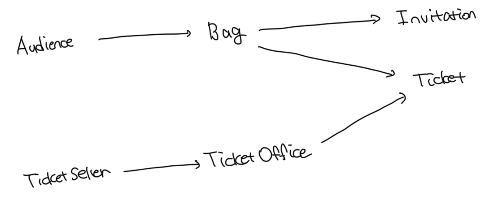

# 초대장

```ts
/**
 * 초대장
 *
 * 당첨자에게 발송되는 초대장 개념을 구현
 */
export default class Invitation {
  /**
   * 공연을 관람할 수 있는 날짜
   */
  private when: Date;
}
```

<br>

# 티켓

```ts
/**
 * 티켓
 *
 * 공연을 관람하기 위해서는 초대장을 소지하고 있어야함
 */
export default class Ticket {
  private fee: number;

  getFee(): number {
    return this.fee;
  }
}
```

<br>

# 가방

```ts
import Invitation from "./invitation.js";
import Ticket from "./ticket.js";

/**
 * 관람객이 소지품을 보관할 가방
 *
 * 1. 이벤트에 당첨되지 않은 관람객의 가방에는 초대장이 들어있지 않을것
 * 2. 이벤트에 당첨된 관람객의 가방에는 현금과 초대장이 들어있음
 */
export default class Bag {
  private amount: number;
  private invitation: Invitation | undefined;
  private ticket: Ticket;

  constructor(amount: number, invitation?: Invitation) {
    this.amount = amount;
    this.invitation = invitation;
  }

  /**
   * 초대장 보유여부
   */
  hasInvitation(): boolean {
    return this.invitation !== undefined;
  }

  /**
   * 티켓 보유여부
   */
  hasTicket(): boolean {
    return this.ticket !== null;
  }

  setTicket(ticket: Ticket): void {
    this.ticket = ticket;
  }

  /**
   * 소지 금액 차감
   */
  minusAmount(amount: number): void {
    this.amount -= amount;
  }

  /**
   * 소지 금액 추가
   */
  plusAmount(amount: number): void {
    this.amount += amount;
  }
}
```

<br>

# 관람객

```ts
import Bag from "./bag.js";

/**
 * 관람객
 *
 * 관람객은 가방을 소지함
 */
export default class Audience {
  private bag: Bag;

  constructor(bag: Bag) {
    this.bag = bag;
  }

  getBag(): Bag {
    return this.bag;
  }
}
```

<br>

# 매표소

```ts
import Ticket from "./ticket.js";

/**
 * 매표소
 *
 * 1. 관람객이 소극장에 입장하기 위해서는 매표소에서 초대장 -> 티켓 교환 또는 구매해야함
 * 2. 매표소에는 관람객에게 판매할 티켓과 티켓의 판매 금액이 보관돼 있어야함
 *
 */
export default class TicketOffice {
  private amount: number;
  private tickets: Ticket[] = [];

  constructor(amount: number, ...tickets: Ticket[]) {
    this.amount = amount;
    this.tickets = tickets;
  }

  getTicket(): Ticket | undefined {
    return this.tickets.shift();
  }

  minusAmount(amount: number): void {
    this.amount -= amount;
  }

  plusAmount(amount: number): void {
    this.amount += amount;
  }
}
```

<br>

# 티켓 판매원

```ts
import TicketOffice from "./ticket-offce.js";

/**
 * 티켓 판매원
 *
 * 초대장을 티켓으로 교환해주거나 티켓을 판매하는 역할
 * 판매원을 구현한 클래스는 자신이 일하는 매표소를 알고있어야함
 */
export default class TicketSeller {
  private ticketOffice: TicketOffice;

  constructor(ticketOffice: TicketOffice) {
    this.ticketOffice = ticketOffice;
  }

  getTicketOffice(): TicketOffice {
    return this.ticketOffice;
  }
}
```

<br>

# 소극장

```ts
import Audience from "./authdience.js";
import TicketSeller from "./ticket-seller.js";

/**
 * 소극장을 구현하는 클래스
 *
 * 관람객을 맞이할 수 있도록 enter 메소드를 공개
 */
export default class Theater {
  private ticketSeller: TicketSeller;

  constructor(ticketSeller: TicketSeller) {
    this.ticketSeller = ticketSeller;
  }

  enter(audience: Audience): void {
    /**
     * 관람객의 가방에 티켓이 있다면
     */
    if (audience.getBag().hasInvitation()) {
      /**
       * 티켓 판매자의 티켓을 관람객에게 전달
       */
      const ticket = this.ticketSeller.getTicketOffice().getTicket();
      audience.getBag().setTicket(ticket);

      /**
       * 관람각의 가방에 티켓이 없다면
       */
    } else {
      /**
       * 티켓 판매자에서 티켓을 꺼내고 해당 가격만큼 관람객의 가방에서 현금을 빼고 티켓을 전달
       */
      const ticket = this.ticketSeller.getTicketOffice().getTicket();
      audience.getBag().minusAmount(ticket.getFee());
      this.ticketSeller.getTicketOffice().plusAmount(ticket.getFee());
      audience.getBag().setTicket(ticket);
    }
  }
}
```

<br>

# 다이어그램


