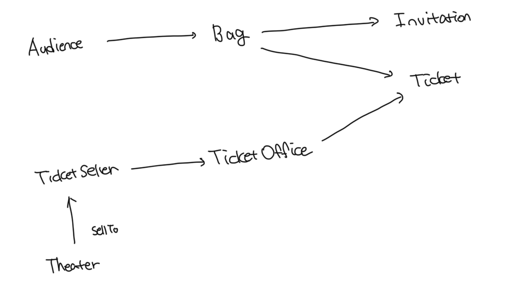
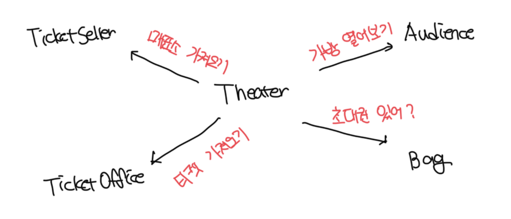
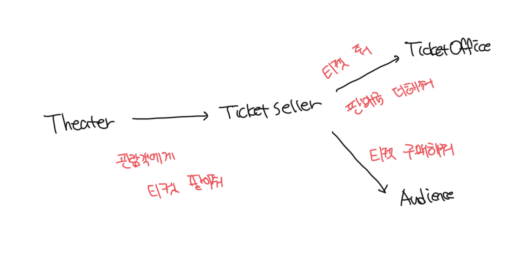
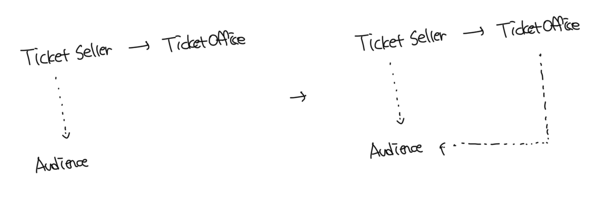

# 기존 코드가 이해하기 어려운 이유

- Theater가 관람객의 가방과 판매원의 매표소에 직접 접근하기 때문임
- 관람객과 판매원은 자신만의 책임이 있는데 기존 코드는 이를 벗어난다
- 즉 현재는 `Theater`가 `Audience`와 `TicketSeller`에 결합되고있다
- 이럴 경우 너무 세세한 부분까지 알지 못하도록 정보를 차단하면 되는데, 다시 말해서 관람객과 판매원을 자율적인 존재로 만들면 되는것이다

<br>

# 자율성을 높이자

- 기존에는 `Theater`가 `Audience`, `TicketSeller`뿐 아닌 `Bag`, `TicketOffice`에도 접근이 가능했음

<br>

### Theater -> TicketOffice 접근 코드 숨기기

- 더 이상 외부에서 `TicketOffice` 접근이 불가능하도록 getter를 제거함
- 이러한 객체 내부의 세부적인 사항을 숨기는것을 `캡슐화(encapsulation)`라고 한다
  - 캡슐화의 목적은 변경하기 쉬운 객체를 만드는것임
- 이제 티켓 판매에 대한 책임이 `TicketSeller`에만 있게됨으로써 `Theater.enter`는 간단하게 변경됨

```ts
import Audience from "./authdience.js";
import TicketOffice from "./ticket-offce.js";

export default class TicketSeller {
  private ticketOffice: TicketOffice;

  constructor(ticketOffice: TicketOffice) {
    this.ticketOffice = ticketOffice;
  }

  sellTo(audience: Audience) {
    if (audience.getBag().hasInvitation()) {
      const ticket = this.ticketOffice.getTicket();
      audience.getBag().setTicket(ticket);
    } else {
      const ticket = this.ticketOffice.getTicket();
      audience.getBag().minusAmount(ticket.getFee());
      this.ticketOffice.plusAmount(ticket.getFee());
      audience.getBag().setTicket(ticket);
    }
  }
}
```

```ts
import Audience from "./authdience.js";
import TicketSeller from "./ticket-seller.js";

export default class Theater {
  private ticketSeller: TicketSeller;

  constructor(ticketSeller: TicketSeller) {
    this.ticketSeller = ticketSeller;
  }

  enter(audience: Audience): void {
    this.ticketSeller.sellTo(audience);
  }
}
```

<br>

### `TicketSeller`의 인터페이스에만 의존하는 `Theater`

- 위 코드에서 이제 Theater는 TicketSeller의 인터페이스에만 의존하게됨
- TicketSeller가 내부에 TicketOffice 인스턴스를 포함하고 있다는 사실은 `구현`영역에 속함
- 객체를 인터페이스와 구현으로 나누고 인터페이스만 공개하는것은 가장 기본적인 설계 원칙임



<br>

### Audience에게 buy 책임 부여하기

- 기존에는 TicketSeller가 직접적으로 Audience의 가방에 접근했음
- Bag에 접근하는 모든 로직을 Audience 내부로 감추기 위해서 buy 메소드를 추가함
- Audience의 구현을 수정해도 더 이상 TicketSeller는 영향을 받지 않음

```ts
import Bag from "./bag.js";
import Ticket from "./ticket.js";

export default class Audience {
  private bag: Bag;

  constructor(bag: Bag) {
    this.bag = bag;
  }

  buy(ticket: Ticket): number {
    if (this.bag.hasInvitation()) {
      this.bag.setTicket(ticket);
      return 0;
    } else {
      this.bag.setTicket(ticket);
      this.bag.setTicket(ticket);
      return ticket.getFee();
    }
  }
}
```

```ts
import Audience from "./authdience.js";
import TicketOffice from "./ticket-offce.js";

export default class TicketSeller {
  private ticketOffice: TicketOffice;

  constructor(ticketOffice: TicketOffice) {
    this.ticketOffice = ticketOffice;
  }

  sellTo(audience: Audience) {
    this.ticketOffice.plusAmount(audience.buy(this.ticketOffice.getTicket()));
  }
}
```

<br>

# 개선된 문제들

- 수정된 Audience랑 TicketSeller는 자신이 보유중인 소지품을 스스로 관리함
- Audience나 TicketSeller의 내부 구현을 변경해도 Theater는 영향을 받지 않음
- 수정된 코드는 변경 용이성의 측면에서 확실히 개선되었음

<br>

# 어떻게 한 것인가

- 자기 자신의 문제를 스스로 해결하도록 코드를 변경함
- 직관을 따랐고 그 결과로 코드는 변경이 용이해지고 이해 가능하도록 수정됨

<br>

# 캡슐화, 응집도

- 핵심은 객체 내부의 상태를 캡슐화하고 객체 간에 오직 메세지를 통해서만 상호작용 하도록 하는것이다
- 밀접하게 연관된 작업만 수행하고 연관성 없는 작업은 다른 객체에게 위임하는 객체를 가르켜 `응집도`가 높다고 한다
- 객체 응집도를 높이기 위해서는 객체 스스로 자신의 데이터를 책임져야 한다
- 객체는 자신의 데이터를 스스로 처리하는 자율적인 존재여야 한다

<br>

# 절차지향과 객체지향

- 수정 전 코드는 Theater에서 티켓의 보유여부를 확인하고, 티켓 발급 및 금액관리 등을 모두 담당했다
- 이 관점에서 Theater.enter()는 프로세스이며, 그 외는 모두 데이터다

### 절차적 프로그래밍

- 위 처럼 프로세스와 데이터를 별도의 모듈에 위치시키는 방식을 `절차적 프로그래밍`이라고 한다
- 절차적 프로그래밍의 세상은 우리의 예상을 너무나도 쉽게 벗어나기 때문에 의사소통이 힘들다
- 즉 변경하기 어려운 코드를 양상하는 경향이 존재한다
- 변경하기 쉬운 설계는 한 번에 하나의 클래스만 변경할 수 있는 설계다

<br>

### 객체지향 프로그래밍

- 수정 후 코드는 모두 자신의 데이터를 스스로 처리하도록 프로세스의 적절한 단계를 이동시켰다
- 이처럼 데이터와 프로세스가 동일한 모듈 내부에 위치하도록 프로그래밍하는 방식을 `객체지향 프로그래밍`이라고 한다
- 훌룡한 객체지향의 핵심은 캡슐화를 이용해서 의존성을 적절히 관리함으로써 객체 사이의 결합도를 낮추는 것이다
- 객체지향은 자신의 문제를 스스로 처리해야 한다는 예상을 만족시키기 때문이 이해하고 쉽고 변경이 수월하다

<br>

# 책임의 이동

- 절차지향과 객체지향의 근본적인 차이를 만드는 것은 `책임의 이동`이다
- 책임은 기능을 가르키는 객체지향 세계의 용어로 생각한다
- 다시 말해서 Theater에게 몰려있던 책임이 개별 객체로 이동한것이다
- 객체지향의 핵심은 적절한 객체에 적절한 책임을 할당해야 하는데, 객체가 어떤 데이터를 가질것인가 보다는 객체에 어떤 책임을 할당할지에 대해 초점을 맞춰야한다

<br>

### 기존 절차지향 방식



<br>

### 개선된 객체지향 방식



<br>

# 더 개선하기

- Bag은 여전히 이전의 코드처럼 자기를 스스로 책임지고있지 않음
- 현재는 Audience에 의해서 질질 끌려다니고 있음

<br>

### Bag에게 hold 책임 부여하기

```ts
import Invitation from "./invitation.js";
import Ticket from "./ticket.js";

export default class Bag {
  private amount: number;
  private invitation: Invitation | undefined;
  private ticket: Ticket | null = null;

  constructor(amount: number, invitation?: Invitation) {
    this.amount = amount;
    this.invitation = invitation;
  }

  hold(ticket: Ticket): number {
    if (this.hasInvitation()) {
      this.setTicket(ticket);
      return 0;
    } else {
      this.setTicket(ticket);
      this.minusAmount(ticket.getFee());
      return ticket.getFee();
    }
  }

  private hasInvitation(): boolean {
    return this.invitation !== undefined;
  }

  private setTicket(ticket: Ticket): void {
    this.ticket = ticket;
  }

  private minusAmount(amount: number): void {
    this.amount -= amount;
  }
}
```

```ts
import Bag from "./bag.js";
import Ticket from "./ticket.js";

export default class Audience {
  private bag: Bag;

  constructor(bag: Bag) {
    this.bag = bag;
  }

  buy(ticket: Ticket): number {
    return this.bag.hold(ticket);
  }
}
```

<br>

### TicketOffice 자율권 보장하기

- 단점이 존재한다면 TicketOffice, Audience 사이에 의존성이 생겼다
- TicketOffice의 책임이 명확해지면서 자율성을 높였지만 전체 설계의 관점에서는 결합도가 상승됬다

```ts
import Audience from "./authdience.js";
import Ticket from "./ticket.js";

export default class TicketOffice {
  private amount: number;
  private tickets: Ticket[] = [];

  constructor(amount: number, ...tickets: Ticket[]) {
    this.amount = amount;
    this.tickets = tickets;
  }

  sellTicketTo(audience: Audience): void {
    this.plusAmount(audience.buy(this.getTicket()));
  }

  private getTicket(): Ticket {
    return this.tickets.shift()!;
  }

  private plusAmount(amount: number): void {
    this.amount += amount;
  }
}
```

```ts
import Audience from "./authdience.js";
import TicketOffice from "./ticket-offce.js";

export default class TicketSeller {
  private ticketOffice: TicketOffice;

  constructor(ticketOffice: TicketOffice) {
    this.ticketOffice = ticketOffice;
  }

  sellTo(audience: Audience) {
    this.ticketOffice.sellTicketTo(audience);
  }
}
```



<br>

### 트레이드 오프

- 위 리팩토링에서는 Audience의 결합도보다 TicketOffice의 자율성을 보장하기로 했다
- 어떤 기능을 설계하는 방법은 한 가지 이상일수도 있다
- 동일한 기능을 한 가지 이상의 방법으로 설계가 가능하기 때문에 결국 설계는 트레이드오프의 산물이다
- 어떤 경우에도 모든 사람들을 만족시킬 수 있는 설계는 없다

<br>

# 모든것이 자율적인 존재

- 객체지향 세계에서는 모든것이 능동적이고 자율적인 존재가 된다
- 이러한 소프트웨어 객체를 설계하는 원칙을 `의인화`라고 부른다
- 훌룡한 객체지향 설계란 소프트웨어를 구성하는 모든 객체들이 자율적으로 행동하는 설계다
- 이해하기 쉽고 변경이 쉬운 코드를 작성할려면 차라리 한 편의 애니메이션을 만든다고 생각하면 쉽다
