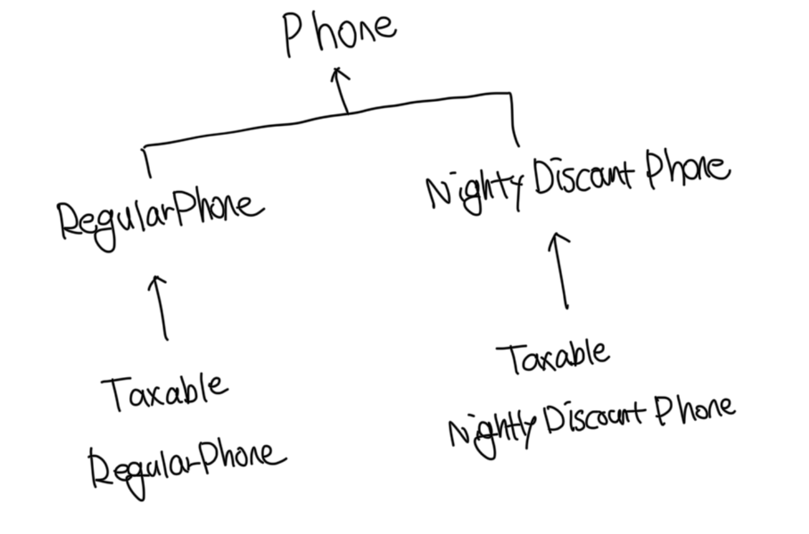
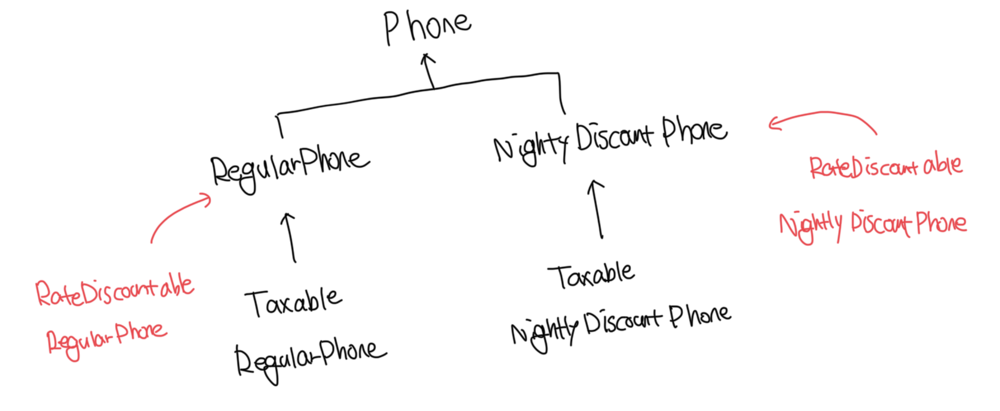

# 상속의 문제점

- 상속으로 인해서 결합도가 높아지는 경우, 코드를 수정하는데 필요한 작업의 양이 과하게 늘어나는 경향이 존재한다
- 하나의 기능을 추가하기 위해서는 불필요하게 많은 수의 클래스를 추가하거나 삭제가 필요하다
- 단일 상속만 지원하는 언어에서는 삭속으로 인해서 오히려 중복 코드의 양이 늘어날수도 있다

<br>

# 기본 정책과 부가정책 조합하기

- 기본 정책에는 `일반요금제`와 `심야 할인 요금제`가 존재한다
- 부가 정책에는 `세금정책`과 `기본 요금 할인 정책`이 존재한다

<br>

### 특성

- 세금 정책인 기본 정책의 계산이 끝난 결과에 세금을 부과한다
- 기본 정책의 계산 결과에 세금 정책을 적용할수도, 적용하지 않을수도 있음
- 기본 정책에 세금 정책만 적용하는것도 가능하고, 기본 요금 할인정책만 적용하는것도 가능함
  - 세금 정책과 기본 요금 할인 정책을 동시에 적용하는것도 가능해야함
- 기본 정책에 세금 정책과 기본 요금 할인 정책을 함꼐 적용하면 2가지 케이스가 가능함
  - 세금 정책을 적용하고나서 기본 요금 할인정책 적용
  - 기본 요금 할인 정책을 적용하고나서 세금 정책 적용
- 이 처럼 요구사항을 구현하는 데 가장 큰 장벽은 매우 많은 경우의 수가 존재하므로, 설계는 다양한 조합을 수용가능하도록 유연해야함

<br>

# 상속을 이용해서 기본 정책 구현하기

### 기존 Phone

```ts
import Call from "./call.js";
import Money from "./money.js";

export abstract class Phone {
  private calls: Call[] = [];

  calculateFee(): Money {
    let result = Money.ZERO;

    for (const call of this.calls) {
      result = result.plus(this.calculateCallFee(call));
    }

    return result;
  }

  protected abstract calculateCallFee(call: Call): Money;
}
```

<br>

### 기존 RegularPhone

```ts
import Call from "./call.js";
import Duration from "./duration.js";
import Money from "./money.js";
import { Phone } from "./phone.js";

export class RegularPhone extends Phone {
  private amount: Money;
  private seconds: Duration;

  constructor(amount: Money, seconds: Duration) {
    super();
    this.amount = amount;
    this.seconds = seconds;
  }

  protected calculateCallFee(call: Call): Money {
    return this.amount.times(
      call.getDuration().getSeconds() / this.seconds.getSeconds()
    );
  }
}
```

<br>

### 기존 NightlyDiscountPhone

```ts
import Call from "./call.js";
import Duration from "./duration.js";
import Money from "./money.js";
import { Phone } from "./phone.js";

export class NightlyDiscountPhone extends Phone {
  private static readonly LATE_NIGHT_HOUR = 22;

  private nightlyAmount: Money;
  private regularAmount: Money;
  private seconds: Duration;

  constructor(nightlyAmount: Money, regularAmount: Money, seconds: Duration) {
    super();
    this.nightlyAmount = nightlyAmount;
    this.regularAmount = regularAmount;
    this.seconds = seconds;
  }

  calculateCallFee(call: Call): Money {
    if (call.getFrom().getHour() >= NightlyDiscountPhone.LATE_NIGHT_HOUR) {
      return this.nightlyAmount.times(
        call.getDuration().getSeconds() / this.seconds.getSeconds()
      );
    } else {
      return this.regularAmount.times(
        call.getDuration().getSeconds() / this.seconds.getSeconds()
      );
    }
  }
}
```

<br>

# 기본 정책에 세금 정책 조합하기

- 기존 상속을 통해서 구현된 객체에 세금 정책을 조합해야 할때 가장 간단한 방법은 `RegularPhone`을 상속받는 `TaxableRegularPhone`을 추가하는것이다
- `super` 호출을 사용하면 원하는 결과를 쉽게 얻을수는 있지만, 그만큼 부모자식간 결합도가 높아진다

<br>

### 상속을 통한 확장

```ts
export class TaxableRegularPhone extends RegularPhone {
  private taxRate: number;

  constructor(amount: Money, seconds: Duration, taxRate: number) {
    super(amount, seconds);
    this.taxRate = taxRate;
  }

  calculateFee(): Money {
    const fee = super.calculateFee();
    return fee.plus(fee.times(this.taxRate));
  }
}
```

<br>

### 추상메소드를 통한 확장

- 부모 클래스에 추상메소드를 추가하게되면 모든 자식 클래스들은 추상 메소드를 오버라이딩 해야함
- 자식 클래스수가 적다면 괜찮겠지만 자식이 많은 경우는 매우 번거로운일이 되버림

```ts
export abstract class Phone {
  private calls: Call[] = [];

  calculateFee(): Money {
    let result = Money.ZERO;

    for (const call of this.calls) {
      result = result.plus(this.calculateCallFee(call));
    }

    return result;
  }

  protected abstract calculateCallFee(call: Call): Money;

  // 전체 요금을 계산한 후 수행할 로직을 추가할 수 있는 기회를 제공
  protected abstract afterCalculated(fee: Money): Money;
}
```

```ts
export class RegularPhone extends Phone {
  private amount: Money;
  private seconds: Duration;

  constructor(amount: Money, seconds: Duration) {
    super();
    this.amount = amount;
    this.seconds = seconds;
  }

  protected calculateCallFee(call: Call): Money {
    return this.amount.times(
      call.getDuration().getSeconds() / this.seconds.getSeconds()
    );
  }

  // 일반 요금제를 요금을 수정할 필요가 없어서 요금 그대로 반환
  protected afterCalculated(fee: Money): Money {
    return fee;
  }
}
```

```ts
export class NightlyDiscountPhone extends Phone {
  private static readonly LATE_NIGHT_HOUR = 22;

  private nightlyAmount: Money;
  private regularAmount: Money;
  private seconds: Duration;

  constructor(nightlyAmount: Money, regularAmount: Money, seconds: Duration) {
    super();
    this.nightlyAmount = nightlyAmount;
    this.regularAmount = regularAmount;
    this.seconds = seconds;
  }

  calculateCallFee(call: Call): Money {
    if (call.getFrom().getHour() >= NightlyDiscountPhone.LATE_NIGHT_HOUR) {
      return this.nightlyAmount.times(
        call.getDuration().getSeconds() / this.seconds.getSeconds()
      );
    } else {
      return this.regularAmount.times(
        call.getDuration().getSeconds() / this.seconds.getSeconds()
      );
    }
  }

  // 심야 요금제는 요금을 수정할 필요가 없어서 요금 그대로 반환
  protected afterCalculated(fee: Money): Money {
    return fee;
  }
}
```

<br>

### 추상메소드를 부모로 올리기

- 이전에 내용 중 동일한 로직을 부모 클래스로 올리라고 나온적이 있다
- 위 예제에서 요금계산 이후에 해야할 행동을 부모 클래스로 올릴 수 있다
- 이제 더이상 `RegularPhone`와 `NightlyDiscountPhone`는 `afterCalculated`를 오버라이딩 할 필요가 없음

```ts
export abstract class Phone {
  private calls: Call[] = [];

  calculateFee(): Money {
    let result = Money.ZERO;

    for (const call of this.calls) {
      result = result.plus(this.calculateCallFee(call));
    }

    return result;
  }

  // 추상메소드가 아닌 일반 메소드로 변경
  protected afterCalculated(fee: Money): Money {
    return fee;
  }

  protected abstract calculateCallFee(call: Call): Money;
}
```

<br>

### 세금이 적용된 일반요금제 수정하기

- `Phone`의 수정에 따라서 `afterCalculated` 메소드에 세금을 더해서 반환하도록 구현하면된다

```ts
export class TaxableRegularPhone extends RegularPhone {
  private taxRate: number;

  constructor(amount: Money, seconds: Duration, taxRate: number) {
    super(amount, seconds);
    this.taxRate = taxRate;
  }

  protected afterCalculated(fee: Money): Money {
    return fee.plus(fee.times(this.taxRate));
  }
}
```

<br>

### 세금이 적용된 심야요금제 추가하기

```ts
import Duration from "./duration.js";
import Money from "./money.js";
import { NightlyDiscountPhone } from "./nightly-discount-phone.js";

export class TaxableNightlyDiscountPhone extends NightlyDiscountPhone {
  private taxRate: number;

  constructor(
    nightlyAmount: Money,
    regularAmount: Money,
    seconds: Duration,
    taxRate: number
  ) {
    super(nightlyAmount, regularAmount, seconds);
    this.taxRate = taxRate;
  }

  protected afterCalculated(fee: Money): Money {
    return fee.plus(fee.times(this.taxRate));
  }
}
```

<br>

### 현재 설계의 문제점

- 하지만 여전히 세금 정책을 적용한 클래스 사이에는 코드가 중복된다
- 사실상 부모 클래스의 이름을 제외하면 모든 코드가 동일하자
- 이처럼 자바를 비롯한 대부분의 객체지향 언어는 단일 상속만 지원하기 때문에 상속으로 인해 발생하는 중복코드 문제를 해결하기는 쉽지않다

<br>

### 도식화



<br>

# 기본 정책에 기본 요금 할인 정책 조합하기

- 기본 요금 할인정책이란 매달 청구되는 요금에서 고정된 요금을 차감하는 부가정책이다
- 매달 1000원을 할인해주는 요금제가 있다면, 이 요금제에는 부가 정책으로 기본 요금할인 정책이 조합돼있다고 볼 수 있다
- 해당 방법의 경우 여전히 `Taxable` 처럼 중복코드가 많이 발생한다

<br>

### 일반 요금제 + 기본 요금 할인 정책 조합

```ts
import Duration from "./duration.js";
import Money from "./money.js";
import { RegularPhone } from "./regular-phone.js";

export class RateDiscountableRegularPhone extends RegularPhone {
  private discountAmount: Money;

  constructor(amount: Money, seconds: Duration, discountAmount: Money) {
    super(amount, seconds);
    this.discountAmount = discountAmount;
  }

  protected afterCalculated(fee: Money): Money {
    return fee.minus(this.discountAmount);
  }
}
```

<br>

### 심야 할인 요금제 + 기본 요금 할인 정책 조합

```ts
import Duration from "./duration.js";
import Money from "./money.js";
import { NightlyDiscountPhone } from "./nightly-discount-phone.js";

export class RateDiscountableNightlyDiscountPhone extends NightlyDiscountPhone {
  private discountAMount: Money;

  constructor(
    nightlyAmount: Money,
    regularAmount: Money,
    seconds: Duration,
    discountAmount: Money
  ) {
    super(nightlyAmount, regularAmount, seconds);
    this.discountAMount = discountAmount;
  }

  protected afterCalculated(fee: Money): Money {
    return fee.minus(this.discountAMount);
  }
}
```

<br>

### 도식화



<br>

# 중복 코드의 덫에 걸리다

- 상속을 이용한 해결 방법은 모든 가능한 조합별로 자식 클래스를 하나씩 추가하게된다
- 이럴 경우는 코드가 복잡해지는 문제도 있지만 새로운 정책을 추가하기가 매우 어려워진다
- 현재 설계의 경우는 새로운 정책을 추가할 때 불필요하게 많은 수의 클래스를 상속계층안에 추가해야한다

<br>

### 클래스 폭발 문제 / 조합의 폭팔 문제

- 위 구조의 경우는 상속의 남용으로 인해서 클래스의 수가 매우 많아졌다
- 이처럼 기능을 추가하기 위해서 필요 이상으로 많은 수의 클래스를 추가해야 하는 경우를 `클래스 폭발` 또는 `조합의 폭발` 문제라고 부른다
- 이러한 문제를 해결할 수 있는 최선의 방법은 상속을 포기하는 것이다
