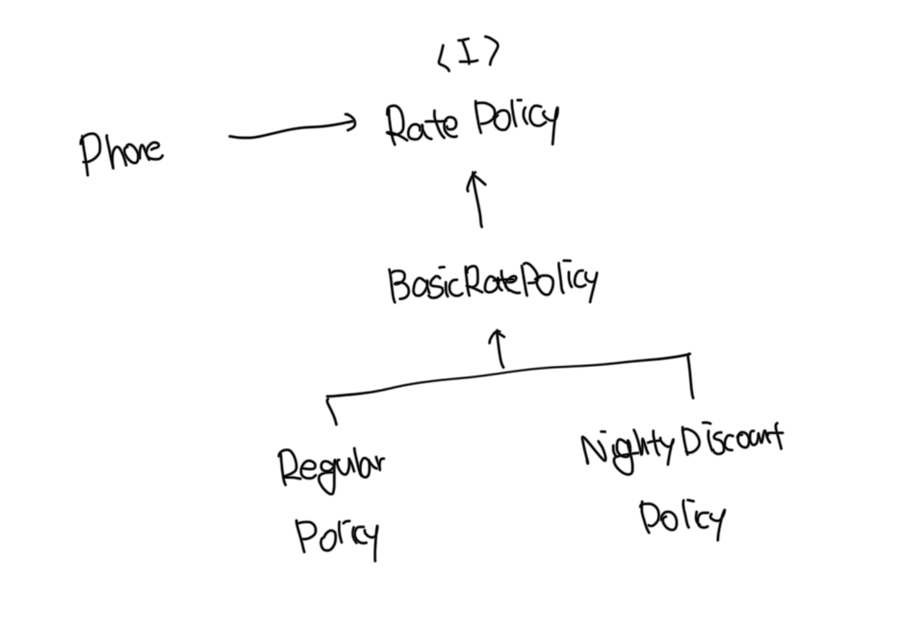

# 상속의 문제점

- 상속은 컴파일 시점에 관계가 결정되기 때문에 여러 기능을 조합해야 하는 설계에서는 클래스를 추가할 수 밖에 없다
- 합성은 컴파일타임 관계를 런타임 관계로 변경함으로써 이런 문제를 해결한다
- 클래스 폭발 문제 해결을 위해서 합성을 사용하는 이유는 런타임 시점에 객체 사이의 의존성을 자유롭게 변경할 수 있기 때문이다

<br>

# 기본 정책 합성하기

- 기본적인 할인 정책과 그 하위에 존재하는 일반할인정책, 야간할인 정책을 구성한다
- 여기서는 `Phone` 내부에 `RatePolicy`를 참조하는걸 주목해야 하는데, 이게 바로 `합성` 이다
- 요금 정책의 타입이 `RatePolicy` 이므로 Phone은 다양한 요금제와 상호작용이 가능해진다

### RatePolicy

```ts
/**
 * 기본 정책과 부가 정책을 포괄하는 인터페이스
 */
export interface RatePolicy {
  calculateFee(phone: Phone): Money;
}
```

<br>

### 기본 정책

```ts
export abstract class BasicRatePolicy implements RatePolicy {
  calculateFee(phone: Phone): Money {
    let result = Money.ZERO;

    for (const call of phone.getCalls()) {
      result = result.plus(this.calculateCallFee(call));
    }

    return result;
  }

  protected abstract calculateCallFee(call: Call): Money;
}
```

<br>

### 일반 요금제

```ts
export class RegularPolicy extends BasicRatePolicy {
  private amount: Money;
  private seconds: Duration;

  constructor(amount: Money, seconds: Duration) {
    super();
    this.amount = amount;
    this.seconds = seconds;
  }

  protected calculateCallFee(call: Call): Money {
    return this.amount.times(
      call.getDuration().getSeconds() / this.seconds.getSeconds()
    );
  }
}
```

<br>

### 심야 할인 요금제

```ts
export class NightlyDiscountPolicy extends BasicRatePolicy {
  private static readonly LATE_NIGHT_HOUR = 22;

  private nightlyAmount: Money;
  private regularAmount: Money;
  private seconds: Duration;

  constructor(nightlyAmount: Money, regularAmount: Money, seconds: Duration) {
    super();
    this.nightlyAmount = nightlyAmount;
    this.regularAmount = regularAmount;
    this.seconds = seconds;
  }

  protected calculateCallFee(call: Call): Money {
    if (call.getFrom().getHour() >= NightlyDiscountPolicy.LATE_NIGHT_HOUR) {
      return this.nightlyAmount.times(
        call.getDuration().getSeconds() / this.seconds.getSeconds()
      );
    } else {
      return this.regularAmount.times(
        call.getDuration().getSeconds() / this.seconds.getSeconds()
      );
    }
  }
}
```

<br>

### 합성을 통한 전화기 구현

```ts
export class Phone {
  private calls: Call[] = [];
  private ratePolicy: RatePolicy;

  constructor(ratePolicy: RatePolicy) {
    this.ratePolicy = ratePolicy;
  }

  getCalls(): Call[] {
    return this.calls;
  }

  calculateFee(): Money {
    return this.ratePolicy.calculateFee(this);
  }
}
```

<br>

### 도식화



<br>

### 사용하기

```ts
/**
 * 일반 요금제의 규칙에 따라서 요금 계산하기
 */
const phone = new Phone(
  new RegularPolicy(Money.wons(10), Duration.ofSeconds(10))
);
console.log(phone.calculateFee());

/**
 * 심야 할인 요금에의 규칙에 따라서 요금 계산하기
 */
const phone2 = new Phone(
  new NightlyDiscountPolicy(
    Money.wons(5),
    Money.wons(10),
    Duration.ofSeconds(10)
  )
);
console.log(phone2.calculateFee());
```

<br>

# 부가 정책 적용하기

- 부가 정책의 경우는 기본 정책에 대한 계산이 끝난 후에 적용된다
- 부가 정책의 인스턴스는 어떤 종류의 정책과도 합성이 가능해야하고, 기본 정책과 부가 정책은 협력 안에서 동일한 `역할`을 수행해야한다
  - 이 뜻은 부가 정책이 기본 정책과 동일한 `RatePolicy` 인터페이스를 구현해야 한다는것을 의미한다

<br>

### 부가 정책

```ts
export abstract class AdditionalRatePolicy implements RatePolicy {
  private next: RatePolicy;

  constructor(next: RatePolicy) {
    this.next = next;
  }

  calculateFee(phone: Phone): Money {
    const fee = this.next.calculateFee(phone);
    return this.afterCalculated(fee);
  }

  protected abstract afterCalculated(fee: Money): Money;
}
```

<br>

### 세금 정책

```ts
import { AdditionalRatePolicy } from "./additional-rate-policy.js";
import Money from "./money.js";
import { RatePolicy } from "./rate-policy.js";

export class TaxablePolicy extends AdditionalRatePolicy {
  private taxRate: number;

  constructor(next: RatePolicy, taxRate: number) {
    super(next);
    this.taxRate = taxRate;
  }

  protected afterCalculated(fee: Money): Money {
    return fee.plus(fee.times(this.taxRate));
  }
}
```

<br>

### 기본 요금 할인 정책

```ts
import { AdditionalRatePolicy } from "./additional-rate-policy.js";
import Money from "./money.js";
import { RatePolicy } from "./rate-policy.js";

export class RateDiscountablePolicy extends AdditionalRatePolicy {
  private discountAmount: Money;

  constructor(next: RatePolicy, discountAmount: Money) {
    super(next);
    this.discountAmount = discountAmount;
  }

  protected afterCalculated(fee: Money): Money {
    return fee.minus(this.discountAmount);
  }
}
```

<br>

# 기본 정책과 부가 정책 합성하기

- 객체를 조합하고 사용하는 방식이 상속을 사용한 방식보다 더 예측 가능하고 일관성이 있다
- 합성의 진가는 새로운 클래스를 추가하거나 수정하는 시점에서야 비로소 진가를 발휘한다

```ts
/**
 * 기본 요금제에 세금 정책을 조합
 */
const phone1 = new Phone(
  new TaxablePolicy(
    new RegularPolicy(Money.wons(1000), Duration.ofSeconds(60)),
    0.05
  )
);

/**
 * 일반 요금제 + 기본 요금 할인 정책 + 세금 정책
 */
const phone2 = new Phone(
  new TaxablePolicy(
    new RateDiscountablePolicy(
      new RegularPolicy(Money.wons(1000), Duration.ofSeconds(60)),
      Money.wons(1000)
    ),
    0.05
  )
);

/**
 * 일반 요금제 + 세금정책 + 기본 요금 할인 정책(순서변경한 버전)
 */
const phone3 = new Phone(
  new TaxablePolicy(
    new RateDiscountablePolicy(
      new RegularPolicy(Money.wons(1000), Duration.ofSeconds(60)),
      Money.wons(1000)
    ),
    0.05
  )
);
```

<br>

# 새로운 정책 추가하기

- 상속의 경우는 불필요하게 너무많은 클래스를 추가해야했다
- 합성을 기반으로 한 설계에서는 이러한 문제점을 간단하게 해결이 가능했다
- 만약 고정 요금제가 필요하다면, 고정 요금제를 구현한 클래스를 `하나만` 추가하면 된다
- 더 중요한건 요구사항을 변경할 때 오직 하나의 클래스만 수정해도 된다는 것이다

<br>

# 객체 합성이 클래스 상속보다 더 좋은 방법이다

- 코드를 재사용하면서도 건전한 결합도를 유지할 수 있는 더 좋은 방법은 합성을 이용하는것이다
- 이외에도 믹스인이라는 방법이 존재하는데, 이는 상속과 합성의 특성을 모두 가진 재사용 방법이다
