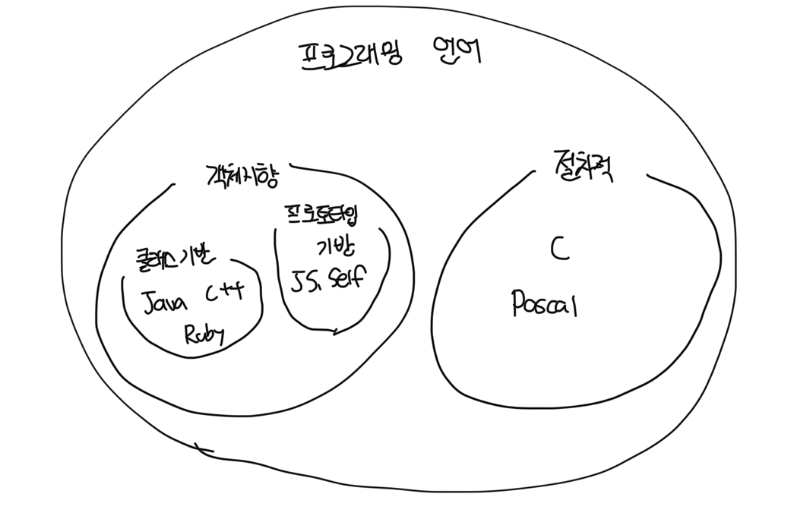

# 타입 사이의 포함관계

- 타입은 객체들의 집합이기 때문에 다른 타입을 포함하는것이 가능하다
- 타입 계층을 구성하는 두 타입 간의 관계에서 더 일반적인 타입을 `슈퍼타입`이라고 부르고, 더 특수한걸 `서브타입`이라고 부른다

 

### 슈퍼타입

- 집합이 다른 집한의 모든 멤버를 포함한다
- 타입 정의가 다른 타입보다 조금 더 일반적이다

 

### 서브타입

- 집합에 포함되는 인스턴스들이 더 큰 집합에 포함된다
- 타입 정의가 다른 타입보다 좀 더 구체적이다

 

# 객체지향 프로그래밍과 타입 계층

- 객체의 타입을 결정하는 것은 퍼블릭 인터페이스다
- 슈퍼타입은 서브타입이 정의한 퍼블릭 인터페이스를 일반화 시켜서 상대적으로 범용적이고 넓은 의미로 정의한 것이다
- 서브타입은 슈퍼타입이 정의한 퍼블릭 인터페이스를 특수화시켜서 상대적으로 구체적이고 좁은 의미로 정의한 것이다
- 즉 서브타입의 인스턴스는 슈퍼타입의 인스턴스로 간주될 수 있다
