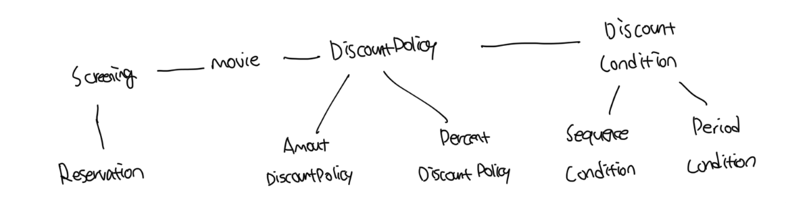
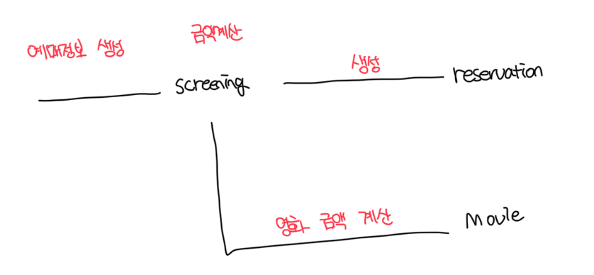

# 협력, 객체, 클래스

- 진정한 객체지향 프로그래밍은 어떤 클래스가 필요한지 먼저 결정하지 않음
- 클래스가 아닌 객체에 초점을 맞출 떄에만 진정한 객체지향 프로그래밍 패러다임으로의 전환이 가능함

<br>

### 어떤 클래스가 필요한지 보다 어떤 객체들이 필요한지 고민하기

- 클래스의 윤곽을 잡기 위해서는 어떤 객체들이 어떤 상태와 행동을 가지는지를 먼저 결정해야한다
- 객체를 중심에 두는 접근 방법은 설계를 단순하고 깔끔하게 만든다

<br>

### 객체를 독립적인 존재가 아닌 기능을 구현하기 위해 협력하는 공동체의 일원으로 보기

- 객체는 홀로 존재하는게 아닌 다른 객체에게 도움을 주거나 의존하며 살아가는 협력적인 존재다
- 객체를 고립된 존재로 바라기보단 협력하는 공통체의 일원으로 보는것이 설계를 유연하고 확장 가능하게 만든다
- 객체들의 모양과 윤곽이 잡힌다면 이 타입을 기반으로 클래스를 구현하는게 좋다

<br>

# 도메인의 구조를 따르는 프로그램 구조

- `도메인`은 문제를 해결하기 위해 사용자가 프로그램을 사용하는 분야를 뜻한다
- 객체지향에서는 요구사항과 프로그램을 객체라는 동일한 관점에서 바라볼 수 있따
- 이 땜준에 도메인을 구성하는 개념들이 프로그램의 객체와 클래스로 매끄럽게 연결될 수 있다

<br>

### 예제: 영화 예매 도메인을 구성하는 개념과 관계

- 일반적으로 클래스의 일므은 대응되는 도메인 개념의 이름과 동일하거나, 적어도 유사하게 짓는게 좋다
- 클래스 사이의 관계도 도메인 개념 사이에 맺어진 관계와 유사하게 만들어서 프로그램 구조를 이해하고 예상하기 쉽게 만들어야한다



<br>

# 클래스 구현하기

- 클래스를 구현하거나 사용할 떄 가장 중요한건 클래스의 계를 구분짓는 것이다
- 외부에서는 객체의 속성에 직접 접근할 수 없도록 막고, 적절한 공개된 메소드를 통해서만 내부 상태를 변경할 수 있게 해야함
- 그 이유는 경계의 명확성이 객체의 자율성을 보장하기 때문이다

```ts
export default class Screening {
  private movie: Movie;
  private sequence: number;
  private whenScreened: Date;

  constructor(movie: Movie, sequence: number, whenScreened: Date) {
    this.movie = movie;
    this.sequence = sequence;
    this.whenScreened = whenScreened;
  }

  getStartTime(): Date {
    return this.whenScreened;
  }

  isSequence(sequence: number): boolean {
    return this.sequence === sequence;
  }

  getMovieFee(): number {
    return this.movie.getFee();
  }
}
```

<br>

### 자율적인 객체

#### 자율적인 객체가 가지는 두가지 사실

- 객체는 `상태(state)`와 `행동(behavior)`를 함께 가지는 복합적인 존재다
- 객체는 스스로 판단하고 행동하는 `자율적인 존재`다
- 이처럼 데이터와 기능을 객체 내부로 함께 묶는 것을 `캡슐화`라고 부른다
- 요즘 대부분의 언어는 `접근 수정자`를 통해서 `접근 제어` 매커니즘도 지원한다

<br>

#### 객체 내부 접근을 통제하는 이유

- 객체를 자율적인 존재로 만들기 위해서다
- 객체자 자율적인 존재로 우뚝 서기 위해서는 외부의 간섭을 최소화 해야한다
- 어떤 생각을 하고있는지 알아서도 안되고 결정에 직접적으로 개입해서도 안된다
- 객체에게 원하는 것을 요청하고는 객체가 스스로 최선의 방법을 결정할 수 있을 것이라는 점을 믿어야한다

<br>

#### 캡슐화와 접근제어는 객체를 두 부분으로 나눈다

- 외부에서 접근 가능한 부분으로 이를 `퍼블릭 인터페이스(public interface)`라고 한다
- 외부에서 접근 불가능하고 오직 내부에서만 접근 가능한 부분으로 이를 `구현(implementation)`라고 함
- 일반적으로 객체의 상태는 숨기고 행동만 외부에 공개해야한다

<br>

### 프로그래머의 자유

#### `클래스 작성자(class creaetor)`

- 새로운 데이터 타입을 프로그램에 추가하는 역할을 맡는다
- 클라이언트 프로그래머에게 필요한 부분만 공개하고 나머지는 꽁꽁 숨겨야한다
- 숨겨놓은 부분에 맘대로 접근이 불가능하게 방지함으로써 사이드이펙트 없이 기능 수정이 가능하다
  - 이를 `구현 은닉(implementation hiding)`이라고 한다
- 위 규칙을 따르기 위해서는 클래스를 개발할 때 마다 인터페이스와 구현을 깔끔하게 분리하기 위해 노력해야한다

<br>

#### 설계가 필요한 이유

- 설계가 필요한 이유는 변경을 관리하기 위해서다
- 객체의 변경을 관리할 수 있는 기법 중에서 가장 대표적인것이 접근제어다
- 변경될 가능성이 있는 세부적인 구현 내용을 `private` 영역안에 감춰서 변경으로 인한 혼란을 최소화 할 수 있다

<br>

# 협력하는 객체들의 공동체

### Screening 마저 완성하기

```ts
/**
 * 상영을 구현하는 클래스
 *
 * 상영할 영화, 순번, 상영 시작시간을 포함함
 */
export default class Screening {
  private movie: Movie;
  private sequence: number;
  private whenScreened: Date;

  constructor(movie: Movie, sequence: number, whenScreened: Date) {
    this.movie = movie;
    this.sequence = sequence;
    this.whenScreened = whenScreened;
  }

  getStartTime(): Date {
    return this.whenScreened;
  }

  isSequence(sequence: number): boolean {
    return this.sequence === sequence;
  }

  getMovieFee(): number {
    return this.movie.getFee();
  }

  /**
   * 영화를 예매함
   * @param customer 예매자에 대한 정보
   * @param audienceCount 인원수
   * @returns 예매 정보를 담은 정보 반환
   */
  reserve(customer: Customer, audienceCount: number) {
    return new Reservation(customer, this, this.calculateFee(audienceCount), audienceCount);
  }

  /**
   * 예매를 위한 요금을 계산
   * @param audienceCount 인원 수
   * @returns
   */
  private calculateFee(audienceCount: number): number {
    /**
     * 영화 가격을 가져오고 인원수를 곱하면 예메 가격이
     */
    return this.movie.calculateMovieFee(this).times(audienceCount);
  }
}
```

<br>

### Money 클래스

- `number` 같은 타입은 `Money` 타입처럼 저장하는 값이 금액과 관련돼 있다는 의미 전달이 불가능하다
- 객체를 이용해 도메인의 의미를 풍부하게 표현할 수 있는것은 객체지향의 장점이다
- 의미를 좀 더 명시적이고 분명하게 표현할 수 있다면 객체를 사용해서 해당 개념을 구현하는게 좋다
- 비록 하나의 인스턴스 변수만 포함하더라도 개념을 명시적으로 표현하느넋은 전체적인 설계의 명확성과 유연성을 높이는 첫걸음이다

```ts
/**
 * 돈
 *
 * 금액과 관련된 다양한 계산을 구현하는 간단한 클래스
 */
export default class Money {
  static readonly ZERO = Money.wons(0);

  private readonly amount: number;

  constructor(amount: number) {
    this.amount = amount;
  }

  static wons(amount: number): Money {
    return new Money(amount);
  }

  plus(money: Money): Money {
    return new Money(this.amount + money.amount);
  }

  minus(money: Money): Money {
    return new Money(this.amount - money.amount);
  }

  times(percent: number) {
    return new Money(this.amount * percent);
  }

  isLessThan(money: Money): boolean {
    return this.amount < money.amount;
  }

  isGreaterThanOrEqual(money: Money): boolean {
    return this.amount >= money.amount;
  }
}
```

<br>

### Reservation(예매 정보) 클래스

- 영화를 예매하기 위해 각 인스턴스들은 서로의 메소드를 호출하며 상호작용한다
- 이처럼 시스템의 기능을 구현하기 위해서 객체들 사이에 이뤄지는 상호작용을 `협력(collaboration)`이라고 부른다
- 객체지향 프로그램을 작성할땐 먼저 협력의 관점에서 어떤 객체가 필요한지를 결정하고, 객체들의 공통 살태와 행위를 구현하기 위해 클래스를 작성하는게 좋다

```ts
import Money from "./money";
import Screening from "./screening";

/**
 * 예매 정보
 */
export default class Reservation {
  private customer: Customer;
  private screening: Screening;
  private fee: Money;
  private audienceCount: number;

  constructor(customer: Customer, screening: Screening, fee: Money, audienceCount: number) {
    this.customer = customer;
    this.screening = screening;
    this.fee = fee;
    this.audienceCount = audienceCount;
  }
}
```



<br>

# 협력에 관한 짧은 이야기

- 객체는 다른 객체의 인터페이스에 공개된 행동을 수행하도록 `요청(request)`이 가능해야한다
- 요청을 받은 객체는 자율적인 방법에 따라서 요청을 처리한 후 `응답(response)`해야한다
- 객체가 다른 객체와 상호작용할 수 있는 유일한 방법은 `메세지를 전송(send message)`하는 것이다
- 수신된 메세지를 처리하기 위한 자신만의 방법을 `메소드(method)`라고 부른다
-
