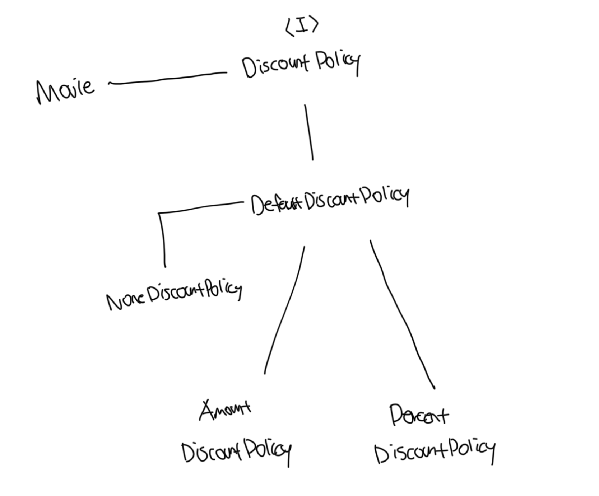

# 추상화의 힘

### 요구사항의 정책을 높은 수준에서 서술이 가능하다

- 추상화를 이용해서 상위 정책을 기술한다는 것은 기본적인 앱의 협력 흐름을 기술한다는것을 의미함
- 예를 들면 `영화 예매 요금은 최대 하나의 "할인정책"과 다수의 "할인조건"을 이용해 계산이 가능하다`라는걸 표현함
- 이러한 개념은 재사용 가능한 설계의 기본을 이루는 `디자인 패턴`, `프레임워크` 모두 추상화를 이용해서 상위 정책을 정의하는 객체지향의 매커니즘을 활용하고있음
- 이처럼 추상화를 통해서 상위 정책을 표현하면 기존 구조를 수정하지 않고도 새로운 기능을 쉽게 추가하고 확장이 가능함

<br>

# 유연한 설계

- 객체의 책임의 위치를 결정하기 위해서 조건문을 사용하는건 협력의 설계 측면에서 대부분의 경우 좋지 않은 선택임
- 가능하면 추상화를 중심으로 코드의 구조를 설계하면 유연하고 확장 가능한 설계를 만들 수 있음
- 이처럼 유연한 설게를 가능하게 하는 이유는 설계가 구체적인 상황에 결합되는것을 방지해주기 때문임
- 결론은 `유연성이 필요한곳에 추상화를 사용`하면 된다

<br>

### 예시: 조건물을 사용해서 책임의 위치 결정사례

```tscalculateMoviePrice(screening: Screening): Money {
    // 영화 금액을 계산하는 책임이 Movie에 할당됨
    if (!this.discountPolicy) {
      return Money.ZERO;
    }

    return this.fee.minus(this.discountPolicy.calculateDiscountAmount(screening));
  }
```

<br>

### 예시: 추상화를 중심으로 코드의 구조 설계하기

```ts
import DiscountCondition from "../conditions/discount-condition";
import Money from "../money";
import Screening from "../screening";
import DiscountPolicy from "./discount-policy";

export default class NoneDiscountPolicy extends DiscountPolicy {
  protected getDiscountAmount(screening: Screening): Money {
    return Money.ZERO;
  }
}
```

```ts
// Movie {
//   title: '스타워즈',
//   runningTime: Duration { milliseconds: 12600000 },
//   fee: Money { amount: 10000 },
//   discountPolicy: NoneDiscountPolicy { conditions: [] }
// }
const starwars = new Movie(
  "스타워즈",
  Duration.ofMinutes(210),
  Money.wons(10000),
  new NoneDiscountPolicy([])
);
```

<br>

# 추상 클래스와 인터페이스 트레이드오프

- 기존 구조에서는 부모 클래스인 `DiscountPolicy`에서 할인조건이 없는 경우는 `getDiscountAmount`를 호출하지 않음
- 이는 부모 클래스와 강하게 결합되어 버리는데 개발자가 `getDiscountAmount`가 호출되지 않으면 `DiscountPolicy`가 0원을 반환활 것이라는 사실을 가정하고 있음
- 이런 문제는 `DiscountPolicy`를 인터페이스로 변경하고 `NoneDiscountPolicy`가 `DiscountPolicy`의 `getDiscontAmount` 메소드가 아닌 `calculateDiscountAmount`를 오버라이딩 하도록 변경하면 해결이 가능하다
- 하지만 이러한 코드에는 합당한 이유가 존재해야하며 구현과 관련된 모든것들이 트레이드 오프의 대상이 될 수 있다

### DiscountPolicy

```ts
import Money from "../money.js";
import Screening from "../screening.js";

export interface DiscountPolicy {
  calculateDiscountAmount(screeing: Screening): Money;
}
```

<br>

### DefaultDiscountPolicy

```ts
import DiscountCondition from "../conditions/discount-condition.js";
import Money from "../money.js";
import Screening from "../screening.js";
import { DiscountPolicy } from "./discount-policy.js";

export default abstract class DefaultDiscountPolicy implements DiscountPolicy {
  /**
   * 할인 조건들
   */
  private conditions: DiscountCondition[] = [];

  constructor(conditions: DiscountCondition[]) {
    this.conditions = conditions;
  }

  calculateDiscountAmount(screening: Screening): Money {
    for (const condition of this.conditions) {
      if (condition.isSatisfiedBy(screening)) {
        return this.getDiscountAmount(screening);
      }
    }

    return Money.ZERO;
  }

  protected abstract getDiscountAmount(screening: Screening): Money;
}
```

<br>

### NoneDiscountPolicy

```ts
import Money from "../money";
import Screening from "../screening";
import { DiscountPolicy } from "./discount-policy.js";

export default class NoneDiscountPolicy implements DiscountPolicy {
  calculateDiscountAmount(screeing: Screening): Money {
    return Money.ZERO;
  }
}
```

<br>

### 다이어그램



<br>

# 코드 재사용

- 상속은 코드를 재사용하기 위해서 널리 사용되는 방법이지만 가장 좋은 방법은 아니다
- 상속보다는 `합성(Composition)`이라는 개념이 더 좋은 방법인데 이는 서로 다른 객체의 인스턴스를 자신의 인스턴스 변수로 포함해서 재사용하는 방법을 뜻한다

<br>

# 상속

- 상속은 객체지향에서 코드를 재사용하기 위해서 널리 사용되는 기법이다
- 하지만 상속은 캡슐화를 위반하여 설계를 유연하지 못하게 만들게된다

<br>

### 부모와 자식간 강결합

- 상속을 하게되면 부모 클래스에 대한 내용을 자식이 알아야되는데 이로써 부모 클래스의 구현이 자식 클래스에게 노출되어 캡슐화가 약화된다
- 또한 부모와 자식은 강하게 결합되므로 상속을 과도하게 사용한 코드는 변경하기도 힘들다

<br>

### 유연하지 않은 설계

- 상속은 부모 클래스와 자식 클래스 사이의 관계를 컴파일 시점에 결정한다
- 실행 시점에 객체의 종류를 변경하는게 불가능하다

<br>

# 합성

- 인터페이스에 정의된 메세지를 통해서만 코드를 재사용하는 방법을 합성이라고 부른다
- 상속은 클래스를 통해 강하게 결합되는데 비해 합성은 메세지를 통해 느슨하게 결합된다
- 코드의 재사용을 위해서는 상속보다는 합성을 선호하는것이 더 좋은 방법이다
- 하지만 매번 합성은 아니며 코드 재사용을 위해서는 상속보다는 합성이지만, 다형성을 위해 인터페이스 재사용시는 함께 조합해서 사용할 수 밖에 없다
